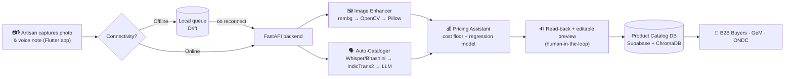

<div align="center">

# 🪔 Karigar Setu
### AI-Driven Market Linkage & Smart Cataloging for Marginalized Artisans

docs: https://docs.google.com/document/d/11JJ13SqLMxHMm4TntohtAeoQhq9FtmR79HMz0T-F4cY/edit?usp=sharing

**An offline-first mobile "virtual business manager" that turns a phone photo and a voice note into a professional, fairly-priced, bilingual product listing — no typing, no English, no middlemen.**

*Built for Smart India Hackathon 2026 · Problem Statement PS-90*

[](https://flutter.dev)
[](https://fastapi.tiangolo.com)
[](https://supabase.com)
[](https://www.trychroma.com)
[]()
[]()
[](#license)

</div>

---

## 📌 The Problem

Government programs already fund thousands of artisans and weavers, and give them market exposure through periodic fairs like **Shilp Samagam**, **Surajkund Mela**, and **Dilli Haat**. But that exposure is seasonal.

The moment the fair ends, the sales stop — because moving to year-round digital commerce requires things most artisans have never had access to: a decent camera setup, the ability to write an SEO-friendly product description in English, and a sense of what a "fair market price" even looks like. Low digital literacy and language barriers turn a straightforward listing task into an impossible one.

**Karigar Setu closes that gap.** It's a cross-platform mobile app that acts as a virtual business manager — the artisan just points a phone camera and talks in their own language; the AI handles the rest.

## 🎯 Core Features

### 1. 📸 AI Image Enhancer & Studio
A built-in camera module that turns a cluttered, low-light phone photo into an e-commerce-ready product shot — background removed, cropped, lighting corrected, compressed — with a before/after slider so the artisan can accept or redo the shot.

### 2. 🎙️ Multilingual Auto-Cataloger
The artisan describes their product by **speaking in their regional language or dialect**. The app transcribes it, translates and cleans it up, and generates a structured, SEO-friendly product listing in **English and Hindi** — then reads the result back out loud in the artisan's own language for confirmation before anything goes live.

### 3. 💰 Dynamic Pricing Assistant
A pricing engine that blends a **cost-based floor** (raw materials + labour + transport, so the AI can never suggest a price that undercuts the artisan) with a **market-reference model** trained on real handicraft listing data, returning a suggested price range with reasoning the artisan can accept, adjust, or override.

All three features are stitched together by one guiding principle: **the artisan reviews and approves every AI decision — image, listing, and price — before it ever goes live.**

## 🧭 How It Works



Every step is designed to survive a bad or absent internet connection: photos and voice notes are captured and queued **locally first**, then synced automatically the moment connectivity returns — nothing is ever lost waiting for a signal.

## 🏗️ Tech Stack

| Layer | Technology | Why |
|---|---|---|
| **Mobile app** | Flutter | Single codebase for Android/iOS, offline-capable local storage for the capture queue |
| **Backend API** | FastAPI | Async, lightweight, fast to iterate on `/enhance`, `/catalog`, `/price-suggest` endpoints |
| **Database & Storage** | Supabase | Postgres for structured catalog data + auth + object storage for images, with a generous free tier |
| **Vector store** | ChromaDB | Embedding-based similarity search for category/material matching in the pricing engine |
| **Background removal** | [rembg](https://github.com/danielgatis/rembg) (U²-Net) | Open-source, self-hostable, no per-call API cost at scale |
| **Image processing** | OpenCV + Pillow | Auto-crop, white-balance correction, compression/format conversion |
| **Speech-to-text** | Whisper / AI4Bharat IndicWhisper / Bhashini ASR | Regional-language and code-mixed speech, with confidence-based fallback |
| **Translation** | [IndicTrans2](https://github.com/AI4Bharat/IndicTrans2) / Bhashini | Open-source MT across all 22 scheduled Indian languages |
| **Listing generation** | LLM (structured JSON output) | Produces title, EN + HI description, tags, and category from cleaned transcript |

## 🔌 Offline-First by Design

Connectivity, not intent, is the biggest blocker for rural artisan clusters. Every pipeline is built around this:

| Area | Challenge | Solution |
|---|---|---|
| **Input quality** | Blurry/poorly lit photos from budget phones | On-screen capture guide flags blur/low light *before* upload |
| **Language** | Regional dialects, Hindi-English code-mixing | Confidence-scored transcription with automatic fallback to Bhashini ASR or a re-record prompt |
| **Connectivity** | Poor/no internet in rural clusters | Offline-first capture — photos and voice notes queue locally, sync automatically on reconnect |
| **Trust in AI** | Low-literacy users can't read/verify AI output | Text-to-speech read-back in the artisan's own language + human-in-the-loop sign-off before anything publishes |
| **Onboarding** | Artisans unlikely to self-onboard | On-site digitization kiosks at existing fairs, staffed by NGO/cluster development officers |
| **Cost at scale** | AI inference cost across thousands of artisans | Self-hosted open-source models (rembg, Whisper) for the core pipeline; paid APIs reserved for edge cases |

## 🌍 Impact

- **Continuous income, not seasonal spikes** — converts a few weeks of fair-season sales into a year-round digital storefront.
- **Fair, data-backed pricing** — protects artisans from the information asymmetry that lets middlemen underpay them.
- **Financial inclusion** — consistent, timestamped sales history becomes an alternative credit signal for artisans invisible to formal banking.
- **Disproportionate benefit to women artisans**, many of whom face mobility restrictions that limit access to physical fairs.
- **Built on India's own Digital Public Infrastructure** — designed to plug into **ONDC**, **GeM**, and **Bhashini** rather than compete with them.

## 💸 Revenue Model (guiding principle)

> Free for artisans to list and sell. Revenue comes from **buyers, institutions, and optional premium add-ons** — never a commission carved out of a marginalized seller's basic livelihood.

| Phase | Primary revenue | Rationale |
|---|---|---|
| **Pilot** | Government grants/tenders, CSR sponsorship, NABARD/SIDBI funding | No paying user base yet — impact-first funding builds credibility |
| **Growth** | B2B transaction commission (buyer-side, 2–5%), buyer subscriptions, loan/insurance referral fees | Monetization sits on the buyer side, not the artisan |
| **Maturity** | State government white-labeling, export-documentation services, anonymized data insights, opt-in premium artisan tier | Platform becomes infrastructure with diversified, stable revenue |

## 🗺️ Roadmap

**✅ In current architecture (MVP):** offline-first capture & queuing, ONDC/GeM export connector, feedback loop for retraining the pricing model.

**Phase 2:** WhatsApp/SMS-based listing via a Business API chatbot · sentiment-aware review analysis · voice-narrated analytics dashboard for artisans.

**Phase 3:** Bulk B2B order aggregation across clusters · counterfeit/duplicate-listing detection (perceptual hashing) · CLIP-style image search for buyers · 15–30s artisan-story video with auto-subtitling · credit-score & microfinance loan matching.

**Exploring:** demand forecasting around festival calendars, auto-matching artisans to eligible government schemes, cluster inventory pooling, blockchain provenance certificates, and export documentation automation (HS codes, invoices, certificates of origin).

## 📚 Research Grounding

This isn't guesswork on voice-first UX for low-literacy users — it builds on established ICTD (ICT for Development) research:

- Patel et al., *["Experiences Designing a Voice Interface for Rural India" (Avaaj Otalo)](https://dl.acm.org/doi/10.1145/1998249.1998258)* — informs pairing voice input with confirmation buttons rather than voice-only interaction.
- Medhi et al., *"Designing Mobile Interfaces for Novice and Low-Literacy Users" (VideoKheti)* — supports the human-in-the-loop review safeguard.
- Gala, Chitale et al., *["IndicTrans2," TMLR 2023](https://github.com/AI4Bharat/IndicTrans2)* — the translation layer this project builds on.
- Qin et al., *"U²-Net: Going Deeper with Nested U-Structure for Salient Object Detection," Pattern Recognition 2020* — the model underlying the background-removal pipeline.

## 🏁 Competitive Landscape

| Platform | Vendors | Where they fall short for our users |
|---|---|---|
| Amazon Karigar | 1.6M+ | Treats handicrafts like any mass-produced SKU — artisans in Kutch report lackluster sales because generic cataloging doesn't capture craft value |
| Flipkart Samarth | 1.5M+ (by 2023) | Strong NGO partnerships, but still requires manual, English-first cataloging |
| GoCoop | 275+ cooperatives, 10 states | Free cataloging support, but **human-powered**, not automated — the manual version of what this project automates |
| ListIQ | 30K+ sellers | Closest AI-cataloging competitor, but general e-commerce focused, not built for marginalized/artisan sellers |

## 🚀 Getting Started

> This section will evolve as implementation lands. Current scaffold:

```bash
# Backend (FastAPI)
cd backend
python -m venv venv && source venv/bin/activate
pip install -r requirements.txt
uvicorn main:app --reload

# Mobile app (Flutter)
cd mobile
flutter pub get
flutter run
```

Environment variables you'll need (see `.env.example`): Supabase URL/key, ChromaDB connection, Bhashini/Whisper API credentials, and object storage credentials for enhanced images.

## 📁 Project Structure

```
karigar-setu/
├── mobile/              # Flutter app — camera, voice capture, offline queue, review UI
├── backend/             # FastAPI service — /enhance, /catalog, /price-suggest
│   ├── image_pipeline/  # rembg, OpenCV, Pillow
│   ├── catalog_pipeline/# STT, translation, LLM structuring
│   └── pricing_engine/  # cost floor + regression model
├── docs/                # Problem statement, architecture notes, research references
└── README.md
```


## 📄 License

Licensed under the [MIT License](LICENSE).

---

<div align="center">
<sub>Digitizing what the government already helped artisans build — without taking a cut of their livelihood to do it.</sub>
</div>
