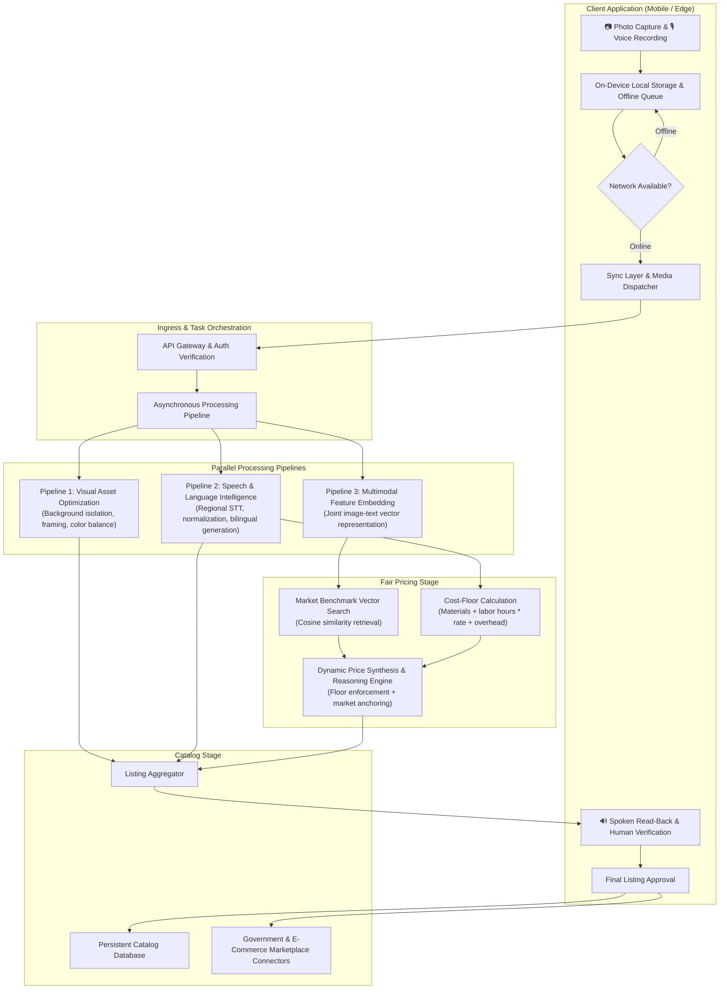

# System Architecture: Karigar Setu

An offline-first platform designed to empower rural and marginalized artisans by converting camera captures and regional voice descriptions into market-ready, fairly priced, bilingual product listings with complete human-in-the-loop oversight.

---

## 1. System Overview

Karigar Setu is structured around a resilient client-server architecture built for low-connectivity environments. The client application captures product imagery and spoken artisan audio on-device, staging changes locally before syncing them when network connectivity is detected. Once synchronized, the server orchestrates three parallel processing branches: image optimization, speech transcription with bilingual listing generation, and multimodal market benchmark retrieval. These branches converge into a dual-engine pricing stage that enforces an ethical cost-based wage floor before blending market comparables. The compiled listing is returned to the client for artisan review, spoken verification, and manual confirmation prior to persistence and external marketplace export.



---

## 2. Component Breakdown

| Component | Purpose & Responsibility | Codebase Location | Key Classes & Functions | Implementation Status |
| :--- | :--- | :--- | :--- | :--- |
| **Client Core & UI** | 5-step guided listing creation flow (capture, image preview, voice note, listing review, pricing override, final publish). | `frontend/lib/features/add_product/` | `AddProductFlowScreen`, `AddProductDraft`, `AddProductFlowNotifier` | **Done** |
| **Client Local Queue** | Persistent local store for products, drafts, and pending mutation queues (CREATE, UPDATE, DELETE). | `frontend/lib/data/repositories/`<br>`frontend/lib/data/models/` | `ProductRepository`, `Product`, `ProductStatus` | **Done** |
| **Client Sync Layer** | Connectivity monitoring and automatic draining of queued operations on network recovery. | `frontend/lib/data/services/` | `SyncService` (`triggerSync`, `_updateConnectionStatus`) | **Done** |
| **Client Remote Client** | Abstraction layer for HTTP client communication with remote services. | `frontend/lib/data/services/` | `ApiService` (abstract), `MockApiService` | **Partial** (Mock client implemented; real HTTP client integration pending) |
| **API Gateway & Routing** | Ingress validation, route handling, request lifecycle, static media delivery, and error handling. | `backend/main.py`<br>`backend/routers/` | `app`, `products_router`, `catalog_router`, `pricing_router`, `health_router` | **Done** |
| **Media Storage Service** | Local file persistence and URL resolution for uploaded visual and audio assets. | `backend/services/` | `StorageService` (`save_upload`, `get_local_path_from_url`) | **Done** |
| **Image Enhancement Pipeline** | Background clutter removal, white balance adjustment, centering, and e-commerce compression. | `ML/image_pipeline/`<br>`backend/routers/catalog.py` | `enhance_image` route stub | **Planned / Not yet implemented** (Directory present as stub; currently echoes stored file path) |
| **Speech-to-Text Service** | Multimodal audio transcription handling regional Indian languages and dialect variations. | `backend/services/` | `CatalogService.transcribe_audio` | **Done** |
| **Bilingual Listing Generator** | Transforms raw transcripts into structured, search-optimized bilingual listings (English and Hindi). | `backend/services/` | `CatalogService.generate_listing` | **Done** |
| **Secondary Image Cleaning** | Secondary visual preprocessing step feeding clean visual inputs into the pricing vector engine. | `ML/image_pipeline/` | — | **Planned / Not yet implemented** |
| **Multimodal Feature Embedder** | Projects product imagery and text descriptions into a shared semantic vector space. | `ML/pricing/embeddings/` | `EmbeddingEngine` (`embed_multimodal`, `embed_text`, `embed_image`) | **Done** |
| **Market Vector Store** | Persistent vector index of benchmark handicraft products supporting similarity queries. | `ML/pricing/embeddings/` | `VectorStore` (`add_products`, `query_similar`, `get_count`) | **Done** |
| **Market Data Scrapers** | Extraction pipelines and curated seed data for benchmark marketplace items. | `ML/pricing/scrapers/` | `ScraperRunner`, `BaseScraper`, seed dataset modules | **Done** |
| **Cost-Floor Calculator** | Computes the ethical break-even floor `(materials + (labor_hours * wage_rate) + transport + overhead)`. | `ML/pricing/models.py`<br>`frontend/lib/core/providers/` | `CostInputs.cost_floor`, `AddProductDraft.floorPrice` | **Done** |
| **Price Synthesis & Reasoning** | Combines retrieved benchmark products, artisan cost constraints, and contextual reasoning. | `ML/pricing/llm/`<br>`ML/pricing/artisan/` | `LLMPricer.calculate_price`, `ArtisanProductProcessor.process_upload` | **Done** |
| **Price Audit Logger** | Records pricing recommendations, confidence scores, and inputs for governance and model retraining. | `backend/models/db_models.py`<br>`backend/services/pricing_service.py` | `PriceAuditDB`, `PricingService.suggest_price` | **Done** |
| **Catalog Database** | Relational storage for live, draft, and pending product records. | `backend/database.py`<br>`backend/models/db_models.py` | `ProductDB`, `init_db`, `get_db` | **Done** |
| **Marketplace Export Connectors** | Connectors to export approved listings to public procurement and digital commerce networks. | `backend/routers/` | — | **Planned / Not yet implemented** |
| **Authentication & User Identity** | Artisan phone number verification and profile management. | `frontend/lib/features/auth/`<br>`backend/` | `UserProfileNotifier` | **Partial** (Client state mock exists; backend auth endpoints planned) |

---

## 3. End-to-End Data Flow

Tracing an artisan listing workflow from offline capture to catalog publication:

```
[1. Mobile Capture]
    │  Artisan captures raw product photo and records spoken audio note offline.
    ▼
[2. Local Queuing]
    │  Record saved locally with status "pendingSync". Operation ("CREATE") placed in local queue.
    ▼
[3. Connectivity Recovery & Sync Dispatch]
    │  Sync layer detects active network, reads pending mutation queue, and dispatches batch payload.
    ▼
[4. Ingress & Media Staging]
    │  Server receives media assets, persists them to object storage, and initializes processing tasks.
    ▼
[5. Parallel Processing Execution]
    ├── Branch A (Visual): Background isolation, boundary cropping, lighting correction.
    ├── Branch B (Speech & Language): Regional STT transcription -> Normalization -> Structured EN/HI listing.
    └── Branch C (Feature Extraction): Generates multimodal embedding vector from image and transcript.
    ▼
[6. Fair Price Synthesis]
    │  Vector store retrieves nearest benchmark products.
    │  Cost-floor calculator computes non-negotiable wage floor.
    │  Pricing synthesis engine evaluates market anchors against cost floor, outputting range and Hindi/English reasoning.
    ▼
[7. Human-in-the-Loop Review (Client)]
    │  Aggregated draft (enhanced image, bilingual title/description, suggested price, price reasoning) delivered to client.
    │  Client application performs spoken read-back of listing and pricing rationale in artisan's chosen dialect.
    │  Artisan confirms or adjusts pricing and listing details.
    ▼
[8. Persistence & Marketplace Publication]
    │  Approved product committed to central relational catalog with status "live".
    │  Listing queued for external marketplace and government procurement platform export.
```

---

## 4. API Surface

### Product Management (`/api/v1/products`)

* **`GET /api/v1/products`**
  * **Query Parameters:** `category` (optional string), `status` (optional string), `limit` (int, default 50), `offset` (int, default 0)
  * **Response:** Array of `ProductResponse` objects `[{ id, title, title_hi, description, description_hi, price, image_url, category, tags, status, created_at, updated_at }]`

* **`GET /api/v1/products/{product_id}`**
  * **Path Parameters:** `product_id` (string)
  * **Response:** Single `ProductResponse` object (404 if not found)

* **`POST /api/v1/products`**
  * **Request Body:** `ProductCreate` `{ title, title_hi, description, description_hi, price, image_url, category, tags, status, id?, created_at? }`
  * **Response (201):** `ProductResponse` (Idempotent: updates existing entry if matching ID is supplied)

* **`PUT /api/v1/products/{product_id}`**
  * **Path Parameters:** `product_id` (string)
  * **Request Body:** `ProductUpdate` `{ title?, title_hi?, description?, description_hi?, price?, image_url?, category?, tags?, status? }`
  * **Response:** Updated `ProductResponse`

* **`DELETE /api/v1/products/{product_id}`**
  * **Path Parameters:** `product_id` (string)
  * **Response:** `{ "success": true, "deleted_id": string }`

* **`POST /api/v1/products/sync`**
  * **Request Body:** `ProductSyncBatch` `{ "products": [ ProductCreate, ... ] }`
  * **Response:** `ProductSyncResponse` `{ "synced_count": int, "products": [ ProductResponse, ... ] }`

---

### Multimodal Cataloger (`/api/v1/catalog`)

* **`POST /api/v1/catalog/enhance-image`**
  * **Request (Multipart):** `image` (binary file)
  * **Response:** `ImageEnhanceResponse` `{ "original_url": string, "enhanced_url": string, "status": "success" }`

* **`POST /api/v1/catalog/transcribe`**
  * **Request (Multipart):** `audio` (binary file), `language_code` (form string, default `"hi"`)
  * **Response:** `AudioTranscribeResponse` `{ "transcript": string, "language_code": string, "detected_language": string? }`

* **`POST /api/v1/catalog/generate-listing`**
  * **Request Body:** `ListingGenerateRequest` `{ "transcript": string, "language_code": string, "category_hint": string?, "image_url": string? }`
  * **Response:** `ListingGenerateResponse` `{ "title_en": string, "title_hi": string, "description_en": string, "description_hi": string, "category": string, "tags": [string] }`

---

### Pricing Intelligence (`/api/v1/pricing`)

* **`POST /api/v1/pricing/suggest`**
  * **Request Body:** `PriceSuggestRequest` `{ description, category?, image_url?, raw_material_cost?, labor_hours?, hourly_wage?, transport?, overhead?, tags? }`
  * **Response:** `PriceSuggestResponse` `{ suggested_price, min_price, max_price, floor_price, confidence_score, market_position, reasoning, reasoning_hi, comparable_products: [ { id, title, selling_price, category, source_platform, similarity_score, product_url } ] }`

* **`POST /api/v1/pricing/suggest-upload`**
  * **Request (Multipart):** `description` (form text), `image` (optional binary file), plus optional cost parameters as form fields.
  * **Response:** `PriceSuggestResponse`

* **`GET /api/v1/pricing/status`**
  * **Response:** `{ "status": "online", "indexed_benchmark_products": int, "vector_db": string, "embedding_dimension": int }`

---

### System Diagnostics (`/api/v1/health`)

* **`GET /api/v1/health`**
  * **Response:** `{ "status": "healthy", "app_name": string, "version": string, "mode": string }`

---

## 5. Data Model & Storage Schema

### Persistent Relational Database

#### `products` Table
Represents master catalog records.

| Field | Type | Attributes | Description |
| :--- | :--- | :--- | :--- |
| `id` | `VARCHAR(64)` | Primary Key, Indexed | Unique product identifier (client or server generated). |
| `title` | `VARCHAR(255)` | Not Null | English product title. |
| `title_hi` | `VARCHAR(255)` | Default `""` | Hindi product title in Devanagari script. |
| `description` | `TEXT` | Default `""` | Full English product narrative. |
| `description_hi` | `TEXT` | Default `""` | Hindi product description. |
| `price` | `FLOAT` | Not Null, Default `0.0` | Approved selling price in local currency. |
| `image_url` | `VARCHAR(512)` | Default `""` | Public/relative URL of primary product photograph. |
| `category` | `VARCHAR(128)` | Indexed, Default `"General"` | Craft sector category. |
| `tags` | `TEXT` | Default `"[]"` | Serialized JSON array of categorical and search tags. |
| `status` | `VARCHAR(32)` | Indexed, Default `"live"` | Record state (`"live"`, `"pendingSync"`, `"draft"`). |
| `created_at` | `DATETIME` | Indexed | Timestamp of initial record creation. |
| `updated_at` | `DATETIME` | Auto-update | Timestamp of last modification. |

#### `price_audits` Table
Records historical price calculations and audit trails.

| Field | Type | Attributes | Description |
| :--- | :--- | :--- | :--- |
| `id` | `VARCHAR(64)` | Primary Key, Indexed | Unique audit record identifier. |
| `category` | `VARCHAR(128)` | Nullable | Craft category evaluated. |
| `description` | `TEXT` | Nullable | Input text provided for estimation. |
| `materials_cost` | `FLOAT` | Default `0.0` | Declared raw material cost. |
| `labor_hours` | `FLOAT` | Default `0.0` | Declared production time. |
| `hourly_rate` | `FLOAT` | Default `0.0` | Base hourly wage rate applied. |
| `calculated_floor` | `FLOAT` | Default `0.0` | Computed minimum ethical threshold. |
| `suggested_price` | `FLOAT` | Default `0.0` | Recommended central price point. |
| `min_price` | `FLOAT` | Default `0.0` | Lower bound of recommended range. |
| `max_price` | `FLOAT` | Default `0.0` | Upper bound of recommended range. |
| `confidence` | `FLOAT` | Default `0.0` | Algorithmic confidence score (0.0 to 1.0). |
| `market_position` | `VARCHAR(64)` | Nullable | Evaluated tier (`"budget"`, `"mid-range"`, `"premium"`, `"luxury"`). |
| `reasoning` | `TEXT` | Nullable | Full English explanation. |
| `reasoning_hi` | `TEXT` | Nullable | Conversational Hindi explanation for audio playback. |
| `created_at` | `DATETIME` | Default current time | Audit entry timestamp. |

---

### Vector Index Schema
Managed inside the vector collection for similarity matching.

* **Vector Space:** Multimodal dense vector representation (cosine distance metric).
* **Document Text:** Concatenated `Title | Description | Category: <category>`.
* **Index Metadata:** `{ title, description, category, selling_price, source_platform, product_url, image_url }`.

---

## 6. Offline-First Design

The offline architecture ensures full app utility in remote artisan clusters with intermittent or absent cellular networks:

```
                  ┌──────────────────────────────┐
                  │   User Performs Action       │
                  │ (Add / Edit / Delete Product)│
                  └──────────────┬───────────────┘
                                 │
                                 ▼
                  ┌──────────────────────────────┐
                  │ Save to Local Product Store  │
                  │   (Marked as pendingSync)    │
                  └──────────────┬───────────────┘
                                 │
                                 ▼
                  ┌──────────────────────────────┐
                  │ Append ID & Action Type to   │
                  │   Local Pending Queue Store  │
                  └──────────────┬───────────────┘
                                 │
                                 ▼
                  ┌──────────────────────────────┐
                  │   Is Device Currently        │
                  │         Online?              │
                  └───────┬──────────────┬───────┘
                          │              │
                    No    │              │  Yes
             ┌────────────┘              └────────────┐
             ▼                                        ▼
┌──────────────────────────┐             ┌──────────────────────────┐
│ Retain in local queue    │             │ Execute Remote API Call  │
│ Await network recovery   │             │ (Single item or Batch)   │
└────────────┬─────────────┘             └────────────┬─────────────┘
             │                                        │
             │ Network Status: Online                 │ HTTP 200 Success
             ▼                                        ▼
┌──────────────────────────┐             ┌──────────────────────────┐
│ Trigger SyncService      │             │ Remove item from queue   │
│ Drain all pending items  │             │ Update status to "live"  │
└──────────────────────────┘             └──────────────────────────┘
```

1. **Optimistic Local Execution:** All catalog writes immediately update local storage. The UI updates instantly without blocking on network I/O.
2. **Deterministic Mutation Ledger:** An isolated key-value queue records operation verbs (`CREATE`, `UPDATE`, `DELETE`) alongside target business identifiers.
3. **Reactive Connectivity Monitoring:** Client listeners monitor network state streams. When connectivity transitions from offline to online, the queue drain routine executes automatically.
4. **Idempotent Reconciliation:** Server endpoints treat entity creation idempotently; if an entity with an incoming client-generated identifier already exists, attributes are reconciled rather than rejected.

---

## 7. External Integrations

External dependencies described by capability:

* **Multimodal Embedding Service:** Converts product imagery and descriptive text into joint high-dimensional vector embeddings for similarity indexing.
* **Generative Language Model Service:** Powers zero-shot speech transcription, translation, bilingual catalog structuring, and conversational pricing reasoning in Indian regional languages.
* **Object / Binary File Storage:** Persists high-resolution original photographs, optimized studio shots, and recorded voice notes.
* **National & Public Digital Commerce Connectors (Planned):** Protocol gateways designed to export published catalog listings directly to national e-commerce interfaces and public procurement portals.
* **Regional Speech Recognition & Translation Gateways (Planned):** Edge and cloud regional language speech-to-text models for indigenous dialect translation.

---

## 8. Known Gaps

The following table summarizes deviations between the target architectural specification and current codebase implementation:

| Architectural Requirement | Target State | Current Implementation State | Remediation Path |
| :--- | :--- | :--- | :--- |
| **Image Enhancement Pipeline** | Automated background removal, auto-cropping, lighting balancing, and image compression. | Stub endpoint (`/enhance-image`) that saves and returns original image without transformation. `ML/image_pipeline/` directory is empty. | Implement image processing pipeline in `ML/image_pipeline/` and link to `CatalogService`. |
| **Client-to-Backend Integration** | Client services communicate with backend endpoints over HTTP. | Client uses hardcoded mock services (`MockApiService`, `MockImageEnhancerService`, `MockSpeechService`, `MockPricingService`). | Implement live HTTP service classes and inject them into client state providers. |
| **Secondary Image Cleaning for Pricing** | Preprocessing step isolating clean visual subjects prior to feature vector embedding. | Embedder consumes raw uploaded image paths directly without secondary segmentation. | Integrate image cleaning output from image pipeline as input to `EmbeddingEngine`. |
| **Asynchronous Job / Task Queue** | Decoupled background task queue for long-running image and multimodal pipelines. | Synchronous request-response execution inside API router functions. | Introduce background worker queue for compute-heavy multimodal operations. |
| **Authentication & User Profiles** | Verified phone/OTP authentication with multi-artisan tenancy. | Single hardcoded mock user profile in client state; no backend authentication routes or user tables. | Implement authentication router, token verification, and tenant-scoped database models. |
| **Marketplace & Government Export** | Direct connectors to publish listings to public procurement and digital commerce platforms. | Not implemented. | Develop marketplace export adapters and payload serializers. |
| **Scalable Vector Database Infrastructure** | Production-grade distributed vector indexing. | Local file-based vector storage instance running in-process. | Configure hosted or distributed vector storage instance for production deployments. |
