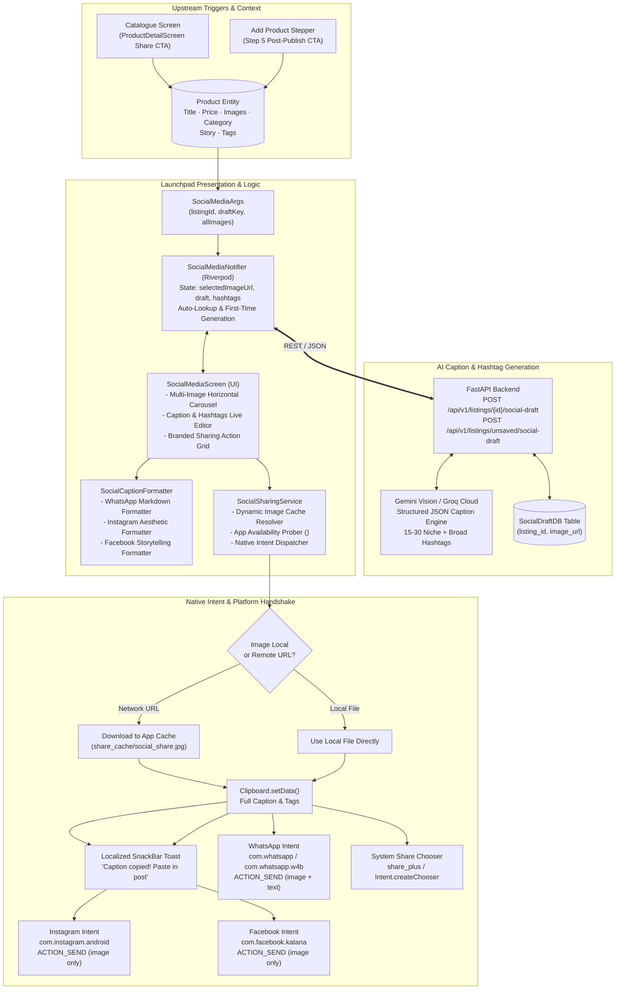
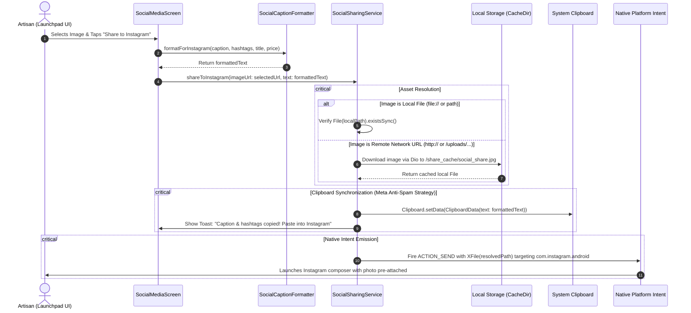
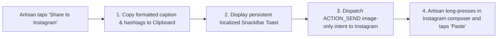
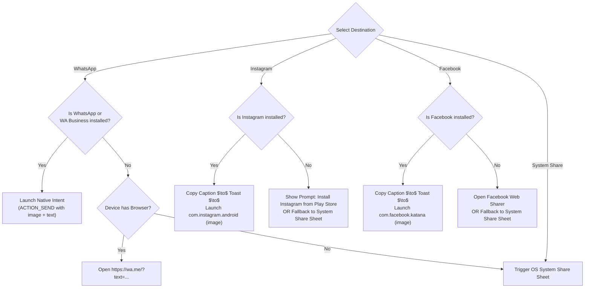
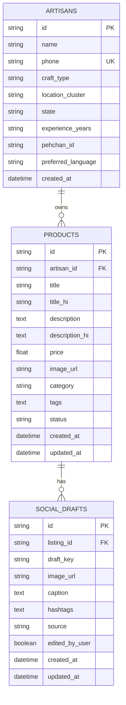
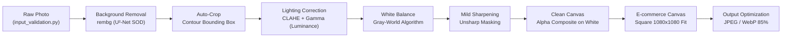
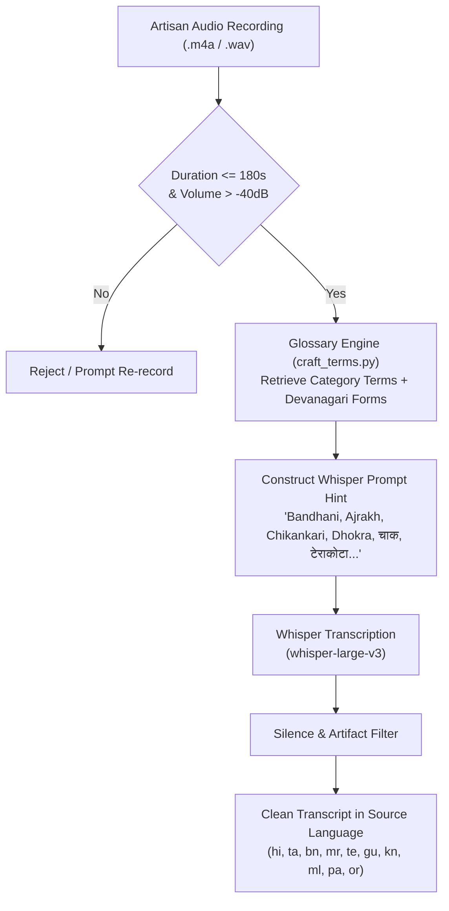
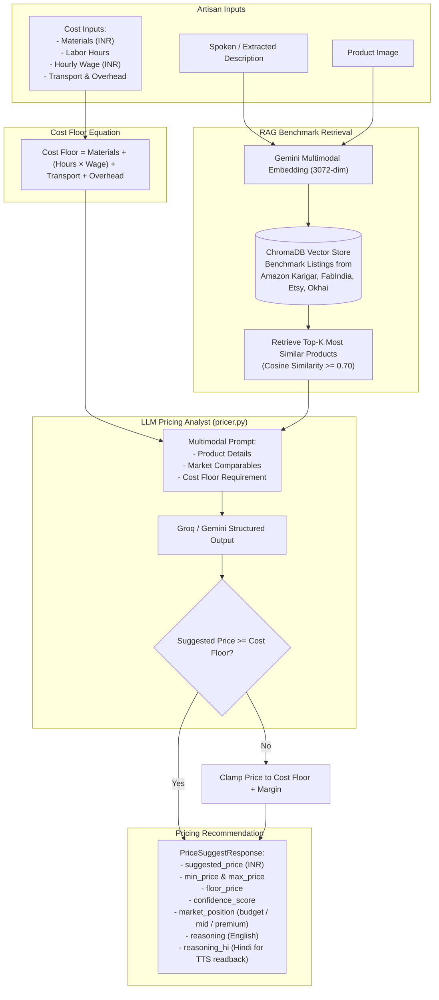
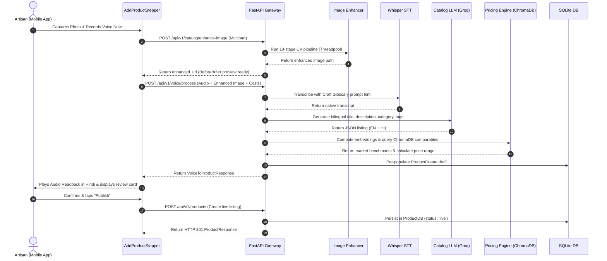

# KalaSetu — System Architecture & Technical Specification

> **AI-Driven Market Linkage & Smart Cataloging Platform for Marginalized Artisans**  
> *Built for Smart India Hackathon 2026 · Problem Statement PS-90*

---

## 1. Executive Summary & Core Mission

**KalaSetu (कलासेतु)** is an offline-first, multilingual, AI-powered "virtual business manager" built to bridge the digital and economic divide for India's traditional artisans, weavers, and craft clusters.

Government initiatives (e.g., *Shilp Samagam*, *Surajkund Mela*, *Dilli Haat*) provide seasonal market exposure, but when fairs conclude, artisan revenues halt. Traditional artisans face severe hurdles in accessing digital e-commerce:
1. **Camera & Studio Access:** Lack of equipment and studio lighting for e-commerce-grade product photos.
2. **Language & Digital Literacy:** Inability to write SEO-optimized English descriptions or navigate complex marketplace vendor dashboards.
3. **Information Asymmetry & Pricing:** Vulnerability to predatory middlemen due to a lack of benchmark market pricing data.
4. **Rural Connectivity:** Unreliable or absent internet in artisan villages and rural craft clusters.

KalaSetu solves this by transforming a simple phone camera capture and a regional spoken voice note into a studio-grade, fairly-priced, bilingual (Hindi & English) product listing with zero typing, zero English requirement, and complete offline capability.

---

## 2. High-Level System Architecture

KalaSetu is designed as a distributed, offline-first client-server ecosystem consisting of a cross-platform **Flutter mobile/web application**, an asynchronous **FastAPI API gateway**, a persistent **SQLite/SQLAlchemy database layer**, and three modular **Machine Learning pipelines** (Computer Vision, Speech-to-Text with Craft Glossary injection, and RAG-based Dynamic Pricing).

```mermaid
flowchart TB
    subgraph Client ["Client Layer — Flutter Cross-Platform (Android / iOS / Web)"]
        UI["UI Layer\n- 5-Step Add Product Stepper\n- Catalogue & Product Detail\n- KalaMitra AI Chatbot & Agent\n- Orders & Packaging Advisor\n- Artisan Stats Dashboard\n- Social Media Sharing Launchpad"]
        
        State["State Management\nFlutter Riverpod 2.x\nAsyncNotifier & StateProviders"]
        
        subgraph LocalStorage ["Offline-First Local Storage Engine"]
            DriftDB[("Drift SQLite Database\noffline_sync.sqlite\nMedia Upload Queue\nJobs & Retry Policy")]
            HiveBoxes[("Hive Key-Value Store\nproducts_box · draft_box\nuser_profile_box · auth_box\npending_sync_box · app_settings_box")]
        end

        NetDetect["Connectivity Monitor\nconnectivity_plus + Health Probe\nDynamic Base URL Discovery"]
        
        UI --> State
        State <--> DriftDB
        State <--> HiveBoxes
        State --> NetDetect
    end

    subgraph Gateway ["API Gateway & Backend — FastAPI"]
        Router["FastAPI Application (main.py)\nCORS · Static Media Mount (/uploads)\nAsync Lifespan & Threadpool Dispatch"]
        
        subgraph Endpoints ["REST API Endpoints"]
            AuthEP["/api/v1/auth\nRegister, Login, OTP, Profile"]
            ProdEP["/api/v1/products\nCRUD, Status Filter, /sync Batch"]
            CatEP["/api/v1/catalog\n/enhance-image, /transcribe,\n/generate-listing, /voice-to-product"]
            PriceEP["/api/v1/pricing\n/suggest, /suggest-upload,\n/suggest-from-voice"]
            VoiceEP["/api/v1/voice\n/transcribe, /process, /glossary"]
            ChatEP["/api/v1/chat\n/message, /quick-topics, /voice-message"]
            SocialEP["/api/v1/social-drafts\n/listings/{id}/social-draft, Lookup"]
            HealthEP["/api/v1/health\nLiveness & Connectivity Probe"]
        end

        subgraph Services ["Backend Core Services"]
            CatSvc["CatalogService\nThreadpool Runner, Audio Silence Check,\nHallucination Filter, Category Heuristic"]
            ChatSvc["ChatService\nDynamic System Prompt, Craft Context,\nAction Parser, Plain-Text Sanitizer"]
            PriceSvc["PricingService\nRAG Bridge, Cost Floor Enforcer,\nHindi TTS Reasoning Translator"]
            SocialSvc["SocialMediaService\nVision Captioning, Tone Engine,\nIn-Memory Rate Limiter"]
            GroqClnt["GroqClient\nAsync httpx Client, Thinking Tag Stripper,\nJSON Recovery, Model Cascade"]
            StorageSvc["StorageService\nLocal Disk Uploads, UUID Keying"]
        end

        DB[("Relational Database\nSQLite 3 via SQLAlchemy 2.0\nkalasetu.db\nartisans · products · social_drafts")]

        Router --> Endpoints
        Endpoints --> Services
        Services <--> DB
    end

    subgraph ML_Subsystems ["Machine Learning & AI Pipelines"]
        subgraph CV_Pipe ["Image Enhancement Pipeline (ML/image_pipeline)"]
            CV_Val["Input Validation & EXIF"]
            CV_Rembg["rembg (U²-Net SOD)\nAlpha Matting"]
            CV_Crop["Contour Bounding Auto-Crop"]
            CV_Light["CLAHE + Gamma (Luminance)"]
            CV_WB["Gray-World White Balance"]
            CV_Sharp["Unsharp Masking"]
            CV_Canvas["1080x1080 Studio Canvas"]
            CV_Val --> CV_Rembg --> CV_Crop --> CV_Light --> CV_WB --> CV_Sharp --> CV_Canvas
        end

        subgraph ASR_Pipe ["Voice & Audio Pipeline (ML/voice_pipeline)"]
            ASR_Pre["Volume & Duration Check\nffmpeg volumedetect (-40dB)"]
            ASR_Glossary["Craft Glossary Prompt Injection\n100+ Curated Indian Craft Terms\nDevanagari & Latin Orthography"]
            ASR_Whisper["Whisper STT (whisper-large-v3)\nOpenAI-Compatible Inference"]
            ASR_Filter["Silence Hallucination Guard\nStrip Gratuitous Outputs"]
            ASR_Pre --> ASR_Glossary --> ASR_Whisper --> ASR_Filter
        end

        subgraph Pricing_Pipe ["Dynamic Pricing Pipeline (ML/pricing)"]
            Price_Embed["Google Gemini Multimodal\ngemini-embedding-001\n3072-dim Unified Vector Space"]
            Price_Vector[("ChromaDB Vector Store\nCosine Similarity Index\nAmazon Karigar, FabIndia, Etsy, Okhai")]
            Price_Floor["Cost Floor Calculation\nMaterials + (Hours × Wage) + Freight + Overhead"]
            Price_RAG["RAG LLM Pricer (Groq / Gemini)\nPrice Range, Confidence, Market Position\nInvariant: Suggested Price >= Floor"]
            Price_Embed --> Price_Vector --> Price_RAG
            Price_Floor --> Price_RAG
        end
    end

    subgraph External_APIs ["External Foundation Models & Public Infrastructure"]
        GroqCloud["Groq Cloud API\nopenai/gpt-oss-120b\nqwen/qwen3.6-27b"]
        GoogleAI["Google Gemini API\ngemini-3.6-flash\ngemini-embedding-001"]
        WhisperAPI["Whisper STT Host\nOpenAI / Groq Whisper"]
        ONDC_GeM["ONDC / GeM Network\nArtisan Profile QR & B2B Linkage"]
        SocialSinks["Native Social Sinks\nWhatsApp · Instagram · Facebook · System Share"]
    end

    Client <==>|"REST / JSON / Multipart HTTP\nDynamic IP Bridge"| Gateway
    Client -.->|"Direct Native Intents & Clipboard Sync"| SocialSinks
    Services --> CV_Pipe
    Services --> ASR_Pipe
    Services --> Pricing_Pipe
    Services <--> GroqCloud
    Services <--> GoogleAI
    Services <--> WhisperAPI
    Services -.-> ONDC_GeM
```



---

## 3. Frontend Architecture (`frontend/`)

The mobile application is built using **Flutter** (Dart 3.x) and structured around **Domain-Driven Design (DDD)** principles, separating data layers, business logic/repositories, presentation widgets, and state providers.

```
frontend/lib/
├── main.dart                          # App bootstrap, Hive init, dynamic IP discovery, EasyLocalization
├── app.dart                           # MaterialApp wrapper, ThemeData, GoRouter binding
├── core/
│   ├── config/api_config.dart         # Dynamic IP candidate probe & failover
│   ├── offline_sync/                  # Drift SQLite queue, sync manager, background workers
│   │   ├── database/database.dart     # Drift DB definition (QueueItems table)
│   │   ├── models/queue_item.dart     # QueueItem, QueueStatus, QueueItemType
│   │   ├── services/sync_manager.dart # Upload orchestration & retries
│   │   └── offline_sync_service.dart  # Singleton facade for app-wide queue interaction
│   ├── providers/app_providers.dart   # Riverpod providers, AddProductDraft, ProductListNotifier
│   ├── router/                        # GoRouter definitions & auth route guards
│   ├── theme/                         # AppColors (terracotta, indigo, turmeric), AppTextStyles, Spacing
│   └── widgets/                       # Reusable buttons, cards, responsive widgets, banners
├── data/
│   ├── models/                        # Product, UserProfile, Order, ChatMessage, Pricing models
│   ├── repositories/                  # ProductRepository, AuthRepository (Hive + API sync)
│   └── services/                      # ApiService, HttpSpeechService, HttpImageEnhancerService, HttpSocialMediaService
└── features/
    ├── add_product/                   # 5-step smart cataloging wizard & before/after preview
    ├── auth/                          # Splash, language selector, OTP login, registration
    ├── catalogue/                     # Searchable grid/list catalogue, filters, detail view
    ├── chatbot/                       # KalaMitra AI conversational sheet & floating action button
    ├── home/                          # HomeShell bottom navigation (4 tabs)
    ├── notifications/                 # In-app notifications & fulfillment alerts
    ├── orders/                        # Order management, packaging suggestions, PDF label maker
    ├── profile/                       # Artisan profile, language settings, performance analytics
    └── social_media/                  # Multi-platform sharing launchpad & AI caption engine
        ├── providers/social_media_provider.dart
        ├── screens/social_media_screen.dart
        ├── services/social_sharing_service.dart
        └── utils/caption_formatter.dart
```

### 3.1 Design System & Accessibility for Marginalized Artisans
Artisans frequently experience challenges with standard e-commerce interfaces due to low digital literacy and language barriers. The design system explicitly enforces:
* **Earthy, Respectful Color Palette:** Primary Terracotta (`#C85A32`), Deep Indigo (`#1A2B4C`), Warm Turmeric (`#E09F3E`), Sage Green (`#4E7960`), and Canvas Surface (`#FDFBF7`).
* **Clear Typography:** Google Fonts *Zilla Slab* for headings and *Nunito Sans* for readable UI copy.
* **Large Touch Targets:** Minimum 48x48 dp interactive hitboxes.
* **High Contrast & Audio Guidance:** Every primary text block and listing reasoning incorporates audio readback buttons (Text-To-Speech).

### 3.2 Dual Offline-First Local Storage Engine

| Storage Engine | Technology | Responsibility |
|---|---|---|
| **Media Sync Queue** | **Drift (SQLite)** | Background queuing of heavy media tasks (`imageEnhance`, `voiceCatalog`). Tracks status (`pending`, `uploading`, `processing`, `completed`, `failed`), retry counters, error logs, and result JSON. |
| **Instant Data Store** | **Hive (NoSQL)** | Instant synchronous access to product records (`products_box`), pending mutation markers (`pending_sync_box`), draft state (`draft_box`), user credentials (`auth_box`), and app settings. |

#### Offline Sync Lifecycle:
1. **Local Instant Commit:** When an artisan adds or edits a product without internet, `ProductRepository` immediately writes the model into Hive with `status = ProductStatus.pendingSync` and notes the operation in `pending_sync_box`. The UI updates instantly with zero latency.
2. **Media Enqueuing:** Heavy images or audio recordings are copied to the application document directory and registered in Drift's `QueueItems` table.
3. **Connectivity Detection & Health Ping:** `ConnectivityService` listens to network state changes via `connectivity_plus` and verifies actual internet reachability by polling `/api/v1/health`.
4. **Batch Drain (`/api/v1/products/sync`):** As soon as connectivity returns, `SyncManager` drains the queue, uploads media, calls the FastAPI batch sync endpoint, receives server-assigned timestamps, and promotes local items to `ProductStatus.live`.

### 3.3 Dynamic IP Bridge (`ApiConfig.discoverWorkingUrl`)
Developing and testing across physical devices (e.g. Samsung SM-M346B on Wi-Fi), Android emulators, and local machines often fails due to hardcoded localhost IPs. KalaSetu implements dynamic backend discovery on startup:
* Automatically probes candidate addresses in parallel:
  1. Host Wi-Fi LAN IP (e.g. `http://192.168.1.5:8000`)
  2. Android emulator virtual bridge (`http://10.0.2.2:8000`)
  3. Loopback (`http://127.0.0.1:8000`)
* Locks onto the first responsive address that returns HTTP 200 on `/api/v1/health`.

### 3.4 Multi-Step Smart Cataloging Flow (`features/add_product`)
The listing creation wizard is partitioned into 5 state-managed steps via `AddProductDraft`:
* **Step 1 — Capture & Enhance:** Camera capture or gallery picker with an interactive Before/After image comparison slider powered by the 10-stage AI image pipeline. Supports adding up to 3 high-resolution angles.
* **Step 2 — Voice Description:** Audio recorder paired with spoken visual cue chips:
  * *"सामग्री"* (Materials: clay, silk, brass, etc.)
  * *"बनाने में लगा समय"* (Hours of manual labor invested)
  * *"विशेष तकनीक"* (Heritage technique: wheel-thrown, handloom pit loom, lost-wax casting)
* **Step 3 — AI Listing Review:** Generates engaging, SEO-friendly e-commerce titles, storytelling descriptions in English and Hindi Devanagari, tags, and craft categorization with an in-place regeneration trigger.
* **Step 4 — Dynamic Pricing Assistant:** Displays a breakdown of raw material costs, labor hours, and artisan hourly wage floor alongside suggested market price ranges and comparable products.
* **Step 5 — Confirmation & Publishing:** Artisan reviews final listing details, previews AI-generated social media captions, and publishes (or queues for offline sync).

### 3.5 KalaMitra AI Chatbot & In-App Navigation Agent (`features/chatbot`)
`KalaMitra` (कला-मित्र) is an integrated conversational AI mentor and autonomous app navigator:
* **Artisan Craft Contextualization:** Automatically recognizes the artisan's registered craft (e.g. *Terracotta Pottery*, *Chanderi Handloom*) and tailors all technical, packaging, and pricing advice to that trade.
* **Autonomous Navigation & Tool Execution:** Emits structured in-app actions (`ChatActionSchema`) that the Flutter client executes:
  * `navigate`: Switches bottom navigation tabs or pushes GoRouter routes.
  * `update_product_status`: Directly marks items as sold or relisted in Hive with one-tap Undo.
  * `filter_catalogue`: Pre-filters catalog views by search term or craft category.
  * `sync_pending`: Manually triggers immediate offline sync queue drain.
* **Accessibility Strict Formatting:** Enforces an absolute ban on raw asterisks (`*` or `**`) in responses to ensure clean rendering on standard text views for non-tech-savvy users.
* **Cross-Language Detection:** If an artisan asks a question in a language different from the app's selected UI locale, KalaMitra answers in the query's language and emits a navigation action to switch the app language.

### 3.6 Orders, AI Packaging Advisory & PDF Label Maker (`features/orders`)
* **Order Tracking Pipeline:** Tracks B2B and direct consumer orders across states (`newOrder` $\to$ `packed` $\to$ `shipped` $\to$ `delivered`).
* **Category Packaging Advisory:** Provides tailored material suggestions to prevent in-transit breakage:
  * *Pottery/Terracotta:* Double-wall corrugated boxes, shredded paper/straw cushioning, corner guards.
  * *Textiles/Silk:* Moisture-proof inner lining, acid-free tissue paper wrapping.
  * *Brass/Metal:* Anti-tarnish wrapping, bubble-wrap buffers.
* **Printable Artisan Story & Packaging Label (`LabelMakerService`):** Generates ready-to-print PDF shipping labels complete with:
  * Order and consignee details.
  * Bilingual craft story and artisan heritage narrative.
  * Wash-care and handling instructions.
  * Verified ONDC/GeM artisan profile QR code.

### 3.7 Social Media Helper & Sharing Launchpad Integration
The social media promotion workflow is anchored directly into the product lifecycle. Rather than acting as an isolated copy generator, it provides a unified multi-platform launchpad allowing artisans to broadcast their listings directly to WhatsApp, Instagram, Facebook, and the native OS Share Sheet. Complete architectural specification, platform policy constraints, package visibility requirements, and fallback pipelines are detailed in **Section 4**.

---

## 4. Social Media Helper — Multi-Platform Sharing Launchpad Architecture

The **Social Media Helper & Multi-Platform Sharing Launchpad** (`features/social_media`) bridges AI-generated e-commerce catalog listings and direct consumer marketing across dominant Indian social and messaging channels.



### 4.1 System Context & Architectural Seam [V1 CONTRACT]

The Multi-Platform Sharing Launchpad sits at the convergence of two critical user workflows:
1. **Catalogue Promotion Seam:** Located in `ProductDetailScreen` via the "Promote Listing / सोशल मीडिया पर शेयर करें" action chip. Artisans can re-open the helper at any point to broadcast seasonal offers or festival discounts.
2. **Post-Publishing Onboarding Seam:** Located in `step5_confirm_widget.dart` of the `AddProductFlowScreen`. Immediately after creating a new product listing (online or offline), artisans are guided to broadcast their newly digitized craft to buyers.

#### Upstream Contract:
The launchpad consumes `SocialMediaArgs`:
* `listingId`: UUID of persisted product (nullable during draft add-flow).
* `draftKey`: Ephemeral draft ID from the stepper (upsert key when unsaved).
* `allImages`: List of image paths (original, enhanced, and additional angles).
* `title`, `category`, `materials`, `description`: Craft metadata used to ground the LLM prompt and prevent factual hallucination.

#### Downstream Sinks:
* **WhatsApp (`com.whatsapp`, `com.whatsapp.w4b`):** Primary B2B and direct consumer communication medium in India.
* **Instagram (`com.instagram.android`):** Key visual discovery channel for urban buyers and export handicraft lovers.
* **Facebook (`com.facebook.katana`):** Popular community platform for regional artisan clusters, craft cooperatives, and exhibitions.
* **System Share Sheet (`share_plus`):** OS-level fallback supporting Telegram, SMS, Email, and Bluetooth/Nearby Share.

---

### 4.2 Component Breakdown & Responsibility Matrix [V1 CONTRACT]

The launchpad follows strict separation of concerns across presentation, state, formatting, and native platform integration:

| Component | Layer / Path | Primary Responsibility | Inputs | Outputs / Side Effects |
|---|---|---|---|---|
| **`SocialSharingService`** | `core/services/social_sharing_service.dart` | Encapsulates native platform channels, URI schemes, package availability queries, and temporary asset resolution. | Destination platform enum, local/remote image path, formatted text | Dispatches native `ACTION_SEND` intents, synchronizes system clipboard, displays toasts. |
| **`SocialCaptionFormatter`** | `features/social_media/utils/caption_formatter.dart` | Formats the base AI caption into channel-tailored templates adhering to platform syntax and character constraints. | Caption string, hashtags list, product title, price, ONDC link | Channel-optimized text strings (WhatsApp, Instagram, Facebook, Generic). |
| **`SocialMediaScreen`** | `features/social_media/screens/social_media_screen.dart` | Redesigned presentation surface offering image carousel, inline editing, hashtag chip management, and branded action grid. | `SocialMediaArgs` via route parameters | User mutations (caption edits, tag additions, destination share taps). |
| **`SocialMediaNotifier`** | `features/social_media/providers/social_media_provider.dart` | Riverpod `StateNotifier` managing the async lifecycle of draft generation, image normalization, error recovery, and persistence. | `SocialMediaArgs`, `HttpSocialMediaService` | Emits `SocialMediaState` (`selectedImageUrl`, `draft`, `hashtags`, `isLoading`, `isSaving`). |
| **`HttpSocialMediaService`**| `data/services/social_media_service.dart` | HTTP client communicating with FastAPI backend `/api/v1/listings/{id}/social-draft`. | Listing metadata, image URL, desired tone (`warm`, `playful`, `minimal`) | Returns validated `SocialDraft` model. |

---

### 4.3 Data Flow & Asset Resolution Pipeline [DATA FLOW]

Dispatched native intents on Android and iOS require physical file references that can be shared via the Android `FileProvider` or iOS share sheet. Sharing a raw HTTP URL as an image attachment will crash or be ignored by external apps. KalaSetu executes a deterministic 4-stage asset and caption resolution pipeline:



#### Detailed Pipeline Stages:
1. **Asset Normalization & Image Resolution:**
   - If the selected asset is already a local file path (`photoPath` from camera/gallery), the path is validated directly.
   - If the asset is a network URL (e.g. enhanced image served from backend `/uploads/enhanced/...` or remote storage), `SocialSharingService` verifies if a cached copy exists. If not, it streams the image to the app's temporary cache directory (`getTemporaryDirectory() / share_cache/`), naming it deterministically with a SHA-256 hash of the URL to prevent repeated downloads.
2. **Channel-Specific Caption Generation:**
   - **WhatsApp Template:** Applies WhatsApp markdown formatting (`*` for bold titles, bullet points `•`, pricing highlighted as `*मूल्य: ₹950*`), craft heritage summary, and direct order link.
   - **Instagram Template:** Formats visual storytelling layout with paragraph breaks, craft tags, artisan village mention, and 20–30 structured hashtags grouped at the bottom.
   - **Facebook Template:** Focuses on community narrative, craft history, cluster location, and an explicit buying CTA.
3. **Clipboard Synchronization:**
   - Regardless of destination, the launchpad synchronously writes the compiled text to the system clipboard via `Clipboard.setData()`.
4. **Intent Packaging & Execution:**
   - Dispatches the appropriate platform intent using `share_plus` / Android `Intent` flags.

---

### 4.4 Platform Intent Constraints & Meta Anti-Spam Policy [DESIGN DECISION]

A frequent pitfall in cross-platform mobile development is the assumption that Android's standard `ACTION_SEND` intent with `Intent.EXTRA_TEXT` behaves uniformly across all social platforms.

#### The Meta Anti-Spam Policy Barrier (Instagram & Facebook):
* **Meta Platform Policy 2.3:** Meta's developer terms strictly state:
  > *"2.3 Don't pre-fill captions, comments, or user messages. You must obtain all content directly from the user."*
* **Native Implementation Constraint:** Both `com.instagram.android` and `com.facebook.katana` explicitly ignore `Intent.EXTRA_TEXT` when receiving an image intent (`ACTION_SEND` with `image/*`). If an app bundles pre-filled caption text with an image, Instagram strips the text completely, while Facebook may reject the intent entirely or throw an `ActivityNotFoundException`.

#### The KalaSetu Clipboard-First Strategy [ADR-001]:
To ensure a zero-friction experience for marginalized artisans while complying with Meta platform rules, KalaSetu implements the **Clipboard-First Toast Pattern**:



* **Feedback Message:**
  * *English:* *"Caption & hashtags copied to clipboard! Opening Instagram — just paste in your post caption."*
  * *Hindi:* *"विवरण और हैशटैग कॉपी हो गए हैं! इंस्टाग्राम खुल रहा है — पोस्ट में पेस्ट करें।"*

#### Contrast with WhatsApp:
WhatsApp does **not** enforce this restriction. It natively accepts pre-populated text in `ACTION_SEND` alongside media (`EXTRA_STREAM`), enabling a genuine 1-tap sharing experience for direct messaging and WhatsApp Status.

---

### 4.5 Android Package Visibility & Native Manifest Requirements (`<queries>`) [INVARIANT]

Starting with **Android 11 (API Level 30)**, Google introduced package visibility filtering to limit an application's ability to inspect other installed apps on the device. 

#### Architectural Consequence:
If an application does not declare target packages in its `AndroidManifest.xml`, API calls like `canLaunchUrl(Uri.parse('whatsapp://...'))` or intent resolution queries will return `false`, even if WhatsApp or Instagram is actively installed on the user's phone. This causes the launchpad to mistakenly assume target apps are missing and trigger unnecessary fallback sheets.

#### Mandatory Manifest Contract:
To ensure reliable app-detection across Android 11, 12, 13, 14, and 15, `frontend/android/app/src/main/AndroidManifest.xml` must declare the following explicit `<queries>` block:

```xml
<queries>
    <!-- WhatsApp (Consumer) -->
    <package android:name="com.whatsapp" />

    <!-- WhatsApp Business (Extensively used by Indian craft cooperatives) -->
    <package android:name="com.whatsapp.w4b" />

    <!-- Instagram -->
    <package android:name="com.instagram.android" />

    <!-- Facebook -->
    <package android:name="com.facebook.katana" />

    <!-- Generic Send Intents for Image and Text Sharing -->
    <intent>
        <action android:name="android.intent.action.SEND" />
        <data android:mimeType="image/*" />
    </intent>
    <intent>
        <action android:name="android.intent.action.SEND" />
        <data android:mimeType="text/plain" />
    </intent>
</queries>
```

---

### 4.6 Fallback Matrix & Fault-Tolerant Dispatch [RESILIENCE]

Artisans operate budget Android devices with varying sets of installed applications. The launchpad guarantees that sharing never fails silently, implementing a hierarchical fallback matrix:



#### Detailed Fallback Rules:

| Target Platform | Primary Mechanism | Fallback Trigger | Graceful Degradation Action |
|---|---|---|---|
| **WhatsApp** | Native intent to `com.whatsapp` with image + text | Neither WhatsApp nor WA Business installed | 1. Attempt WhatsApp Web URL scheme (`https://wa.me/?text=...`).<br>2. Fall back to OS System Share Sheet (`share_plus`). |
| **Instagram** | Native intent to `com.instagram.android` with image | Instagram not installed | 1. Copy formatted caption to clipboard.<br>2. Show dialog: "Instagram not found" with direct Google Play link (`market://details?id=com.instagram.android`) and "Share via other apps" fallback button. |
| **Facebook** | Native intent to `com.facebook.katana` with image | Facebook app not installed | 1. Copy formatted caption to clipboard.<br>2. Open browser URL `https://www.facebook.com/sharer/sharer.php`.<br>3. Fall back to OS System Share Sheet. |
| **Any Platform** | Image cache download fails | Device offline or backend unreachable | Use original unenhanced image from local device storage (`photoPath`) rather than blocking the share. |

---

### 4.7 Testing, Verification & Device Validation [VERIFICATION]

The launchpad architecture is verified across three testing tiers:

#### 1. Unit Tests (`frontend/test/social_sharing_service_test.dart`):
* **Caption Formatting:** Verifies that `SocialCaptionFormatter` correctly formats WhatsApp bolding, Instagram hashtag blocks, and Facebook storytelling copy.
* **URL Encoding:** Verifies proper URI component encoding of Hindi Devanagari text in `whatsapp://send?text=...` schemes.
* **Clipboard Mocking:** Validates that `Clipboard.setData` is called with exact expected string payloads prior to intent dispatch.

#### 2. Widget & Provider Tests:
* Verifies thumbnail switching in the multi-image horizontal carousel.
* Validates chip additions, deletions, and character counter limits.
* Tests error panel rendering and retry callbacks when backend generation returns HTTP 500/502.

#### 3. Live Physical Device Validation:
* **Reference Device:** Samsung Galaxy SM-M346B (Android 14 / API 34).
* **Package Query Verification:** Verified that `<queries>` declarations successfully permit `canLaunchUrl` to detect WhatsApp and Instagram without throwing security exceptions.
* **Intent Launch Verification:** Confirmed that tapping "Share to WhatsApp" opens the contact picker with image and pre-filled text intact. Confirmed that tapping "Share to Instagram" triggers the clipboard copy toast and directly opens the Instagram photo editor.

---

### 4.8 Architecture Decision Records (ADRs) [ADR]

#### [ADR-001] Clipboard-First Pre-Fill Strategy for Meta Applications
* **Status:** Accepted & Implemented
* **Context:** Artisans need their product story, price, and hashtags shared to Instagram and Facebook, but Meta Platform Policy 2.3 blocks external pre-filled text in `ACTION_SEND` intents.
* **Decision:** Automate clipboard copying on tap, display a high-visibility localized instructional SnackBar (*"Caption copied! Long press to paste in Instagram"*), and dispatch image-only native intents.
* **Consequences:** Eliminates intent crash bugs; maintains 100% compliance with Meta platform policies; provides consistent artisan UX.

#### [ADR-002] Dynamic Image Cache Normalization for Native Intent Dispatch
* **Status:** Accepted & Implemented
* **Context:** Product images may reside in local storage (new camera capture) or on remote servers (enhanced AI photo URL). Native Android/iOS intents require a local `file://` or FileProvider URI.
* **Decision:** Implement a dynamic asset resolver in `SocialSharingService` that verifies local file presence, downloads remote assets into a dedicated `share_cache/` directory on demand, and shares the local path.
* **Consequences:** Prevents `FileUriExposedException` and network intent failures; ensures offline sharing works for locally stored images.

---

## 5. Backend Architecture (`backend/`)

The backend is built on **FastAPI** with Python 3.10+, utilizing asynchronous event loops, Pydantic v2 schemas for strict contract validation, and SQLAlchemy 2.0 ORM with SQLite (`backend/kalasetu.db`).

```
backend/
├── main.py                        # FastAPI application entrypoint, CORS, static uploads mount
├── config.py                      # Pydantic Settings, environment variables, directories
├── database.py                    # SQLAlchemy engine, SessionLocal, get_db dependency
├── kalasetu.db                    # Persistent SQLite database
├── models/
│   ├── db_models.py               # ArtisanDB, ProductDB, SocialDraftDB
│   └── schemas.py                 # Pydantic DTOs for requests and responses
├── routers/
│   ├── auth.py                    # Phone login, artisan profile, OTP endpoints
│   ├── catalog.py                 # Image enhance, transcription, listing generation
│   ├── chat.py                    # KalaMitra chat, voice chat, quick topics, rate limiter
│   ├── health.py                  # Health check probe
│   ├── pricing.py                 # Price suggestion endpoints (JSON, upload, voice)
│   ├── products.py                # Product CRUD & offline queue batch sync (/sync)
│   ├── social.py                  # Social media caption generation & draft persistence
│   └── voice.py                   # Voice transcribe, complete voice-to-product pipeline
├── services/
│   ├── catalog_service.py         # Threadpool dispatcher, hallucination filter, voice orchestrator
│   ├── chat_service.py            # KalaMitra LLM engine, prompt builder, action extractor
│   ├── groq_client.py             # Async httpx client with fallback cascades & tag cleaning
│   ├── pricing_service.py         # Bridge to ML pricing processor & Hindi TTS translator
│   ├── social_media_service.py    # Vision-based social caption generation & rate limiting
│   └── storage_service.py         # File persistence & URL mapping
└── tests/                         # Pytest test suite for API, chat actions, and pipelines
```

### 5.1 Database Schema & Data Models (`backend/models/db_models.py`)



* **`ArtisanDB`:** Stores registered artisan profiles. Identified by 10-digit mobile number, Pehchan ID (Ministry of Textiles artisan identification card), primary craft trade, and geographic cluster.
* **`ProductDB`:** Stores catalog listings. Features bilingual titles (`title`, `title_hi`), bilingual storytelling descriptions (`description`, `description_hi`), selling price, image path, status (`live`, `draft`, `sold`, `soldOut`, `listingRemoved`), and JSON-encoded tags.
* **`SocialDraftDB`:** Persists generated Instagram/Facebook/WhatsApp promotional copy and hashtags, keyed by `(listing_id, image_url)` or add-flow `(draft_key, image_url)`.

### 5.2 Centralized LLM & Inference Routing
The backend supports multi-provider LLM orchestration with seamless failover:
1. **Primary Chat & Text Structuring:** **Groq Cloud API** (`openai/gpt-oss-120b` or `qwen/qwen3.6-27b`) delivering sub-second conversational latency and structured JSON output.
2. **Multimodal Vision & Embeddings:** **Google Gemini API** (`gemini-3.6-flash`, `gemini-embedding-001`) for visual product inspection, social media captioning from images, and 3072-dimensional multimodal embeddings.
3. **Speech-to-Text:** OpenAI-compatible **Whisper API** (`whisper-large-v3`) with craft vocabulary prompting.
4. **Resilient Local Fallbacks:** Rule-based heuristics guarantee that if external APIs are unreachable, catalog listings and pricing advice still generate deterministically.

### 5.3 Resilience & Guardrails
* **Non-Blocking Image Processing:** CPU-heavy OpenCV, Pillow, and rembg executions are dispatched via `starlette.concurrency.run_in_threadpool`, keeping FastAPI's `asyncio` event loop responsive.
* **Audio Silence & Hallucination Guard:** Uses `ffmpeg volumedetect` to measure decibel levels; audio below `-40 dB` is rejected immediately before making API calls. Transcripts are checked against regex patterns to eliminate known Whisper silence hallucinations (*"Thanks for watching"*, *"Please subscribe"*, *"धन्यवाद"* repetition loops).
* **API Rate Limiting:**
  * Chat endpoint (`/api/v1/chat/message`): Capped at 20 requests per minute per IP.
  * Social helper (`/api/v1/listings/{id}/social-draft`): In-memory sliding window allows a maximum of 5 regenerations per hour per listing.

---

## 6. Machine Learning Pipelines (`ML/`)

KalaSetu embeds three specialized ML subsystems located in the `/ML` directory:

### 6.1 Computer Vision Image Enhancement Pipeline (`ML/image_pipeline`)
The image pipeline transforms a raw, cluttered, poorly-lit phone photograph taken in a rural workshop into an e-commerce-ready studio asset.



#### Pipeline Stages:
1. **Input Validation:** Verifies image integrity, handles EXIF orientation rotation, and converts RGBA/palette modes.
2. **Background Removal:** Executes `rembg` (U²-Net Salient Object Detection) to isolate the handicraft foreground, producing a clean alpha transparency mask.
3. **Product Detection & Auto-Crop:** Analyzes non-zero alpha contours to crop tightly around the product with a configurable 8% margin padding.
4. **Lighting Correction:** Converts image to the LAB color space and applies CLAHE (Contrast Limited Adaptive Histogram Equalization) with gamma correction strictly on the **L (Luminance)** channel. *Crucial:* Performed *before* placing on white canvas to avoid histogram distortion caused by pure white backgrounds.
5. **White Balance Correction:** Implements the gray-world assumption to neutralize heavy warm/cold color casts from household bulbs.
6. **Sharpening:** Applies subtle unsharp masking to emphasize fine artisanal details (wood grain, embroidery weaves, metal engraving).
7. **Canvas Compositing:** Composites the enhanced foreground onto a pure white (`#FFFFFF`) or off-white studio background.
8. **E-Commerce Canvas Standard:** Centers and scales the product onto a standard square e-commerce canvas (1080x1080 px).

---

### 6.2 Speech-to-Text with Craft Glossary Biasing (`ML/voice_pipeline`)
General ASR models trained on broadcast news fail catastrophically on regional handicraft terminology:
* *"Dhokra"* (ancient lost-wax casting) is misrecognized as *"doctor"*.
* *"Chikankari"* (Lucknow embroidery) is misrecognized as *"chicken curry"*.
* *"चाक"* (potter's wheel) is misrecognized as *"चात"*.

To solve this, KalaSetu implements **Craft Glossary Prompt Biasing**:



#### Domain Vocabulary Corpus (`craft_terms.py`):
* **Textiles:** Bandhani, Ajrakh, Chikankari, Kalamkari, Ikat, Patola, Banarasi, Chanderi, Kanjeevaram, Phulkari, Kantha, Zari, Zardozi, Tussar, Muga silk.
* **Pottery:** Terracotta, Khurja, Blue pottery, Chaak, Kulhad, Surahi, Matka, Diya, Glazed earthenware.
* **Metalwork:** Dhokra, Bidriware, Bell metal, Thewa, Meenakari, Filigree, Kansa, Repousse.
* **Paintings:** Madhubani, Mithila, Pattachitra, Warli, Gond, Kalighat, Phad, Tanjore, Cheriyal.
* **Wood & Bamboo:** Channapatna, Sandalwood carving, Rosewood inlay, Sheesham, Sikki grass, Jute craft.
* **Devanagari Set:** Full dual-script glossary ensures phonetic alignment in native Devanagari output.

---

### 6.3 Dynamic Pricing Engine (`ML/pricing`)
Marginalized artisans frequently sell goods below cost due to lack of market data, while middlemen capture 300–500% retail markups. KalaSetu enforces an unbreachable mathematical cost floor combined with vector-based market retrieval:



#### The Cost Floor Mathematical Invariant:
$$\text{Cost Floor} = C_{\text{materials}} + (T_{\text{labor}} \times W_{\text{hourly}}) + C_{\text{transport}} + C_{\text{overhead}}$$

The prompt explicitly programs the LLM with this hard invariant:
$$\text{Suggested Price} \ge \text{Cost Floor}$$
If an LLM hallucinates a price below this threshold, server-side post-processing clamps `suggested_price` to the cost floor plus craft category baseline margins.

---

## 7. End-to-End Sequence Workflows

### 7.1 Unified Voice-to-Product Cataloging Flow



### 7.2 Offline Capture and Reconnection Synchronization

```mermaid
sequenceDiagram
    autonumber
    actor Artisan as Artisan (Offline)
    participant App as Flutter App
    participant Hive as Hive Store
    participant Drift as Drift SQLite Queue
    participant Net as Connectivity Monitor
    participant API as FastAPI Backend
    participant RemoteDB as Server SQLite

    Note over Artisan,Drift: Artisan captures product while offline in cluster
    Artisan->>App: Creates product listing & saves
    App->>Hive: Put product (status: 'pendingSync')
    App->>Hive: Record operation in 'pending_sync_box'
    App->>Drift: Enqueue image & audio files (QueueItems: pending)
    App-->>Artisan: Listing saved locally! Shows "Sync Pending" badge

    Note over Net,API: Artisan travels to town; internet connectivity restores
    Net->>App: Connectivity changed (WiFi/Cellular detected)
    App->>API: GET /api/v1/health (Probe reachability)
    API-->>App: HTTP 200 OK

    App->>Drift: Read pending queue items
    loop For each queued media file
        App->>API: Upload media to /uploads/
        API-->>App: Return server media URL
        App->>Drift: Mark QueueItem completed
    end

    App->>Hive: Fetch all pendingSync products
    App->>API: POST /api/v1/products/sync (Batch payload)
    API->>RemoteDB: Upsert products into ProductDB (status: 'live')
    RemoteDB-->>API: Persisted
    API-->>App: ProductSyncResponse (synced_count: N)

    App->>Hive: Update local products (status: 'live')
    App->>Hive: Clear 'pending_sync_box'
    App-->>Artisan: Notification: "All offline products synced successfully!"
```

---

## 8. Security, Privacy & Production Readiness

### 8.1 Data Protection & Privacy
* **Artisan Data Sovereignty:** Phone numbers and Pehchan IDs are stored exclusively in the artisan's dedicated database record. Pehchan ID numbers are optional and never transmitted to third-party LLM prompts.
* **Scoped File Storage:** Uploaded media files are hashed with UUID prefixes (`uuid.uuid4().hex`) and segregated into dedicated directories (`/uploads/raw`, `/uploads/enhanced`, `/uploads/audio`, `/uploads/products`). Path traversal attacks are mitigated using resolved paths.

### 8.2 Guardrails & LLM Content Filtering
* **Strict Handicraft Domain Scope:** The `KalaMitra` system prompt incorporates strict boundary guardrails. Queries regarding politics, speculative finance, or unrelated topics are politely redirected back to craft advisory and marketplace assistance.
* **Zero Asterisks Mandate:** System prompts enforce clean, plain-text responses without markdown asterisks to guarantee high-legibility rendering on mobile displays.
* **Dynamic Language Adaptation:** Prompts instruct the model to always match the artisan's conversational language (e.g. Hindi Devanagari or Hinglish) rather than defaulting to English.

### 8.3 Rate Limiting & Abuse Prevention
* **Chat Endpoint Limiting:** Enforces in-memory IP tracking (`20 req/min`) with automatic window pruning to protect backend inference budgets from spam or automated scrapers.
* **Social Helper Limiting:** Prevents token exhaustion by restricting caption regenerations to 5 per hour per listing.

---

## 9. Technology Stack Summary

| Subsystem | Technology | Purpose & Rationale |
|---|---|---|
| **Mobile & Web UI** | Flutter 3.x / Dart 3.x | Single codebase for Android, iOS, and Web. Native hardware camera and microphone integration. |
| **State Management** | Flutter Riverpod 2.x | Compile-safe, reactive state management with dependency injection. |
| **Local Relational Queue** | Drift (SQLite) | Persistent offline media upload queue with retry mechanisms and reactive streams. |
| **Local Document Store** | Hive | High-speed, lightweight local NoSQL key-value cache for products and settings. |
| **Navigation** | GoRouter | Declarative URL-based routing with route-level authentication guards. |
| **Backend Framework** | FastAPI (Python 3.10+) | High-performance async REST gateway with OpenAPI/Swagger auto-documentation. |
| **Relational Database** | SQLAlchemy 2.0 / SQLite 3 | Embedded, zero-configuration relational persistence for artisans, products, and social drafts. |
| **Vector Store** | ChromaDB | Lightweight, open-source vector store for cosine similarity search over benchmark products. |
| **Image Processing** | OpenCV, Pillow, rembg | Auto-crop, CLAHE lighting enhancement, gray-world white balance, U²-Net background removal. |
| **Speech-to-Text** | Whisper (`whisper-large-v3`) | OpenAI-compatible endpoint with craft glossary vocabulary prompt injection. |
| **Primary LLM** | Groq Cloud (`gpt-oss-120b`) | Ultra-low latency conversational assistant (KalaMitra) and structured JSON cataloging. |
| **Multimodal LLM & Embed** | Google Gemini (`gemini-3.6-flash`) | Visual analysis for social media drafting and 3072-dimensional multimodal embeddings. |
| **PDF Label Generation** | Dart `pdf` & `printing` | On-device rendering of printable bilingual packaging labels with ONDC QR codes. |
| **Social Intent Dispatch** | Dart `share_plus` / platform channels | Native sharing intents for WhatsApp, Instagram, Facebook, and System Share Sheet. |
| **Audio Silence Detection** | `ffmpeg` (volumedetect) | Native audio energy analysis to reject silent recordings before executing AI inference. |

---

## 10. Verification & Test Suite

The platform includes comprehensive test suites across backend, ML, and frontend modules:

| Test Target | Test File | Key Coverage |
|---|---|---|
| **Chat Direct Actions** | `backend/tests/test_chat_actions.py` | Validates that user utterances trigger structured navigation actions (`update_product_status`, `filter_catalogue`, `sync_pending`) in English and Hindi. |
| **Chat API & Guardrails** | `backend/tests/test_chat_api.py` | Validates rate limiting (HTTP 429), quick topics, language matching, and system prompt constraints. |
| **Backend Integration** | `backend/tests/test_api.py` | Tests authentication endpoints, product CRUD, and batch offline synchronization (`/sync`). |
| **Voice Integration** | `backend/tests/test_voice_integration.py` | Tests audio silence checks, Whisper transcription, craft glossary injection, and voice-to-product. |
| **Image Pipeline** | `backend/tests/test_image_pipeline_integration.py` | Tests non-blocking image enhancement and output quality. |
| **Frontend Direct Actions** | `frontend/test/chatbot_direct_actions_test.dart` | Tests Riverpod chat notifier executing direct Hive status updates, undo triggers, and catalog filter changes. |
| **Add Product Stepper** | `frontend/test/add_product_flow_test.dart` | Verifies multi-step draft progression, state persistence, and draft resumption dialogs. |
| **Artisan Analytics** | `frontend/test/artisan_analytics_test.dart` | Verifies calculation of fair wage premiums earned over middleman rates. |
| **Packaging & Orders** | `frontend/test/my_orders_chip_test.dart` | Tests order status transitions and craft packaging advisory logic. |

---

*Document maintained under `docs/ARCHITECTURE.md` as the definitive technical architectural specification for KalaSetu.*
