# KalaSetu — System Architecture & Technical Specification

> **AI-Driven Market Linkage & Smart Cataloging Platform for Marginalized Artisans**  
> *Built for Smart India Hackathon 2026 · Problem Statement PS-90*

---

## 1. Executive Summary & Core Mission

**KalaSetu (कलासेतु)** is an offline-first, multilingual, AI-powered "virtual business manager" built to bridge the digital, economic, and linguistic divide for India's traditional artisans, weavers, and rural craft clusters.

Government initiatives (e.g., *Shilp Samagam*, *Surajkund Mela*, *Dilli Haat*) provide temporary, seasonal market exposure, but when exhibitions end, artisan revenues collapse. Traditional craftspeople face four structural barriers when trying to sell online:
1. **Studio Quality Barrier:** Lack of photography equipment, lighting, and knowledge to create clean e-commerce product photos.
2. **Linguistic & Digital Literacy Barrier:** Inability to write SEO-optimized product descriptions in English or navigate complex multi-step e-commerce seller portals.
3. **Information Asymmetry & Exploitative Pricing:** Inability to assess fair market benchmarks, leaving artisans vulnerable to predatory middlemen who capture 300% to 500% retail markups.
4. **Connectivity Barrier:** Unreliable or absent cellular data in rural craft clusters and remote artisan villages.

KalaSetu solves these challenges through a unified mobile-first ecosystem: the artisan captures a photo and speaks naturally in their regional mother tongue. The platform automatically enhances the photo to studio grade, transcribes the dialect with domain craft vocabulary biasing, generates structured bilingual (Hindi & English) listings, calculates a mathematically guaranteed fair price floor with market comparables, reads results aloud via on-device Text-to-Speech so non-literate artisans can understand every screen, and enables instant 1-tap multi-platform social sharing — fully functional even when completely offline.

---

## 2. High-Level System Architecture

KalaSetu is designed as a modular, 4-tier distributed architecture spanning client-side presentation, local offline persistence, an asynchronous API gateway, and specialized machine learning pipelines.

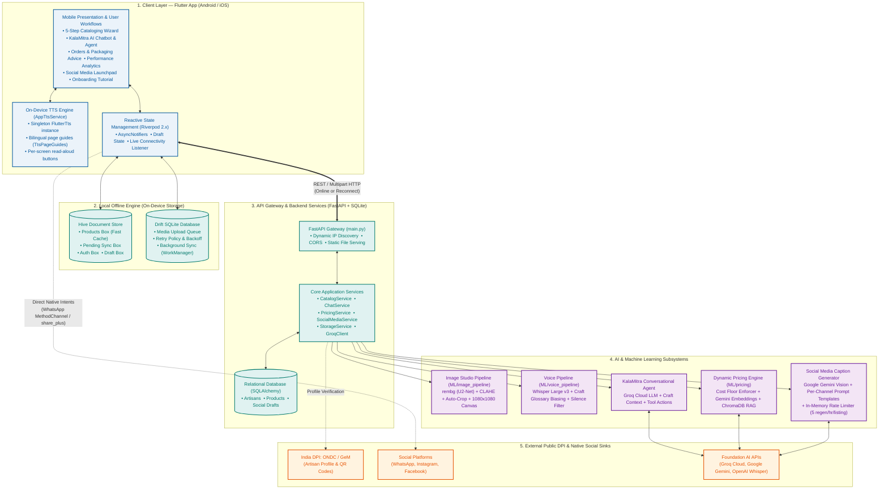

---

## 3. Core Feature 1: AI Image Enhancer & Studio (CV Pipeline)

### 3.1 Problem & Architectural Seam
Artisans typically photograph their products on workshop floors, dusty mats, or poorly-lit indoor spaces using entry-level smartphones. Poor image quality directly causes buyer distrust and product rejection on major e-commerce platforms.

The **AI Image Studio** (`ML/image_pipeline` and `frontend/lib/features/add_product/widgets/step1_capture_widget.dart`) executes a deterministic, 10-stage computer vision workflow that cleans, corrects, centers, and renders the handicraft onto a studio-grade white e-commerce canvas.

### 3.2 10-Stage Computer Vision Pipeline

```mermaid
flowchart LR
    A["1. Raw Capture\n(Validation & EXIF)"] --> B["2. rembg (U2-Net)\nAlpha Matting"]
    B --> C["3. Auto-Crop\nContour Bounding"]
    C --> D["4. Lighting Fix\nCLAHE on Luminance"]
    D --> E["5. White Balance\nGray-World Algorithm"]
    E --> F["6. Sharpening\nUnsharp Masking"]
    F --> G["7. Background\nAlpha Composite on White"]
    G --> H["8. E-Com Canvas\n1080x1080 Square Fit"]
    H --> I["9. Optimization\nJPEG/WebP Quality 85"]
```

#### Detailed Stage Breakdown:
1. **Input Validation & Normalization:** Checks byte integrity, handles EXIF orientation rotation flags, and converts palette/RGBA images into standard formats.
2. **Background Removal (`rembg`):** Uses the U²-Net Salient Object Detection deep learning model to separate foreground craft from cluttered workshop backgrounds, outputting a precise alpha transparency mask.
3. **Product Detection & Auto-Crop:** Identifies the minimum bounding rectangle of non-zero alpha pixels and crops with a balanced 8% margin padding.
4. **Luminance Correction (CLAHE + Gamma):** Converts the image to CIELAB color space and applies Contrast Limited Adaptive Histogram Equalization (CLAHE) with adaptive gamma correction strictly on the **L (Luminance)** channel.  
   *Design Decision:* This step is performed *before* placing the object on a white canvas; applying CLAHE after adding a white background would distort the histogram due to the high concentration of white pixels.
5. **White Balance Correction:** Applies the gray-world assumption to automatically cancel yellowish incandescent or bluish CFL lighting casts typical of village workshops.
6. **Unsharp Masking:** Applies mild edge-enhancement convolution to highlight intricate handcrafted details (wood grain, embroidery threads, pottery textures).
7. **Clean Background Compositing:** Alpha-blends the isolated craft onto a clean pure white (`#FFFFFF`) or soft neutral canvas.
8. **E-Commerce Canvas Standard:** Centers and scales the craft to fit a standard square 1080x1080 e-commerce canvas without distortion.
9. **Final Output Compression:** Compresses output into WebP/JPEG format targeting ~200-400 KB for rapid mobile rendering over 2G/3G networks.

### 3.3 UI Implementation & Interactive Before/After Comparison
In `step1_capture_widget.dart`, artisans are presented with an interactive, gesture-driven **Before/After split slider**. Artisans can drag the dividing line left and right to inspect the background removal and lighting enhancements before accepting or retaking the shot.

---

## 4. Core Feature 2: Multilingual Voice Auto-Cataloger (ASR & LLM)

### 4.1 Problem & Domain Phonetic Substitution
Marginalized artisans possess deep generational knowledge of their craft but often cannot read or write English, and many are not literate in formal Hindi. When speaking about their products, standard ASR models (trained on news broadcasts) consistently misclassify regional craft terminology:
* *"Dhokra"* (ancient lost-wax brass casting) becomes *"doctor"*.
* *"Chikankari"* (delicate Lucknow embroidery) becomes *"chicken curry"*.
* *"chak"* (potter's wheel) is misheard as *"chaat"*.

### 4.2 Voice-to-Bilingual Cataloging Architecture

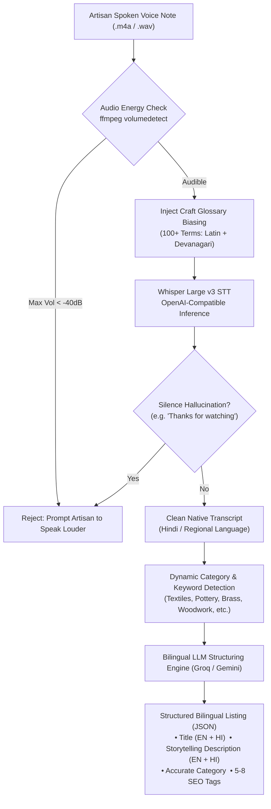

### 4.3 Key Components:
1. **Audio Silence Detection:** `CatalogService._is_audio_silent()` runs `ffmpeg -af volumedetect` on the uploaded recording. If the peak volume is below `-40 dB`, the system flags it as empty noise and prompts the user to re-record before invoking inference.
2. **Craft Vocabulary Glossary Biasing (`craft_terms.py`):** Injects curated Indian craft terminology into Whisper's initial prompt context across categories:
   * *Textiles:* Bandhani, Ajrakh, Chikankari, Kalamkari, Ikat, Patola, Banarasi, Chanderi, Kanjeevaram, Phulkari, Zari, Zardozi, Tussar silk.
   * *Pottery:* Terracotta, Khurja, Blue pottery, Chaak, Kulhad, Surahi, Matka, Diya.
   * *Metalwork:* Dhokra, Bidriware, Bell metal, Thewa, Meenakari, Filigree, Kansa.
   * *Devanagari Set:* Full dual-script glossary ensures phonetic alignment in native Devanagari output.
3. **Silence Hallucination Filtering:** Traps common Whisper failure modes when processing silent or ambient audio (e.g., *"Thank you for watching"*, *"Please subscribe"*, *"dhanyavaad"* looping).
4. **Spoken Cue Guidance (UI Step 2):** Visual chips and audio prompts instruct the artisan on what to include:
   * Materials used
   * Hours of manual labor
   * Special craft technique or heritage method
5. **Cost Cue Extractor:** An LLM routine parses the transcript to extract mentioned raw material expenditures and hours of labor to automatically seed the Pricing Assistant in Step 4.

---

## 5. Core Feature 3: Dynamic Pricing Assistant (RAG & Cost Floor Engine)

### 5.1 The Economic Challenge: Eliminating Middleman Exploitation
Because rural artisans lack access to real-time e-commerce price indices, urban middlemen routinely purchase authentic handicrafts at prices below the artisan's cost of sustenance. KalaSetu prevents this by computing an **unbreachable mathematical cost floor** combined with **Retrieval-Augmented Generation (RAG)** over market benchmarks.

### 5.2 Dynamic Pricing Pipeline

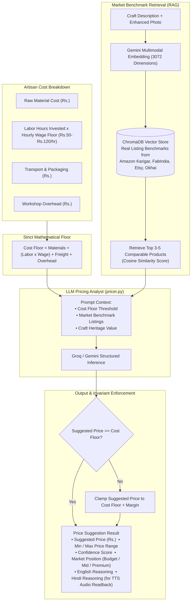

### 5.3 Mathematical Formulation & Hard Invariants
The platform strictly enforces that no suggested price may undercut the artisan:

```
Cost Floor = C_materials + (T_labor x W_hourly) + C_transport + C_overhead
Invariant:  Suggested Price >= Cost Floor
```

If an LLM hallucinates a price below this threshold, server-side post-processing clamps `suggested_price` to the cost floor plus category baseline margins. The response includes a conversational Hindi reasoning string read aloud via on-device Text-to-Speech (TTS) so non-literate artisans understand exactly why the price was recommended.

---

## 6. Core Feature 4: Dual Offline-First Storage & Sync Engine

### 6.1 Architectural Necessity
Rural artisan clusters often have intermittent or absent cellular connectivity. An application requiring a continuous cloud connection is unusable in these regions. KalaSetu implements a **Dual Offline Engine**:

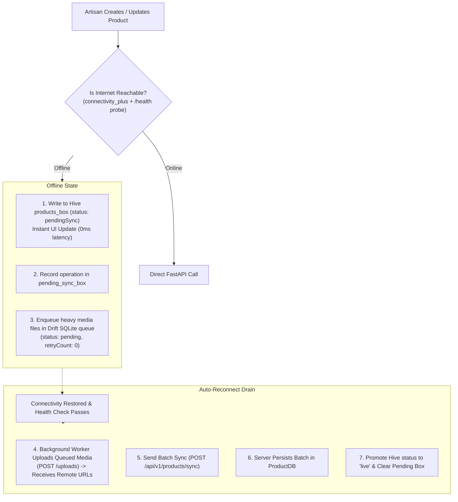

### 6.2 Dual Engine Breakdown:
* **Drift SQLite Database (`offline_sync.sqlite`):** Handles background media upload queueing. The `QueueItems` table tracks media type, file paths, retry counts (up to 3 with exponential backoff), job status (`pending`, `uploading`, `processing`, `completed`, `failed`), and error messages. Background sync is dispatched via `WorkManager` (`workmanager` package).
* **Hive NoSQL Store:** Handles instant synchronous key-value storage for products (`products_box`), authentication (`auth_box`), draft state (`draft_box`), and pending mutation queues (`pending_sync_box`).
* **Dynamic Network Discovery (`ApiConfig`):** When running locally or on physical Android devices over Wi-Fi, the app automatically probes candidate IPs (`LAN IP`, `10.0.2.2`, `localhost`) against `/api/v1/health` and binds to the first responsive host without manual configuration.

---

## 7. Core Feature 5: KalaMitra AI Chatbot & Navigation Agent

### 7.1 Agent Purpose & Scope
**KalaMitra** is an in-app AI assistant, craft mentor, and autonomous navigation agent designed for artisans. Rather than acting as a generic chatbot, KalaMitra understands the artisan's registered trade and can autonomously trigger actions inside the Flutter application.

### 7.2 Agent Loop & Tool Calling Architecture

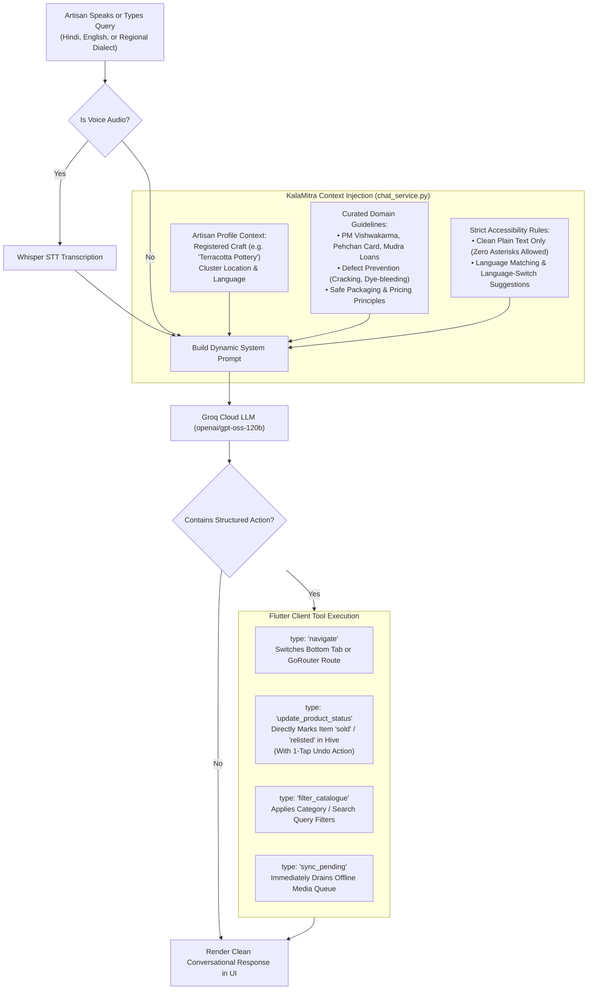

### 7.3 Direct Action Execution Matrix:
* `update_product_status`: Automatically updates product status in Hive (e.g., marks a sold item with an instant undo button in chat).
* `filter_catalogue`: Immediately navigates to the catalogue and filters for queried materials or crafts (e.g., *"Show my brass items"*).
* `sync_pending`: Manually triggers background sync if the artisan wants to force an upload.
* `navigate`: Routes directly to relevant screens (`/add-product`, `/my-stats`, `/language-settings`, `/my-orders`).
* **Zero Asterisks Rule:** To prevent confusing markdown artifacts on simple mobile text views, all responses are stripped of asterisks (`*` and `**`).

---

## 8. Core Feature 6: On-Device Bilingual Text-to-Speech (TTS) System

### 8.1 Problem & Design Rationale
A core user segment of KalaSetu is non-literate or low-literacy artisans who cannot read the AI-generated descriptions, pricing reasoning, or packing instructions on screen. Simply displaying text leaves this group without the benefit of the platform's intelligence. Every significant screen therefore has a **Read Aloud** button that speaks the screen's content — and a brief orientation about what to do on that screen — in the artisan's chosen language.

### 8.2 Architecture: Singleton TTS Engine

A sharp edge in `flutter_tts` is that every `FlutterTts()` constructor call registers a `setMethodCallHandler` on a `static const` platform channel. Handlers are not additive — the newest instance silently takes ownership for all of them. With read-aloud buttons on a dozen screens, only the most recently built instance ever received `onComplete`; all others froze on "Stop" state indefinitely.

**Solution:** A singleton `_TtsEngine` class (in `app_tts_service.dart`) owns a single `FlutterTts` instance. All `AppTtsService` handles (one per screen) share the engine and dispatch through the current `owner` pointer — whichever handle last called `speak()`.

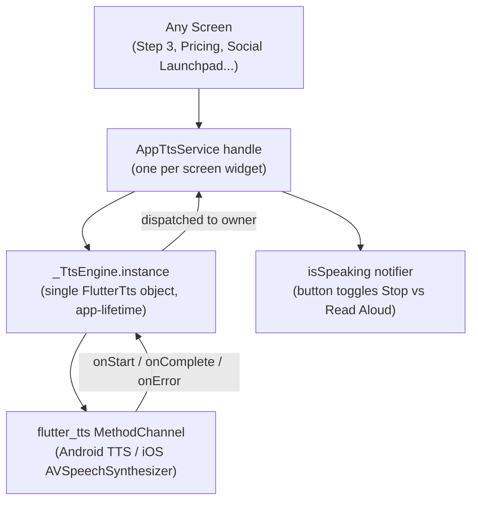

### 8.3 Page-Level Guide System (`TtsPageGuides`)
Every screen's Read Aloud button speaks **two parts** sequentially:
1. **Orientation guide** — where you are, what to check, what to tap next.
2. **Screen content** — the actual caption, price, description, etc.

All guide text lives in `tts_page_guides.dart` as `TtsGuide` records with `en` and `hi` strings so the complete spoken script of the app can be reviewed and corrected in one place.

| Screen | Guide constant | Languages |
|--------|---------------|-----------|
| Add Product — AI Listing Review (Step 3) | `TtsPageGuides.aiListingReview` | EN + HI |
| Add Product — Pricing Assistant (Step 4) | `TtsPageGuides.pricingAssistant` | EN + HI |
| Social Media Launchpad | `TtsPageGuides.socialLaunchpad` | EN + HI |
| Orders & Packaging | `TtsPageGuides.ordersPackaging` | EN + HI |
| Onboarding Tutorial | `TtsPageGuides.tutorialNarration` | EN + HI |

### 8.4 Language & Voice Selection
`AppTtsService` uses the artisan's `preferred_language` preference (stored in Hive `auth_box`) to select the appropriate TTS voice and locale. Hindi content is spoken with `hi-IN` voice; English content uses `en-IN` or `en-US`. The `TtsGuide.forLanguage()` helper falls back to English for any locale without an explicit guide translation. Speech rate is fixed at **0.48** (slower than OS default) for maximum comprehension clarity.

---

## 9. Core Feature 7: Social Media Helper & Sharing Launchpad

### 9.1 Promoting Listings Across Indian Social Sinks
Artisans can promote their creations directly to social platforms from two entry points:
1. **From Catalogue:** Tapping the *"Promote"* action chip on any listing.
2. **From Stepper Step 5:** Immediately upon publishing a new craft listing.

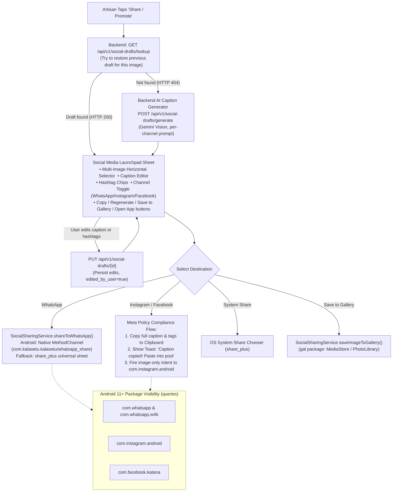

### 9.2 Social Draft Lifecycle & Backend Endpoint Mapping

| UI Action | Backend Endpoint | Purpose |
|-----------|-----------------|---------|
| Open Launchpad (existing listing) | `GET /api/v1/social-drafts/lookup` | Restore saved draft to pre-fill caption/hashtags |
| Tap "Generate" button | `POST /api/v1/social-drafts/generate` | AI-generate caption + hashtags via Gemini Vision |
| Publish listing (add-flow) | `POST /api/v1/social-drafts/link` | Bind unsaved draft_key drafts to final listing_id |
| User edits & saves draft | `PUT /api/v1/social-drafts/{draft_id}` | Persist user edits, set edited_by_user=True |
| Legacy app compatibility | `/api/v1/listings/{id}/social-draft` (alias) | Backward-compatible redirect (hidden from API docs) |

### 9.3 AI Caption Generation Architecture
`SocialMediaService` (`backend/services/social_media_service.py`) uses **Google Gemini** (vision model) with per-channel prompt templates to generate platform-appropriate captions:
* **WhatsApp:** Warm, conversational, emoji-friendly, includes full caption + hashtags as inline text for immediate paste.
* **Instagram:** Storytelling hook opening, linebreak-separated hashtags, emoji accents, visually engaging.
* **Facebook:** Community-oriented tone, slightly longer narrative, hashtags grouped at the end.

Rate limiting: in-memory sliding window allows a maximum of **5 regenerations per hour per listing**. Exceeding this returns HTTP 429.

### 9.4 Platform Constraints & Meta Anti-Spam Compliance:
* **Meta Platform Policy 2.3:** Instagram and Facebook explicitly block third-party applications from pre-filling user post captions via `Intent.EXTRA_TEXT`.
* **The Clipboard-First Strategy:** KalaSetu solves this by copying the formatted caption and hashtags to the system `Clipboard`, displaying a prominent bilingual instruction toast (*"Caption copied! Opening Instagram — paste into your post"*), and launching Instagram's photo composer directly with the resolved local image.
* **WhatsApp Direct Intent:** WhatsApp allows full pre-populated text and media via a custom native `MethodChannel` (`com.kalasetu.kalasetu/whatsapp_share`), providing a 1-tap sharing experience. Falls back to `share_plus` if WhatsApp is not installed or the intent fails.
* **Save to Gallery:** The `gal` package handles cross-version MediaStore insertion (Android) and PhotoLibrary authorization (iOS), allowing artisans to download enhanced product photos to their gallery for manual posting.
* **Android `<queries>` Configuration:** Declares package names in `AndroidManifest.xml` so Android 11+ (API 30+) devices allow package discovery via `canLaunchUrl`.

---

## 10. Core Feature 8: Orders Management, AI Packaging & PDF Labels

### 10.1 Fulfillment Lifecycle & Breakage Prevention
Handicrafts are fragile and often suffer transit damage when shipped across state borders. The Orders module provides end-to-end status tracking paired with **Category-Tailored Packaging Advisory** and a **Printable Artisan Story Label Maker**.

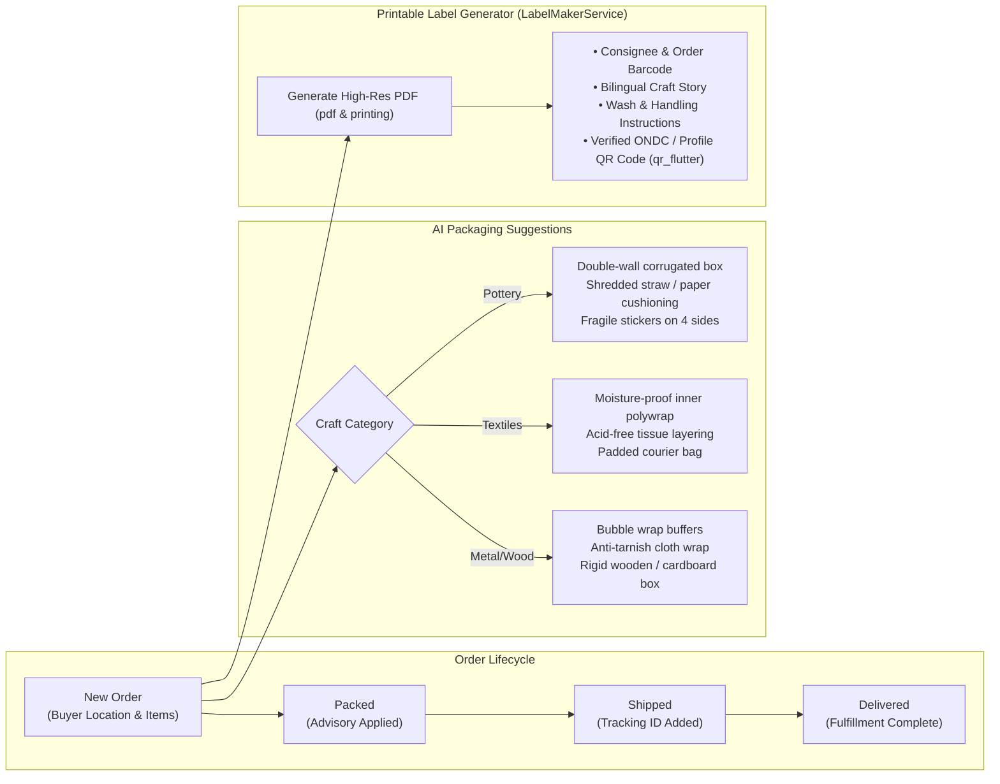

### 10.2 Printable Artisan Story & Packaging Label (`LabelMakerService`):
Generates a printable PDF shipping label using Flutter's `pdf` and `printing` packages:
* **Bilingual Craft Narrative:** Incorporates the story of the craft in English and Hindi.
* **Wash & Care Guidelines:** Tailored handling instructions per craft category.
* **ONDC Profile QR Code:** Links buyers directly to the artisan's verified government digital identity (`qr_flutter`).

---

## 11. Core Feature 9: Artisan Performance & Revenue Analytics

### 11.1 Measuring Direct Economic Empowerment
The **Artisan Analytics Dashboard** (`features/profile/screens/my_stats_screen.dart`) provides clear, visual financial reporting designed for users who may struggle with complex accounting spreadsheets.

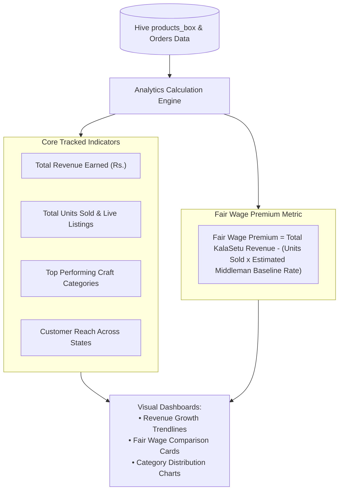

### 11.2 Fair Wage Premium Calculation:
```
Fair Wage Premium = Sum(Direct Selling Price - Middleman Trader Baseline)
```
This demonstrates tangible economic improvement, giving artisans confidence in their digital business.

---

## 12. Backend & Database Architecture (`backend/`)

The backend is an asynchronous **FastAPI** service running on Python 3.10+ backed by **SQLAlchemy 2.0** and SQLite (`backend/kalasetu.db`).

### 12.1 Entity-Relationship Model

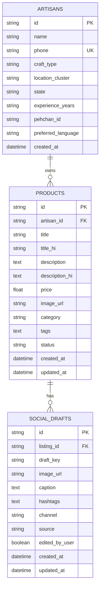

### 12.2 Core Router Specification:

| Router | Prefix | Key Endpoints |
|--------|--------|--------------|
| **health** | `/api/v1/health` | Liveness probe used by mobile connectivity listeners to confirm true internet reachability. |
| **auth** | `/api/v1/auth` | Phone-based registration, demo OTP validation, and artisan profile lookups. |
| **products** | `/api/v1/products` | Product catalog listing, category filtering, updates, and idempotent batch offline synchronization (`/sync`). |
| **catalog** | `/api/v1/catalog` | Computer vision enhancement (`/enhance-image`), bilingual listing generation (`/generate-listing`), and unified voice-to-product orchestration (`/voice-to-product`). |
| **voice** | `/api/v1/voice` | Standalone audio transcription (`/transcribe`), complete voice-to-product pipeline (`/process`), and craft glossary term lookups. |
| **pricing** | `/api/v1/pricing` | RAG price recommendations (`/suggest`), multimodal image pricing (`/suggest-upload`), and voice pricing (`/suggest-from-voice`). |
| **social** | `/api/v1/social-drafts` | Draft lookup (`/lookup`), AI generation (`/generate`), draft-listing linking (`/link`), and user edit persistence (`/{id}`). |
| **chat** | `/api/v1/chat` | KalaMitra conversational assistant, navigation actions, starter topics, and voice chat. |

---

## 13. End-to-End System Workflows

### 13.1 Complete Voice-to-Product Stepper Flow

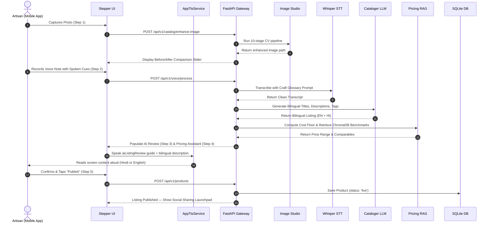

### 13.2 Offline Capture & Reconnection Synchronization

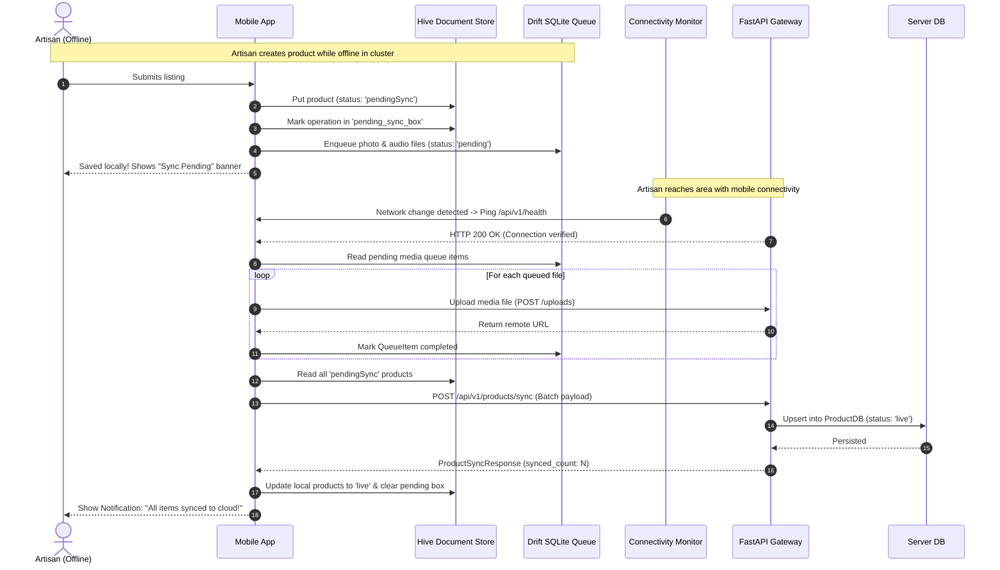

---

## 14. Security, Privacy & Data Governance

* **Artisan Data Sovereignty:** Artisan mobile numbers and optional government Pehchan IDs are stored exclusively in the relational database and are never passed to external LLM completion prompts.
* **Scoped Media Uploads:** Uploaded media files are hashed with UUID prefixes (`uuid.uuid4().hex`) and segregated into dedicated directories (`/uploads/raw`, `/uploads/enhanced`, `/uploads/audio`, `/uploads/products`) to prevent directory traversal vulnerabilities.
* **API Abuse Prevention:**
  * Chat endpoint (`/api/v1/chat/message`): Capped at 20 requests per minute per client IP.
  * Social helper (`/api/v1/social-drafts/generate`): In-memory sliding window allows a maximum of 5 regenerations per hour per listing.
* **Accessible Prompt Guardrails:** System prompts enforce clean plain-text formatting (no raw asterisks) and restrict responses strictly to craft guidance, government schemes, and marketplace assistance.

---

## 15. Technology Stack Summary

| Layer | Component | Technology | Architectural Role |
|---|---|---|---|
| **Mobile Client** | Core App | Flutter 3.x / Dart 3.x (SDK ^3.12.0) | Cross-platform UI for Android and iOS. |
| | State Management | Flutter Riverpod 2.x | Reactive dependency injection and state isolation. |
| | Media Sync Queue | Drift 2.x (SQLite) | Persistent background queue with exponential backoff retries. |
| | Document Store | Hive 2.x | High-speed, synchronous on-device NoSQL storage for catalog data. |
| | Background Tasks | WorkManager (`workmanager ^0.6.0`) | Schedules and executes background media sync even after app close. |
| | Navigation | GoRouter ^14 | Declarative routing with route-level authentication guards. |
| | Text-to-Speech | `flutter_tts ^4.1.0` | On-device bilingual TTS with singleton engine and page-guide system. |
| | Audio Recording | `record ^7.1.1` | Cross-platform microphone capture for voice cataloging and KalaMitra. |
| | Audio Playback | `just_audio ^0.9.40` | Plays voice memos and tutorial narration clips. |
| | Image Picking | `camera ^0.11.0`, `image_picker ^1.1.2` | Hardware camera access and gallery selection. |
| | Label Generation | `pdf ^3.10.8` & `printing ^5.13.2` | On-device PDF rendering for shipping labels. |
| | QR Codes | `qr_flutter ^4.1.0` | Generates ONDC profile QR codes on shipping labels. |
| | Social Sharing | `share_plus ^10.1.4`, `gal ^2.3.2`, `url_launcher ^6.3.1` | Universal share sheet, gallery save, and app deep-linking. |
| | Networking | `dio ^5.7.0`, `connectivity_plus ^6.0.5` | HTTP client with interceptors; real-time connectivity monitoring. |
| | Localization | `easy_localization ^3.0.7` | JSON-based translations for English and Hindi (`assets/translations/`). |
| | Typography | `google_fonts ^6.2.1`; Manrope + Fraunces (bundled variable fonts) | Premium, accessible typefaces for UI and display. |
| **Backend API** | Web Framework | FastAPI (Python 3.10+) | Asynchronous API gateway with OpenAPI documentation. |
| | Database & ORM | SQLite 3 & SQLAlchemy 2.0 | Embedded relational persistence for profiles, products, and social drafts. |
| | Concurrency | `starlette.concurrency` | Threadpool dispatch for blocking OpenCV/rembg CPU tasks. |
| **AI & ML** | Computer Vision | `rembg` (U²-Net), OpenCV, Pillow | Background removal, CLAHE lighting fix, gray-world white balance, 1080x1080 canvas. |
| | Speech-to-Text | Whisper Large v3 | Regional audio transcription with craft glossary vocabulary prompting. |
| | Primary LLM | Groq Cloud (`gpt-oss-120b`) | Ultra-fast structured JSON cataloging and KalaMitra conversational agent. |
| | Multimodal LLM | Google Gemini (`gemini-2.5-flash`) | Multimodal vision analysis for social media caption generation. |
| | Vector Store | ChromaDB | Cosine similarity vector index over real Indian handicraft listings. |
| | Embeddings | Gemini `embedding-001` | 3072-dimensional multimodal unified vector embeddings. |
| | Audio Analysis | `ffmpeg` (volumedetect) | Native audio energy analysis to reject silent recordings before inference. |

---

## 16. Verification, Test Suites & Device Validation

### 16.1 Backend Test Suites

| Test Suite | Path | Verification Focus |
|---|---|---|
| **Chat Tool Actions** | `backend/tests/test_chat_actions.py` | Validates that natural language queries trigger structured in-app actions (`update_product_status`, `filter_catalogue`, `sync_pending`). |
| **Chat API & Guardrails** | `backend/tests/test_chat_api.py` | Tests rate limiting (HTTP 429), language adaptation, and system prompt constraints. |
| **Backend Integration** | `backend/tests/test_api.py` | Tests authentication flows, product CRUD, and batch offline synchronization (`/sync`). |
| **Voice Integration** | `backend/tests/test_voice_integration.py` | Tests audio volume checks, craft glossary prompt injection, and end-to-end voice-to-product. |
| **Image Enhancement** | `backend/tests/test_image_pipeline_integration.py` | Tests threadpool background removal, CLAHE lighting, auto-crop, and canvas sizing. |
| **Social Channels** | `backend/tests/test_social_channels.py` | Tests per-channel caption generation (WhatsApp / Instagram / Facebook), rate limiting, draft persistence, and lookup fallback behavior. |

### 16.2 Frontend Test Suites

| Test Suite | Path | Verification Focus |
|---|---|---|
| **Chatbot Direct Actions** | `frontend/test/chatbot_direct_actions_test.dart` | Tests Riverpod chat notifier mutating Hive product status with undo capability. |
| **KalaMitra Redesign** | `frontend/test/kalamitra_redesign_test.dart` | Tests updated KalaMitra UI rendering and voice input integration. |
| **Add Product Flow** | `frontend/test/add_product_flow_test.dart` | Tests multi-step draft progression, draft resumption, and validation. |
| **Bilingual Listing** | `frontend/test/add_product_bilingual_test.dart` | Tests EN + HI field population from voice transcription output. |
| **Artisan Analytics** | `frontend/test/artisan_analytics_test.dart` | Tests Fair Wage Premium calculations against middleman baselines. |
| **Packaging & Orders** | `frontend/test/my_orders_chip_test.dart` | Tests order fulfillment status transitions and craft packaging advisory logic. |
| **Order Detail & Pricing** | `frontend/test/order_detail_and_pricing_test.dart` | Tests order detail view and associated pricing display. |
| **Auth Flow** | `frontend/test/auth_flow_test.dart` | Tests phone registration, OTP entry, and profile creation. |
| **Catalogue Screen** | `frontend/test/catalogue_screen_test.dart` | Tests product listing, category filtering, and search. |
| **Image Enhancer** | `frontend/test/image_enhancer_service_test.dart` | Tests the before/after slider widget and enhancement triggers. |
| **Social Sharing** | `frontend/test/social_sharing_service_test.dart` | Tests WhatsApp native intent, gallery save, and fallback behavior. |
| **Pricing Service** | `frontend/test/pricing_service_test.dart` | Tests cost floor calculation and price clamping invariants. |
| **Profile Screen** | `frontend/test/profile_screen_compact_test.dart` | Tests profile display and artisan metadata rendering. |
| **Tutorial Carousel** | `frontend/test/tutorial_carousel_test.dart` | Tests onboarding tutorial navigation and TTS narration triggers. |
| **Cycling Guidance Cue** | `frontend/test/cycling_guidance_cue_test.dart` | Tests the rotating spoken guidance cue chips in Step 2. |
| **Offline Sync** | `frontend/test/offline_sync_placeholder_test.dart` | Smoke test for Drift queue initialization and WorkManager registration. |

### 16.3 Physical Device Validation
* **Primary test device:** Realme RMX5101 (Android 14 / API 34).
* **Confirmed working:** `<queries>` package visibility for WhatsApp / Instagram / Facebook, hardware camera and microphone access, USB debugging deployment via `flutter run`, on-device TTS in both Hindi and English.

---

*Document maintained under `docs/ARCHITECTURE.md` as the definitive technical architectural specification for KalaSetu.*

---

## 1. Executive Summary & Core Mission

**KalaSetu (कलासेतु)** is an offline-first, multilingual, AI-powered "virtual business manager" built to bridge the digital, economic, and linguistic divide for India's traditional artisans, weavers, and rural craft clusters.

Government initiatives (e.g., *Shilp Samagam*, *Surajkund Mela*, *Dilli Haat*) provide temporary, seasonal market exposure, but when exhibitions end, artisan revenues collapse. Traditional craftspeople face four structural barriers when trying to sell online:
1. **Studio Quality Barrier:** Lack of photography equipment, lighting, and knowledge to create clean e-commerce product photos.
2. **Linguistic & Digital Literacy Barrier:** Inability to write SEO-optimized product descriptions in English or navigate complex multi-step e-commerce seller portals.
3. **Information Asymmetry & Exploitative Pricing:** Inability to assess fair market benchmarks, leaving artisans vulnerable to predatory middlemen who capture 300% to 500% retail markups.
4. **Connectivity Barrier:** Unreliable or absent cellular data in rural craft clusters and remote artisan villages.

KalaSetu solves these challenges through a unified mobile-first ecosystem: the artisan captures a photo and speaks naturally in their regional mother tongue. The platform automatically enhances the photo to studio grade, transcribes the dialect with domain craft vocabulary biasing, generates structured bilingual (Hindi & English) listings, calculates a mathematically guaranteed fair price floor with market comparables, and enables instant 1-tap multi-platform social sharing and order fulfillment — fully functional even when completely offline.

---

## 2. High-Level System Architecture

KalaSetu is designed as a modular, 4-tier distributed architecture spanning client-side presentation, local offline persistence, an asynchronous API gateway, and specialized machine learning pipelines.

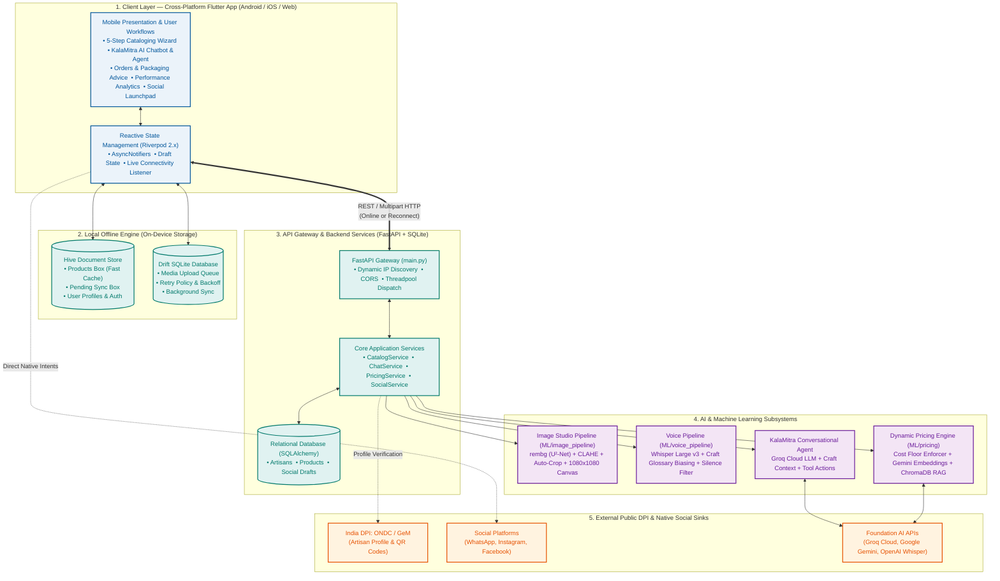

---

## 3. Core Feature 1: AI Image Enhancer & Studio (CV Pipeline)

### 3.1 Problem & Architectural Seam
Artisans typically photograph their products on workshop floors, dusty mats, or poorly-lit indoor spaces using entry-level smartphones. Poor image quality directly causes buyer distrust and product rejection on major e-commerce platforms.

The **AI Image Studio** (`ML/image_pipeline` and `frontend/lib/features/add_product/widgets/step1_capture_widget.dart`) executes a deterministic, 10-stage computer vision workflow that cleans, corrects, centers, and renders the handicraft onto a studio-grade white e-commerce canvas.

### 3.2 10-Stage Computer Vision Pipeline

```mermaid
flowchart LR
    A["1. Raw Capture\n(Validation & EXIF)"] --> B["2. rembg (U²-Net)\nAlpha Matting"]
    B --> C["3. Auto-Crop\nContour Bounding"]
    C --> D["4. Lighting Fix\nCLAHE on Luminance"]
    D --> E["5. White Balance\nGray-World Algorithm"]
    E --> F["6. Sharpening\nUnsharp Masking"]
    F --> G["7. Background\nAlpha Composite on White"]
    G --> H["8. E-Com Canvas\n1080x1080 Square Fit"]
    H --> I["9. Optimization\nJPEG/WebP Quality 85"]
```

#### Detailed Stage Breakdown:
1. **Input Validation & Normalization:** Checks byte integrity, handles EXIF orientation rotation flags, and converts palette/RGBA images into standard formats.
2. **Background Removal (`rembg`):** Uses the U²-Net Salient Object Detection deep learning model to separate foreground craft from cluttered workshop backgrounds, outputting a precise alpha transparency mask.
3. **Product Detection & Auto-Crop:** Identifies the minimum bounding rectangle of non-zero alpha pixels and crops with a balanced 8% margin padding.
4. **Luminance Correction (CLAHE + Gamma):** Converts the image to CIELAB color space and applies Contrast Limited Adaptive Histogram Equalization (CLAHE) with adaptive gamma correction strictly on the **L (Luminance)** channel.  
   *Design Decision:* This step is performed *before* placing the object on a white canvas; applying CLAHE after adding a white background would distort the histogram due to the high concentration of white pixels.
5. **White Balance Correction:** Applies the gray-world assumption to automatically cancel yellowish incandescent or bluish CFL lighting casts typical of village workshops.
6. **Unsharp Masking:** Applies mild edge-enhancement convolution to highlight intricate handcrafted details (wood grain, embroidery threads, pottery textures).
7. **Clean Background Compositing:** Alpha-blends the isolated craft onto a clean pure white (`#FFFFFF`) or soft neutral canvas.
8. **E-Commerce Canvas Standard:** Centers and scales the craft to fit a standard square 1080x1080 e-commerce canvas without distortion.
9. **Final Output Compression:** Compresses output into WebP/JPEG format targeting ~200–400 KB for rapid mobile rendering over 2G/3G networks.

### 3.3 UI Implementation & Interactive Before/After Comparison
In `step1_capture_widget.dart`, artisans are presented with an interactive, gesture-driven **Before/After split slider**. Artisans can drag the dividing line left and right to inspect the background removal and lighting enhancements before accepting or retaking the shot.

---

## 4. Core Feature 2: Multilingual Voice Auto-Cataloger (ASR & LLM)

### 4.1 Problem & Domain Phonetic Substitution
Marginalized artisans possess deep generational knowledge of their craft but often cannot read or write English, and many are not literate in formal Hindi. When speaking about their products, standard ASR models (trained on news broadcasts) consistently misclassify regional craft terminology:
* *"Dhokra"* (ancient lost-wax brass casting) becomes *"doctor"*.
* *"Chikankari"* (delicate Lucknow embroidery) becomes *"chicken curry"*.
* *"चाक"* (chaak - potter's wheel) is misheard as *"चात"* (chaat).

### 4.2 Voice-to-Bilingual Cataloging Architecture


### 4.3 Key Components:
1. **Audio Silence Detection:** `CatalogService._is_audio_silent()` runs `ffmpeg -af volumedetect` on the uploaded recording. If the peak volume is below `-40 dB`, the system flags it as empty noise and prompts the user to re-record before invoking inference.
2. **Craft Vocabulary Glossary Biasing (`craft_terms.py`):** Injects curated Indian craft terminology into Whisper's initial prompt context across categories:
   * *Textiles:* Bandhani, Ajrakh, Chikankari, Kalamkari, Ikat, Patola, Banarasi, Chanderi, Kanjeevaram, Phulkari, Zari, Zardozi, Tussar silk.
   * *Pottery:* Terracotta, Khurja, Blue pottery, Chaak, Kulhad, Surahi, Matka, Diya.
   * *Metalwork:* Dhokra, Bidriware, Bell metal, Thewa, Meenakari, Filigree, Kansa.
   * *Devanagari Set:* Full dual-script glossary ensures phonetic alignment in native Devanagari output.
3. **Silence Hallucination Filtering:** Traps common Whisper failure modes when processing silent or ambient audio (e.g., *"Thank you for watching"*, *"Please subscribe"*, *"धन्यवाद"* looping).
4. **Spoken Cue Guidance (UI Step 2):** Visual chips and audio prompts instruct the artisan on what to include:
   * *"सामग्री"* (Materials used)
   * *"बनाने में लगा समय"* (Hours of manual labor)
   * *"विशेष तकनीक"* (Special craft technique or heritage method)
5. **Cost Cue Extractor:** An LLM routine parses the transcript to extract mentioned raw material expenditures and hours of labor to automatically seed the Pricing Assistant in Step 4.

---

## 5. Core Feature 3: Dynamic Pricing Assistant (RAG & Cost Floor Engine)

### 5.1 The Economic Challenge: Eliminating Middleman Exploitation
Because rural artisans lack access to real-time e-commerce price indices, urban middlemen routinely purchase authentic handicrafts at prices below the artisan's cost of sustenance. KalaSetu prevents this by computing an **unbreachable mathematical cost floor** combined with **Retrieval-Augmented Generation (RAG)** over market benchmarks.

### 5.2 Dynamic Pricing Pipeline

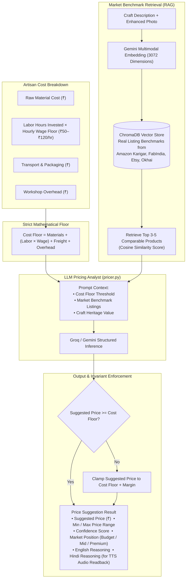

### 5.3 Mathematical Formulation & Hard Invariants
The platform strictly enforces that no suggested price may undercut the artisan:

$$\text{Cost Floor} = C_{\text{materials}} + (T_{\text{labor}} \times W_{\text{hourly}}) + C_{\text{transport}} + C_{\text{overhead}}$$

$$\text{Suggested Price} \ge \text{Cost Floor}$$

If an LLM hallucinates a price below this threshold, server-side post-processing clamps `suggested_price` to the cost floor plus category baseline margins. The response includes a conversational Hindi reasoning string read aloud via on-device Text-to-Speech (TTS) so non-literate artisans understand exactly why the price was recommended.

---

## 6. Core Feature 4: Dual Offline-First Storage & Sync Engine

### 6.1 Architectural Necessity
Rural artisan clusters often have intermittent or absent cellular connectivity. An application requiring a continuous cloud connection is unusable in these regions. KalaSetu implements a **Dual Offline Engine**:


### 6.2 Dual Engine Breakdown:
* **Drift SQLite Database (`offline_sync.sqlite`):** Handles background media upload queueing. The `QueueItems` table tracks media type, file paths, retry counts (up to 3 with exponential backoff), job status (`pending`, `uploading`, `processing`, `completed`, `failed`), and error messages.
* **Hive NoSQL Store:** Handles instant synchronous key-value storage for products (`products_box`), authentication (`auth_box`), draft state (`draft_box`), and pending mutation queues (`pending_sync_box`).
* **Dynamic Network Discovery (`ApiConfig`):** When running locally or on physical Android devices over Wi-Fi, the app automatically probes candidate IPs (`LAN IP`, `10.0.2.2`, `localhost`) against `/api/v1/health` and binds to the first responsive host without manual configuration.

---

## 7. Core Feature 5: KalaMitra AI Chatbot & Navigation Agent

### 7.1 Agent Purpose & Scope
**KalaMitra (कला-मित्र)** is an in-app AI assistant, craft mentor, and autonomous navigation agent designed for artisans. Rather than acting as a generic chatbot, KalaMitra understands the artisan's registered trade and can autonomously trigger actions inside the Flutter application.

### 7.2 Agent Loop & Tool Calling Architecture


### 7.3 Direct Action Execution Matrix:
* `update_product_status`: Automatically updates product status in Hive (e.g., *"चंदेरी साड़ी बिक गई"* $\to$ marks *Chanderi Saree* as `sold` with an instant undo button in chat).
* `filter_catalogue`: Immediately navigates to the catalogue and filters for queried materials or crafts (e.g., *"Show my brass items"*).
* `sync_pending`: Manually triggers background sync if the artisan wants to force an upload.
* `navigate`: Routes directly to relevant screens (`/add-product`, `/my-stats`, `/language-settings`, `/my-orders`).
* **Zero Asterisks Rule:** To prevent confusing markdown artifacts on simple mobile text views, all responses are stripped of asterisks (`*` and `**`).

---

## 8. Core Feature 6: Orders Management, AI Packaging & PDF Labels

### 8.1 Fulfillment Lifecycle & Breakage Prevention
Handicrafts are fragile and often suffer transit damage when shipped across state borders. The Orders module provides end-to-end status tracking paired with **Category-Tailored Packaging Advisory** and a **Printable Artisan Story Label Maker**.


### 8.2 Printable Artisan Story & Packaging Label (`LabelMakerService`):
Generates a printable PDF shipping label using Flutter's `pdf` and `printing` packages:
* **Bilingual Craft Narrative:** Incorporates the story of the craft (e.g., *"Handcrafted using riverbed clay on the potter's wheel..."* in English and Hindi).
* **Wash & Care Guidelines:** Tailored handling instructions (e.g., *"Gentle hand wash with mild soap; avoid direct thermal shock"*).
* **ONDC Profile QR Code:** Links buyers directly to the artisan's verified government digital identity.

---

## 9. Core Feature 7: Artisan Performance & Revenue Analytics

### 9.1 Measuring Direct Economic Empowerment
The **Artisan Analytics Dashboard** (`features/profile/screens/my_stats_screen.dart`) provides clear, visual financial reporting designed for users who may struggle with complex accounting spreadsheets.

```mermaid
flowchart TD
    SalesData[("Hive products_box & Orders Data")] --> MetricEngine["Analytics Calculation Engine"]
    
    subgraph Metrics ["Core Tracked Indicators"]
        M1["Total Revenue Earned (₹)"]
        M2["Total Units Sold & Live Listings"]
        M3["Top Performing Craft Categories"]
        M4["Customer Reach Across States"]
    end

    subgraph FairWageFormula ["Fair Wage Premium Metric"]
        Premium["Fair Wage Premium = Total KalaSetu Revenue - (Units Sold × Estimated Middleman Baseline Rate)"]
    end

    MetricEngine --> Metrics
    MetricEngine --> FairWageFormula
    Metrics & FairWageFormula --> UICharts["Visual Dashboards:\n• Revenue Growth Trendlines\n• Fair Wage Comparison Cards\n• Category Distribution Charts"]
```

### 9.2 Fair Wage Premium Calculation:
The dashboard explicitly calculates the **Fair Wage Premium** earned by selling directly through KalaSetu compared to historical middleman rates:

$$\text{Fair Wage Premium} = \sum (\text{Direct Selling Price} - \text{Middleman Trader Baseline})$$

This demonstrates tangible economic improvement, giving artisans confidence in their digital business.

---

## 10. Core Feature 8: Social Media Helper & Sharing Launchpad

### 10.1 Promoting Listings Across Indian Social Sinks
Artisans can promote their creations directly to social platforms from two entry points:
1. **From Catalogue:** Tapping the *"Promote"* action chip on any listing.
2. **From Stepper Step 5:** Immediately upon publishing a new craft listing.

```mermaid
flowchart TD
    Trigger["Artisan Taps 'Share / Promote'"] --> LoadDraft["Backend AI Caption Generator\n(POST /api/v1/listings/{id}/social-draft)"]
    LoadDraft --> Editor["Social Media Launchpad Screen\n• Multi-Image Selector  • Caption Editor  • Hashtag Chips"]
    
    Editor --> Destination{"Select Destination"}

    Destination -- "WhatsApp" --> WA["SocialSharingService.shareToWhatsApp()\nDirect Intent (com.whatsapp) with Image + Text"]
    
    Destination -- "Instagram / Facebook" --> MetaFlow["Meta Policy Compliance Flow:\n1. Copy full caption & tags to Clipboard\n2. Show Toast: 'Caption copied! Paste into post'\n3. Fire image-only intent to com.instagram.android"]
    
    Destination -- "System Share" --> Generic["OS System Share Chooser (share_plus)"]

    subgraph AndroidQueries ["Android 11+ Package Visibility (<queries>)"]
        Q1["com.whatsapp & com.whatsapp.w4b"]
        Q2["com.instagram.android"]
        Q3["com.facebook.katana"]
    end

    WA & MetaFlow -.-> AndroidQueries
```

### 10.2 Platform Constraints & Meta Anti-Spam Compliance:
* **Meta Platform Policy 2.3:** Instagram and Facebook explicitly block third-party applications from pre-filling user post captions via `Intent.EXTRA_TEXT`.
* **The Clipboard-First Strategy:** KalaSetu solves this by copying the formatted caption and hashtags to the system `Clipboard`, displaying a prominent bilingual instruction toast (*"Caption copied! Opening Instagram — paste into your post"*), and launching Instagram's photo composer directly with the resolved local image.
* **WhatsApp Direct Intent:** WhatsApp allows full pre-populated text and media, providing a 1-tap sharing experience.
* **Android `<queries>` Configuration:** Declares package names in `AndroidManifest.xml` so Android 11+ (API 30+) devices allow package discovery via `canLaunchUrl`.

---

## 11. Backend & Database Architecture (`backend/`)

The backend is an asynchronous **FastAPI** service running on Python 3.10+ backed by **SQLAlchemy 2.0** and SQLite (`backend/kalasetu.db`).

### 11.1 Entity-Relationship Model

```mermaid
erDiagram
    ARTISANS ||--o{ PRODUCTS : owns
    PRODUCTS ||--o{ SOCIAL_DRAFTS : has
    
    ARTISANS {
        string id PK
        string name
        string phone UK
        string craft_type
        string location_cluster
        string state
        string experience_years
        string pehchan_id
        string preferred_language
        datetime created_at
    }

    PRODUCTS {
        string id PK
        string artisan_id FK
        string title
        string title_hi
        text description
        text description_hi
        float price
        string image_url
        string category
        text tags
        string status
        datetime created_at
        datetime updated_at
    }

    SOCIAL_DRAFTS {
        string id PK
        string listing_id FK
        string draft_key
        string image_url
        text caption
        text hashtags
        string source
        boolean edited_by_user
        datetime created_at
        datetime updated_at
    }
```

### 11.2 Core Router Specification:
* `/api/v1/auth`: Phone-based registration, demo OTP validation, and artisan profile lookups.
* `/api/v1/products`: Product catalog listing, category filtering, updates, and idempotent batch offline synchronization (`/sync`).
* `/api/v1/catalog`: Computer vision enhancement (`/enhance-image`), Whisper transcription (`/transcribe`), bilingual listing generation (`/generate-listing`), and unified voice-to-product orchestration (`/voice-to-product`).
* `/api/v1/pricing`: RAG price recommendations (`/suggest`), multimodal image pricing (`/suggest-upload`), and voice pricing (`/suggest-from-voice`).
* `/api/v1/chat`: KalaMitra conversational assistant, navigation actions, starter topics, and voice chat.
* `/api/v1/social`: Social media caption generation and draft persistence.
* `/api/v1/health`: Liveness probe used by mobile connectivity listeners to confirm true internet reachability.

---

## 12. End-to-End System Workflows

### 12.1 Complete Voice-to-Product Stepper Flow

```mermaid
sequenceDiagram
    autonumber
    actor Artisan as Artisan (Mobile App)
    participant UI as Stepper UI
    participant Gateway as FastAPI Gateway
    participant CV as Image Studio
    participant Whisper as Whisper STT
    participant LLM as Cataloger LLM
    participant RAG as Pricing RAG
    participant DB as SQLite DB

    Artisan->>UI: Captures Photo (Step 1)
    UI->>Gateway: POST /api/v1/catalog/enhance-image
    Gateway->>CV: Run 10-stage CV pipeline
    CV-->>Gateway: Return enhanced image path
    Gateway-->>UI: Display Before/After Comparison Slider

    Artisan->>UI: Records Voice Note with Spoken Cues (Step 2)
    UI->>Gateway: POST /api/v1/voice/process
    Gateway->>Whisper: Transcribe with Craft Glossary Prompt
    Whisper-->>Gateway: Return Clean Transcript
    Gateway->>LLM: Generate Bilingual Titles, Descriptions, Tags
    LLM-->>Gateway: Return Bilingual Listing (EN + HI)
    Gateway->>RAG: Compute Cost Floor & Retrieve ChromaDB Benchmarks
    RAG-->>Gateway: Return Price Range & Comparables
    Gateway-->>UI: Populate AI Review (Step 3) & Pricing Assistant (Step 4)

    UI->>Artisan: Plays Hindi Audio Readback of Description & Price
    Artisan->>UI: Confirms & Taps "Publish" (Step 5)
    UI->>Gateway: POST /api/v1/products
    Gateway->>DB: Save Product (status: 'live')
    Gateway-->>UI: Listing Published! Show Social Sharing Launchpad
```

### 12.2 Offline Capture & Reconnection Synchronization

```mermaid
sequenceDiagram
    autonumber
    actor Artisan as Artisan (Offline)
    participant App as Mobile App
    participant Hive as Hive Document Store
    participant Drift as Drift SQLite Queue
    participant Net as Connectivity Monitor
    participant API as FastAPI Gateway
    participant DB as Server DB

    Note over Artisan,Drift: Artisan creates product while offline in cluster
    Artisan->>App: Submits listing
    App->>Hive: Put product (status: 'pendingSync')
    App->>Hive: Mark operation in 'pending_sync_box'
    App->>Drift: Enqueue photo & audio files (status: 'pending')
    App-->>Artisan: Saved locally! Shows "Sync Pending" banner

    Note over Net,API: Artisan reaches area with mobile connectivity
    Net->>App: Network change detected -> Ping /api/v1/health
    API-->>App: HTTP 200 OK (Connection verified)

    App->>Drift: Read pending media queue items
    loop For each queued file
        App->>API: Upload media file (POST /uploads)
        API-->>App: Return remote URL
        App->>Drift: Mark QueueItem completed
    end

    App->>Hive: Read all 'pendingSync' products
    App->>API: POST /api/v1/products/sync (Batch payload)
    API->>DB: Upsert into ProductDB (status: 'live')
    DB-->>API: Persisted
    API-->>App: ProductSyncResponse (synced_count: N)
    App->>Hive: Update local products to 'live' & clear pending box
    App-->>Artisan: Show Notification: "All items synced to cloud!"
```

---

## 13. Security, Privacy & Data Governance

* **Artisan Data Sovereignty:** Artisan mobile numbers and optional government Pehchan IDs are stored exclusively in the relational database and are never passed to external LLM completion prompts.
* **Scoped Media Uploads:** Uploaded media files are hashed with UUID prefixes (`uuid.uuid4().hex`) and segregated into dedicated directories (`/uploads/raw`, `/uploads/enhanced`, `/uploads/audio`, `/uploads/products`) to prevent directory traversal vulnerabilities.
* **API Abuse Prevention:**
  * Chat endpoint (`/api/v1/chat/message`): Capped at 20 requests per minute per client IP.
  * Social helper (`/api/v1/listings/{id}/social-draft`): In-memory sliding window allows a maximum of 5 regenerations per hour per listing.
* **Accessible Prompt Guardrails:** System prompts enforce clean plain-text formatting (no raw asterisks) and restrict responses strictly to craft guidance, government schemes, and marketplace assistance.

---

## 14. Technology Stack Summary

| Layer | Component | Technology | Architectural Role |
|---|---|---|---|
| **Mobile Client** | Core App | Flutter 3.x / Dart 3.x | Cross-platform UI for Android, iOS, and Web. |
| | State Management | Flutter Riverpod 2.x | Reactive dependency injection and state isolation. |
| | Media Sync Queue | Drift (SQLite) | Persistent background queue with exponential backoff retries. |
| | Document Store | Hive | High-speed, synchronous on-device NoSQL storage for catalog data. |
| | Navigation | GoRouter | Declarative routing with route-level authentication guards. |
| | Label Generation | Dart `pdf` & `printing` | On-device PDF rendering for shipping labels with ONDC QR codes. |
| **Backend API** | Web Framework | FastAPI (Python 3.10+) | Asynchronous API gateway with OpenAPI documentation. |
| | Database & ORM | SQLite 3 & SQLAlchemy 2.0 | Embedded relational persistence for profiles, products, and social drafts. |
| | Concurrency | `starlette.concurrency` | Threadpool dispatch for blocking OpenCV/rembg CPU tasks. |
| **AI & ML** | Computer Vision | `rembg` (U²-Net), OpenCV, Pillow | Background removal, CLAHE lighting fix, gray-world white balance, 1080x1080 canvas. |
| | Speech-to-Text | Whisper Large v3 | Regional audio transcription with craft glossary vocabulary prompting. |
| | Primary LLM | Groq Cloud (`gpt-oss-120b`) | Ultra-fast structured JSON cataloging and KalaMitra conversational agent. |
| | Multimodal LLM | Google Gemini (`gemini-3.6-flash`) | Multimodal vision analysis for social media generation. |
| | Vector Store | ChromaDB | Cosine similarity vector index over real Indian handicraft listings. |
| | Embeddings | Gemini `embedding-001` | 3072-dimensional multimodal unified vector embeddings. |
| | Audio Analysis | `ffmpeg` (volumedetect) | Native audio energy analysis to reject silent recordings before inference. |

---

## 15. Verification, Test Suites & Device Validation

| Test Suite | Path | Verification Focus |
|---|---|---|
| **Chat Tool Actions** | `backend/tests/test_chat_actions.py` | Validates that natural language queries trigger structured in-app actions (`update_product_status`, `filter_catalogue`, `sync_pending`). |
| **Chat API & Guardrails** | `backend/tests/test_chat_api.py` | Tests rate limiting (HTTP 429), language adaptation, and system prompt constraints. |
| **Backend Integration** | `backend/tests/test_api.py` | Tests authentication flows, product CRUD, and batch offline synchronization (`/sync`). |
| **Voice Integration** | `backend/tests/test_voice_integration.py` | Tests audio volume checks, craft glossary prompt injection, and end-to-end voice-to-product. |
| **Image Enhancement** | `backend/tests/test_image_pipeline_integration.py` | Tests threadpool background removal, CLAHE lighting, auto-crop, and canvas sizing. |
| **Frontend Direct Actions** | `frontend/test/chatbot_direct_actions_test.dart` | Tests Riverpod chat notifier mutating Hive product status with undo capability. |
| **Catalog Flow** | `frontend/test/add_product_flow_test.dart` | Tests multi-step draft progression, draft resumption, and validation. |
| **Artisan Analytics** | `frontend/test/artisan_analytics_test.dart` | Tests Fair Wage Premium calculations against middleman baselines. |
| **Packaging & Orders** | `frontend/test/my_orders_chip_test.dart` | Tests order fulfillment status transitions and craft packaging advisory logic. |
| **Physical Device Checks** | Live Hardware | Verified on Samsung Galaxy SM-M346B (Android 14 / API 34) ensuring `<queries>` package visibility and smooth hardware camera/mic access. |

---

*Document maintained under `docs/ARCHITECTURE.md` as the definitive technical architectural specification for KalaSetu.*
