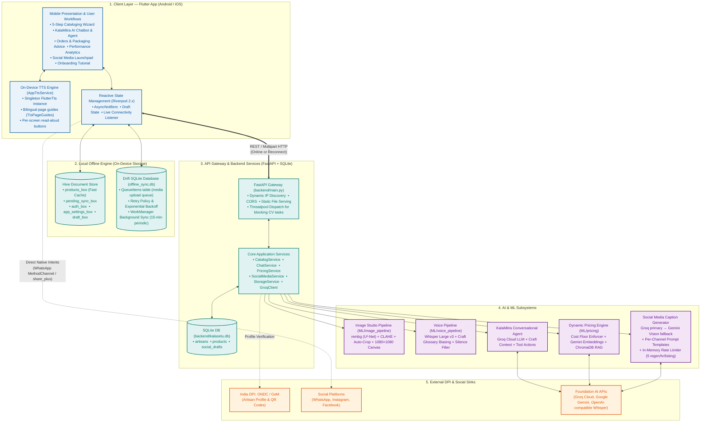
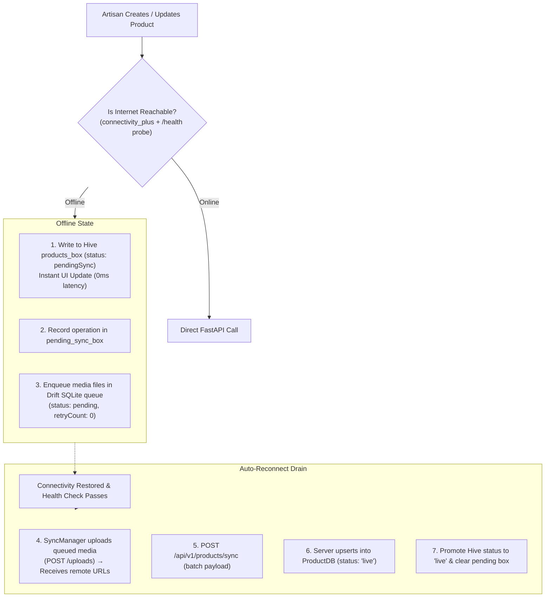
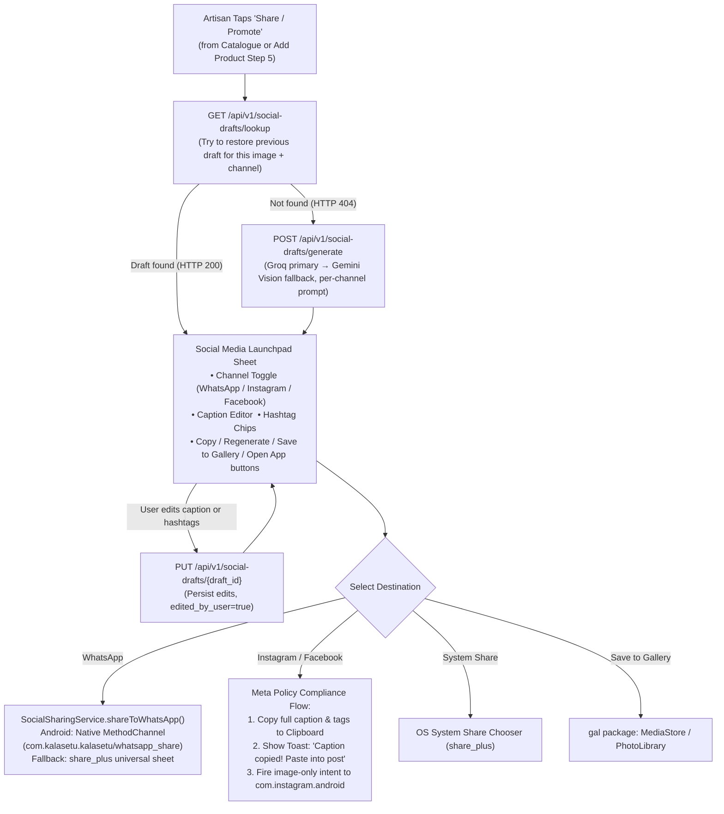
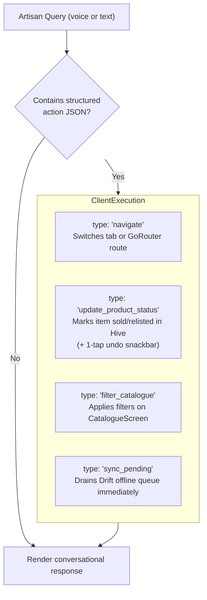
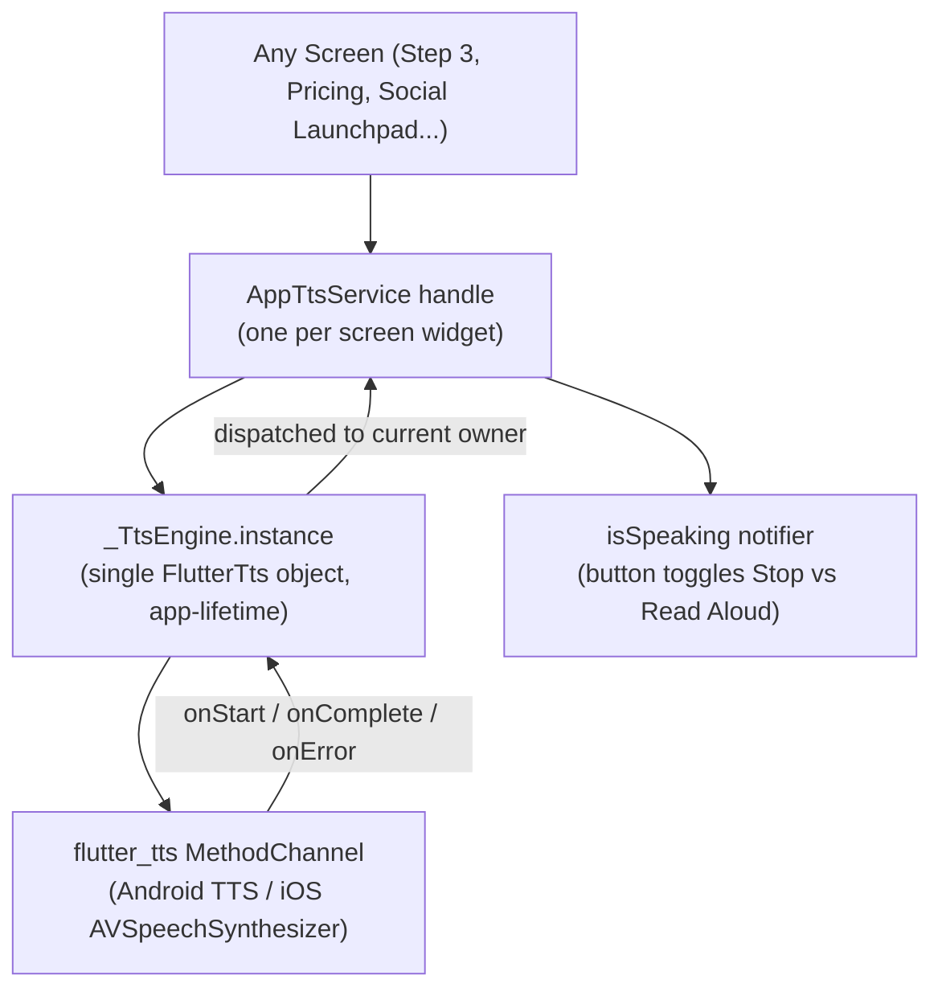
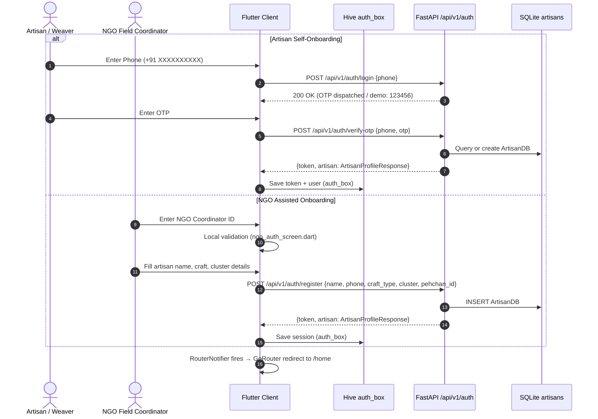
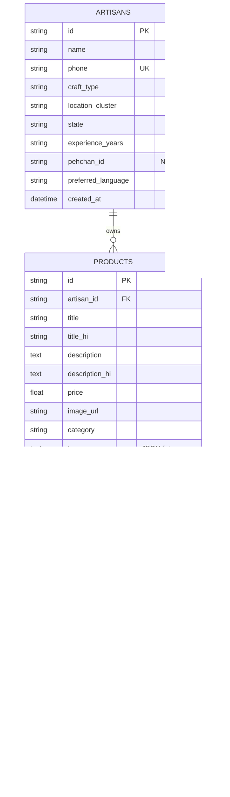
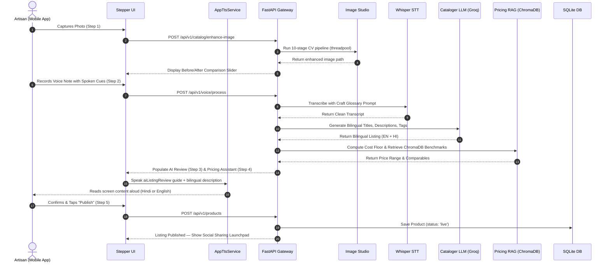
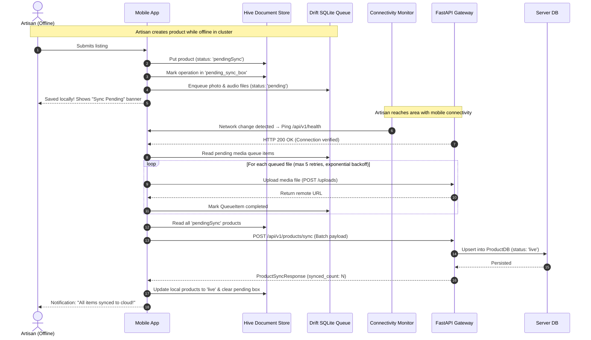

# KalaSetu — System Architecture & Technical Specification

> **AI-Driven Market Linkage & Smart Cataloging Platform for Marginalized Artisans**
> *Built for Smart India Hackathon 2026 · Problem Statement PS-90*

---

## Table of Contents

1. [Executive Summary & Core Mission](#1-executive-summary--core-mission)
2. [High-Level System Architecture](#2-high-level-system-architecture)
3. [Tech Stack Reference](#3-tech-stack-reference)
4. [Folder Structure & Key Files](#4-folder-structure--key-files)
5. [Feature 1: Multilingual Onboarding, Authentication & NGO Assisted Flow](#5-feature-1-multilingual-onboarding-authentication--ngo-assisted-flow)
6. [Feature 2: AI Image Studio (Computer Vision Pipeline)](#6-feature-2-ai-image-studio-computer-vision-pipeline)
7. [Feature 3: Multilingual Voice Auto-Cataloger (ASR & LLM)](#7-feature-3-multilingual-voice-auto-cataloger-asr--llm)
8. [Feature 4: Dynamic Pricing Engine & Cost-Floor Safeguard](#8-feature-4-dynamic-pricing-engine--cost-floor-safeguard)
9. [Feature 5: Dual Offline-First Storage & Sync Engine](#9-feature-5-dual-offline-first-storage--sync-engine)
10. [Feature 6: Product Catalogue & Inventory Management](#10-feature-6-product-catalogue--inventory-management)
11. [Feature 7: Social Media Launchpad (WhatsApp, Instagram, Facebook)](#11-feature-7-social-media-launchpad-whatsapp-instagram-facebook)
12. [Feature 8: KalaMitra AI Chatbot & Navigation Agent](#12-feature-8-kalamitra-ai-chatbot--navigation-agent)
13. [Feature 9: Order Management, AI Packaging Advisory & PDF Labels](#13-feature-9-order-management-ai-packaging-advisory--pdf-labels)
14. [Feature 10: Artisan Performance & Revenue Analytics](#14-feature-10-artisan-performance--revenue-analytics)
15. [Feature 11: On-Device Bilingual TTS & Page Guide System](#15-feature-11-on-device-bilingual-tts--page-guide-system)
16. [Feature 12: Notifications](#16-feature-12-notifications)
17. [Feature 13: Onboarding Tutorial](#17-feature-13-onboarding-tutorial)
18. [Auth & Permissions Lifecycle](#18-auth--permissions-lifecycle)
19. [Data Layer & Storage Architecture](#19-data-layer--storage-architecture)
20. [Backend API Layer](#20-backend-api-layer)
21. [End-to-End System Workflows](#21-end-to-end-system-workflows)
22. [Security, Privacy & Data Governance](#22-security-privacy--data-governance)
23. [Testing & Verification](#23-testing--verification)
24. [Environment Variables & Configuration](#24-environment-variables--configuration)
25. [Conventions for AI Agents Working in This Repo](#25-conventions-for-ai-agents-working-in-this-repo)
26. [Known Gaps, Mocked Components & Future Roadmap](#26-known-gaps-mocked-components--future-roadmap)

---

## 1. Executive Summary & Core Mission

**KalaSetu (कलासेतु — "Bridge of Art")** is an offline-first, multilingual, AI-powered virtual business manager that bridges the digital, economic, and linguistic divide for India's traditional artisans, handloom weavers, and rural craftspersons.

Government initiatives (*Shilp Samagam*, *Surajkund Mela*, *Dilli Haat*) provide temporary seasonal market exposure, but when exhibitions end, artisan revenues collapse. Craftspeople face four structural barriers:

1. **Studio Quality Barrier** — no photography equipment or skills for e-commerce-grade images.
2. **Linguistic & Digital Literacy Barrier** — inability to write SEO listings in English or navigate seller portals.
3. **Information Asymmetry & Exploitative Pricing** — no real-time price benchmarks; middlemen capture 300–500% retail markups.
4. **Connectivity Barrier** — unreliable or absent cellular data in rural craft clusters.

KalaSetu solves all four: an artisan photographs their product, speaks naturally in their mother tongue, and the platform automatically (a) removes the cluttered workshop background, (b) transcribes with domain craft-vocabulary biasing, (c) writes bilingual Hindi + English SEO listings, (d) enforces a mathematical fair-price floor backed by live market RAG comparables, (e) reads everything aloud for non-literate users via on-device TTS, and (f) queues everything locally for fully offline operation until connectivity is restored.

---

## 2. High-Level System Architecture

KalaSetu is a 5-tier architecture: mobile client, local offline engine, API gateway, AI/ML subsystems, and external public infrastructure.



---

## 3. Tech Stack Reference

### 3.1 Frontend (Flutter Mobile Client)

| Component | Technology | Version / Note |
|-----------|-----------|----------------|
| Core App | Flutter / Dart | 3.x / Dart 3.x (`frontend/pubspec.yaml`) |
| State Management | Flutter Riverpod | `^2.6.1` — `StateNotifier`, `AsyncNotifier`, `Provider` |
| Routing | GoRouter | `^14.8.1` — declarative routing with auth redirect guards |
| Local DB (offline queue) | Drift (SQLite) | `^2.21.0` + `sqlite3_flutter_libs: ^0.5.24` |
| Local Cache / Auth | Hive | `hive_flutter: ^1.1.0` — synchronous key-value NoSQL |
| Background Sync | WorkManager | `workmanager: ^0.6.0` — 15-min periodic task, post app-kill |
| HTTP Client | Dio | `^5.7.0` — with interceptors, timeout, and LAN discovery |
| Connectivity | connectivity_plus | `^6.0.5` — stream-based + active health probe |
| Audio Recording | record | `^7.1.1` — cross-platform mic capture to `.m4a` / `.wav` |
| Audio Playback | just_audio | `^0.9.40` — voice memo and TTS audio playback |
| Text-to-Speech | flutter_tts | `^4.1.0` — singleton engine (`AppTtsService`) |
| Camera / Gallery | camera `^0.11.0`, image_picker `^1.1.2` | Hardware camera + gallery access |
| PDF Labels | pdf `^3.10.8`, printing `^5.13.2` | On-device PDF rendering for shipping labels |
| QR Codes | qr_flutter `^4.1.0` | ONDC profile QR on shipping labels |
| Social Sharing | share_plus `^10.1.4`, gal `^2.3.2`, url_launcher `^6.3.1` | Share sheet, gallery save, app deep-links |
| Localization | easy_localization `^3.0.7` | JSON-based EN + HI translations (`assets/translations/`) |
| Typography | google_fonts `^6.2.1` | Manrope + Fraunces bundled variable fonts |

### 3.2 Backend (FastAPI API Gateway)

| Component | Technology | Note |
|-----------|-----------|------|
| Web Framework | FastAPI (`>=0.115.0`) | Async Python 3.11+, OpenAPI docs at `/docs` |
| ASGI Server | Uvicorn (`>=0.30.0`) | `uvicorn backend.main:app --host 0.0.0.0 --port 8000 --reload` |
| ORM | SQLAlchemy 2.0 (`>=2.0.35`) | `SessionLocal`, `Base.metadata.create_all` |
| Database | SQLite 3 (`backend/kalasetu.db`) | Three tables: `artisans`, `products`, `social_drafts` |
| Validation & Config | Pydantic v2 + pydantic-settings | `backend/config.py` → `Settings(BaseSettings)` |
| Async HTTP | HTTPX (`>=0.27.0`), aiofiles | Async file streaming and multipart upload handling |
| Static Files | FastAPI StaticFiles | Mounted at `/uploads` → `backend/uploads/` |
| Blocking Task Dispatch | `starlette.concurrency.run_in_executor` | Prevents OpenCV/rembg from blocking the async event loop |

### 3.3 Machine Learning & AI Services

| Layer | Technology | Role |
|-------|-----------|------|
| Speech-to-Text | Whisper Large v3 (via Groq / OpenAI-compatible endpoint) | Regional audio transcription with craft glossary prompt biasing |
| Primary LLM | Groq Cloud (`openai/gpt-oss-120b`) | Catalog listing generation, pricing reasoning, KalaMitra agent, social captions (primary) |
| Multimodal LLM | Google Gemini (`gemini-3.6-flash`) | Social media caption generation (fallback), cost-breakdown analysis, multimodal vision |
| Embeddings | Gemini `gemini-embedding-001` | 3072-dimensional multimodal embeddings for ChromaDB pricing RAG |
| Computer Vision | rembg (U²-Net), OpenCV, Pillow | Background removal, CLAHE lighting, gray-world white balance, 1080×1080 canvas |
| Vector Store | ChromaDB (`ML/pricing/chroma_db/`) | Cosine similarity index over Amazon Karigar, FabIndia, Etsy, Okhai benchmarks |
| Audio Analysis | ffmpeg `volumedetect` | Rejects silent recordings before sending to inference |

---

## 4. Folder Structure & Key Files

```
kalasetu/
├── .env                            # Local secrets (gitignored — copy from .env.example)
├── .env.example                    # Template listing all required environment variable names
│
├── backend/                        # FastAPI Backend Application
│   ├── config.py                   # Pydantic Settings — API keys, model names, DB URL, upload path
│   ├── database.py                 # SQLAlchemy engine, SessionLocal, Base, init_db()
│   ├── main.py                     # FastAPI app, lifespan, CORS, StaticFiles mount, router registration
│   ├── kalasetu.db                 # SQLite relational database (auto-created at startup)
│   ├── models/
│   │   ├── db_models.py            # SQLAlchemy ORM tables: ArtisanDB, ProductDB, SocialDraftDB
│   │   └── schemas.py              # Pydantic request/response schemas for all endpoints
│   ├── routers/
│   │   ├── auth.py                 # POST /api/v1/auth/{register,login,verify-otp}  GET /api/v1/auth/me
│   │   ├── catalog.py              # POST /api/v1/catalog/{enhance-image,generate-listing}
│   │   ├── chat.py                 # POST /api/v1/chat/{message,voice}  GET /api/v1/chat/quick-topics
│   │   ├── health.py               # GET /api/v1/health (liveness probe)
│   │   ├── pricing.py              # POST /api/v1/pricing/{suggest,suggest-upload,suggest-from-voice}
│   │   ├── products.py             # CRUD + POST /api/v1/products/sync (batch offline upload)
│   │   ├── social.py               # GET,POST,PUT /api/v1/social-drafts/{lookup,generate,link,{id}}
│   │   └── voice.py                # POST /api/v1/voice/{transcribe,process}
│   ├── services/
│   │   ├── catalog_service.py      # Multimodal cataloging: silence check, glossary biasing, LLM listing
│   │   ├── chat_service.py         # KalaMitra agent: system prompt, guardrails, direct action parsing
│   │   ├── groq_client.py          # Groq Cloud API wrapper (chat completions + Whisper STT)
│   │   ├── pricing_service.py      # Cost floor math + ChromaDB RAG + LLM pricing inference
│   │   ├── social_media_service.py # Per-channel caption generation (Groq primary, Gemini fallback)
│   │   └── storage_service.py      # File upload, UUID prefix hashing, subdirectory management
│   ├── uploads/                    # Local media storage (raw/, enhanced/, audio/, products/)
│   └── tests/                      # Backend test suites (pytest)
│
├── ML/                             # Machine Learning & AI Subsystems (standalone pipelines)
│   ├── image_pipeline/
│   │   ├── enhancer.py             # 10-stage rembg + OpenCV image processing pipeline
│   │   ├── run_enhancer.py         # CLI test runner for standalone image enhancement
│   │   └── processors/             # Individual pipeline stage implementations
│   ├── pricing/
│   │   ├── chroma_db/              # ChromaDB persistent vector index files
│   │   ├── embeddings/             # Gemini embedding generation utilities
│   │   ├── llm/                    # LLM pricing inference (pricer.py)
│   │   ├── models.py               # Pydantic data structures: PricingRequest, PricingResponse
│   │   └── run_pipeline.py         # CLI: scrape benchmarks, embed, index, query
│   └── voice_pipeline/
│       ├── glossary/
│       │   └── craft_terms.py      # 100+ Indian craft terms injected into Whisper prompt context
│       ├── orchestrator/           # Audio pre-processing & transcription runners
│       └── transcription/          # Whisper API call wrappers
│
└── frontend/                       # Flutter Mobile Client
    ├── pubspec.yaml                 # All Flutter dependencies and asset registrations
    └── lib/
        ├── main.dart               # App entrypoint: Hive init, WorkManager registration, API discovery
        ├── app.dart                # MaterialApp with EasyLocalization + GoRouter
        ├── core/
        │   ├── config/
        │   │   └── api_config.dart         # Dynamic LAN IP/localhost discovery (discoverWorkingUrl)
        │   ├── offline_sync/
        │   │   ├── database/database.dart  # Drift schema: QueueItems table, QueueStatus enum
        │   │   ├── models/queue_item.dart  # QueueItem model, kMaxQueueItemRetries = 5
        │   │   ├── services/
        │   │   │   ├── sync_manager.dart       # Upload queue drain, exponential backoff, polling
        │   │   │   ├── connectivity_service.dart  # Stream + /health active probe
        │   │   │   └── upload_api.dart         # HTTP multipart upload to backend
        │   │   ├── offline_sync_service.dart   # Singleton service wiring SyncManager + WorkManager
        │   │   └── background_sync.dart        # WorkManager task: kSyncTaskName, 15-min periodic
        │   ├── providers/
        │   │   └── app_providers.dart          # All Riverpod providers (HasSelectedLanguageNotifier, notificationsProvider, etc.)
        │   ├── router/
        │   │   ├── app_router.dart             # GoRouter config, RouterNotifier, redirect guards
        │   │   └── app_route_constants.dart    # Route name constants
        │   ├── services/
        │   │   ├── app_tts_service.dart        # Singleton TTS engine (_TtsEngine) + AppTtsService handle
        │   │   └── tts_page_guides.dart        # TtsGuide records for all screens (EN + HI scripts)
        │   ├── theme/                          # AppColors, AppTextStyles, AppSpacing
        │   └── widgets/                        # Shared widgets (AppScaffold, SpeakerAffordance, CyclingGuidanceCue, etc.)
        ├── data/
        │   ├── models/             # Product, UserProfile, SocialDraft, ChatMessage Dart models
        │   ├── repositories/
        │   │   ├── auth_repository.dart    # Hive-backed auth state + Dio calls to /api/v1/auth
        │   │   └── product_repository.dart # Hive cache-aside pattern for product listing
        │   └── services/
        │       ├── api_service.dart            # HttpApiService base (Dio client + base URL sync)
        │       ├── chat_service.dart           # Chat HTTP calls + direct action parsing
        │       ├── image_enhancer_service.dart # POST /api/v1/catalog/enhance-image
        │       ├── pricing_service.dart        # POST /api/v1/pricing/suggest
        │       ├── social_media_service.dart   # Social draft HTTP calls
        │       ├── speech_service.dart         # record + POST /api/v1/voice/process
        │       └── sync_service.dart           # High-level sync trigger (used by providers)
        └── features/
            ├── add_product/        # 5-step multimodal product digitization wizard
            ├── auth/               # Splash, Language, Sign-In, Register, OTP, NGO Auth screens
            ├── catalogue/          # Product grid, search, filters, product detail
            ├── chatbot/            # KalaMitra FAB, chat sheet, direct action handlers
            ├── home/               # HomeShell (IndexedStack, 4-tab bottom nav + FAB)
            ├── notifications/      # Notifications screen (TTS per-notification, markAllRead)
            ├── orders/             # Orders list, order detail, PDF label, packaging advisory
            ├── profile/            # Profile screen, language settings, analytics dashboard
            ├── social_media/       # Social Media Launchpad (WhatsApp, Instagram, Facebook)
            └── tutorial/           # Onboarding tutorial carousel with TTS narration
```

---

## 5. Feature 1: Multilingual Onboarding, Authentication & NGO Assisted Flow

### 5.1 User-Facing Flow

1. **Splash & Language Gate**: App opens → `SplashScreen` checks Hive `app_settings_box`. If `has_selected_language = false`, routes to `LanguageScreen` (`/language`). User taps language → `HasSelectedLanguageNotifier.markLanguageSelected()` writes to Hive → `RouterNotifier` fires → redirects to `/sign-in`.
2. **Phone Sign-In**: User enters 10-digit phone number → `SignInScreen` → determines new/existing user → routes to `/register` or `/otp?phone=...`.
3. **Registration**: New artisan fills: Name, Craft Type (e.g. Blue Pottery, Zardozi), State, Cluster, Pehchan ID (optional). Submits → `POST /api/v1/auth/register`.
4. **OTP Verification**: `OtpScreen` receives 6-digit code (demo OTP `123456` always passes in dev). Submits → `POST /api/v1/auth/verify-otp` → backend returns `{token, artisan: ArtisanProfileResponse}` → stored in Hive `auth_box` via `AuthRepository`.
5. **NGO Assisted Mode**: Volunteer taps "NGO Assisted Login" → `NgoAuthScreen` (`/ngo-auth`) → enters NGO Coordinator ID → calls `authStateProvider.notifier.signInWithCoordinator(id)` → registers artisan on their behalf via `POST /api/v1/auth/register` → stores session.
6. **Session Active**: `RouterNotifier` listens to `authStateProvider` → redirects to `/home` automatically.

### 5.2 Key Files

| File | Role |
|------|------|
| `frontend/lib/features/auth/screens/splash_screen.dart` | Initial load, Hive check |
| `frontend/lib/features/auth/screens/language_screen.dart` | Language selection (`/language`) |
| `frontend/lib/features/auth/screens/sign_in_screen.dart` | Phone entry (`/sign-in`) |
| `frontend/lib/features/auth/screens/register_screen.dart` | Artisan KYC form (`/register`) |
| `frontend/lib/features/auth/screens/otp_screen.dart` | OTP entry (`/otp`) |
| `frontend/lib/features/auth/screens/ngo_auth_screen.dart` | NGO assisted onboarding (`/ngo-auth`) |
| `frontend/lib/features/auth/providers/auth_provider.dart` | `AuthState`, `AuthNotifier` |
| `frontend/lib/data/repositories/auth_repository.dart` | Hive persistence + Dio calls to auth endpoints |
| `backend/routers/auth.py` | Auth router |
| `backend/models/db_models.py` | `ArtisanDB` SQLAlchemy model |
| `backend/models/schemas.py` | `ArtisanRegisterRequest`, `OTPVerifyRequest`, `ArtisanProfileResponse` |

### 5.3 API Endpoints

| Method | Path | Purpose |
|--------|------|---------|
| `POST` | `/api/v1/auth/register` | Create artisan profile in `artisans` table |
| `POST` | `/api/v1/auth/login` | Dispatch OTP (or confirm phone exists) |
| `POST` | `/api/v1/auth/verify-otp` | Validate OTP → return token + profile |
| `GET` | `/api/v1/auth/me` | Fetch authenticated artisan profile |

### 5.4 Data Model: `artisans` Table

```
artisans(id PK, name, phone UNIQUE, craft_type, location_cluster, state,
         experience_years, pehchan_id NULLABLE, preferred_language, created_at)
```

Hive `auth_box` keys: `user_id`, `phone_number`, `is_authenticated`, `access_token`.

### 5.5 Business Logic

- Demo OTP `123456` is hardcoded when no SMS gateway (Twilio/Gupshup) is configured.
- Pehchan ID (Ministry of Textiles Artisan Card) is optional — collecting it at registration causes drop-off.
- NGO coordinator ID validation is local-only; no backend verification endpoint exists yet (see §26).
- `GoRouter` redirect priority: Language check → Auth check. Both enforce before any authenticated route.

---

## 6. Feature 2: AI Image Studio (Computer Vision Pipeline)

### 6.1 User-Facing Flow

1. **Capture (Add Product Step 1)**: Artisan taps the "Add Product" FAB → `AddProductFlowScreen` → `step1_capture_widget.dart`. Camera opens; artisan photographs craft. Client-side blur/glare check runs.
2. **Backend Enhancement**: Image multipart-uploaded to `POST /api/v1/catalog/enhance-image`. Backend dispatches to `CatalogService` which calls `ML/image_pipeline/enhancer.py` inside a `run_in_executor` threadpool to avoid blocking the async event loop.
3. **9-Stage CV Pipeline runs** (see §6.2 below). Output: studio-grade PNG saved to `backend/uploads/enhanced/`.
4. **Before/After UI**: `step1_capture_widget.dart` renders an interactive gesture-driven split slider. Artisan drags the divider to compare raw vs. enhanced. Can retake if unsatisfied.
5. **Accept**: Artisan taps Accept → `AddProductDraft.enhancedImageUrl` set → advances to Step 2.

### 6.2 9-Stage Computer Vision Pipeline

```mermaid
flowchart LR
    A["1. Raw Capture
(Validation & EXIF)"] --> B["2. rembg (U²-Net)
Alpha Matting"]
    B --> C["3. Auto-Crop
Contour Bounding"]
    C --> D["4. Lighting Fix
CLAHE on Luminance"]
    D --> E["5. White Balance
Gray-World Algorithm"]
    E --> F["6. Sharpening
Unsharp Masking"]
    F --> G["7. Background
Alpha Composite on White"]
    G --> H["8. E-Com Canvas
1080×1080 Square Fit"]
    H --> I["9. Optimization
WebP/JPEG Quality 85"]
```



**Stage details:**
1. **Input Validation**: Checks byte integrity, handles EXIF orientation rotation, converts palette/RGBA.
2. **Background Removal (rembg)**: U²-Net salient-object detection produces alpha transparency mask separating craft from workshop background.
3. **Auto-Crop**: Minimum bounding rectangle of non-zero alpha pixels, with 8% margin padding.
4. **CLAHE Luminance Correction**: Converts to CIELAB, applies Contrast Limited Adaptive Histogram Equalization + adaptive gamma strictly on the L (Luminance) channel — *before* white canvas is added, to avoid histogram distortion from white pixels.
5. **White Balance**: Gray-world assumption cancels yellowish incandescent / bluish CFL casts common in village workshops.
6. **Unsharp Masking**: Mild edge-enhancement convolution highlights handcrafted surface details.
7. **Canvas Compositing**: Alpha-blends isolated craft onto pure white (`#FFFFFF`) canvas.
8. **E-Commerce Canvas**: Centers and scales to standard 1080×1080 square without distortion.
9. **Output Compression**: WebP/JPEG targeting ~200–400 KB for fast mobile rendering over 2G/3G.

### 6.3 Key Files

| File | Role |
|------|------|
| `frontend/lib/features/add_product/widgets/step1_capture_widget.dart` | Camera, before/after slider UI |
| `frontend/lib/data/services/image_enhancer_service.dart` | Multipart upload to enhance endpoint |
| `backend/routers/catalog.py` | `POST /api/v1/catalog/enhance-image` |
| `backend/services/catalog_service.py` | Calls ML pipeline, manages file paths |
| `ML/image_pipeline/enhancer.py` | 10-stage OpenCV/rembg pipeline |

---

## 7. Feature 3: Multilingual Voice Auto-Cataloger (ASR & LLM)

### 7.1 The Problem: Domain Phonetic Substitution

Standard ASR models trained on news broadcasts consistently misclassify craft terminology. Examples:
- *"Dhokra"* (lost-wax brass casting) → *"doctor"*
- *"Chikankari"* (Lucknow embroidery) → *"chicken curry"*
- *"चाक"* (chaak, potter's wheel) → *"चात"* (chaat)

### 7.2 User-Facing Flow

1. **Voice Recording (Add Product Step 2)**: Artisan holds mic button in `step2_describe_widget.dart`. `SpeechService` records audio to `.m4a`. `CyclingGuidanceCue` widget rotates spoken prompt chips: *"Materials used"*, *"Hours of labor"*, *"Special technique"*.
2. **Upload**: Audio uploaded via `POST /api/v1/voice/process` multipart.
3. **Silence Check**: `CatalogService._is_audio_silent()` runs `ffmpeg -af volumedetect`. If peak volume < −40 dB, rejects and prompts artisan to re-record.
4. **Glossary Biasing**: `craft_terms.py` injects 100+ curated terms (Latin + Devanagari) into Whisper's initial prompt context for the category.
5. **Whisper Transcription**: Whisper Large v3 transcribes with biased vocabulary.
6. **Hallucination Guard**: Traps common Whisper silence artifacts (*"Thank you for watching"*, *"Please subscribe"*); rejects if matched.
7. **LLM Structuring (Groq)**: Clean transcript fed to `openai/gpt-oss-120b` via `GroqClient.chat_json()` → generates:
   - Title (EN + HI), storytelling description (EN + HI), craft category, 5–8 SEO tags.
8. **Cost Cue Extraction**: Secondary LLM parse extracts mentioned material costs and labor hours → auto-seeds Step 4 Pricing Assistant.
9. **AI Review (Step 3)**: Bilingual fields displayed in `step3_ai_review_widget.dart`. Artisan can edit. TTS reads the Hindi listing description aloud.

### 7.3 Key Files

| File | Role |
|------|------|
| `frontend/lib/features/add_product/widgets/step2_describe_widget.dart` | Voice recording UI + cycling cue chips |
| `frontend/lib/features/add_product/widgets/step3_ai_review_widget.dart` | Bilingual listing review + TTS readback |
| `frontend/lib/data/services/speech_service.dart` | Audio recording + upload |
| `frontend/lib/core/widgets/cycling_guidance_cue.dart` | Rotating voice prompt chips |
| `backend/routers/voice.py` | Voice endpoints |
| `backend/services/catalog_service.py` | Silence check, glossary injection, LLM listing generation |
| `backend/services/groq_client.py` | Groq Cloud API wrapper |
| `ML/voice_pipeline/glossary/craft_terms.py` | 100+ craft terms across Textiles, Pottery, Metalwork, Woodwork |

### 7.4 API Endpoints

| Method | Path | Purpose |
|--------|------|---------|
| `POST` | `/api/v1/voice/transcribe` | Standalone audio → transcript only |
| `POST` | `/api/v1/voice/process` | Full pipeline: audio → transcript + bilingual listing + cost cues |
| `POST` | `/api/v1/catalog/generate-listing` | Text transcript + image → bilingual listing |

### 7.5 Craft Glossary Coverage

- **Textiles**: Bandhani, Ajrakh, Chikankari, Kalamkari, Ikat, Patola, Banarasi, Chanderi, Kanjeevaram, Phulkari, Zari, Zardozi, Tussar silk
- **Pottery**: Terracotta, Khurja, Blue Pottery, Chaak, Kulhad, Surahi, Matka, Diya
- **Metalwork**: Dhokra, Bidriware, Bell metal, Thewa, Meenakari, Filigree, Kansa
- **Devanagari set**: Full dual-script glossary for phonetic alignment in native-script output

---

## 8. Feature 4: Dynamic Pricing Engine & Cost-Floor Safeguard

### 8.1 User-Facing Flow

1. **Trigger (Step 4)**: Automatically invoked after voice catalog step OR on-demand from Product Detail edit.
2. **Input**: Artisan reviews auto-extracted material cost, labor hours, transport, overhead (pre-filled from cost cue extraction in Step 3, editable).
3. **Cost Floor Calculation**: Backend computes mathematically guaranteed minimum:
   ```
   Cost Floor = C_materials + (T_labor × W_hourly_floor) + C_transport + C_overhead
   W_hourly_floor ∈ [₹50–₹120/hr]
   ```
4. **ChromaDB RAG Benchmarking**: Product description + enhanced image → `gemini-embedding-001` 3072-dim embeddings → ChromaDB cosine similarity search → Top 3–5 comparable listings from Amazon Karigar, FabIndia, Etsy, Okhai.
5. **LLM Pricing Inference**: Groq/Gemini receives: cost floor, comparable prices, craft category → outputs structured price suggestion.
6. **Invariant Enforcement**: If suggested price < cost floor, server clamps to `cost_floor + category_margin`. This invariant is **never bypassed**.
7. **UI Price Range**: `step4_pricing_widget.dart` shows three tiers:
   - Minimum Safe Price (break-even + 15% margin)
   - Recommended Fair Price (optimal direct-to-consumer)
   - Premium Gallery Price (export/luxury)
8. **Hindi Audio Reasoning**: `AppTtsService` reads the `explanation_hi` field aloud (e.g. *"Aapka kaam Zardozi embroidery ka hai, 16 ghante lage hain. Bazaar moolya ₹2,400 se ₹3,200 ke beech hona chahiye."*)
9. **Price Guard UI**: If artisan manually enters price below cost floor, orange badge appears: *"Warning: This price is below your cost of materials and labor."*

### 8.2 Key Files

| File | Role |
|------|------|
| `frontend/lib/features/add_product/widgets/step4_pricing_widget.dart` | Pricing UI, cost input, price range display |
| `frontend/lib/data/services/pricing_service.dart` | POST to pricing endpoint |
| `backend/routers/pricing.py` | Pricing endpoints |
| `backend/services/pricing_service.py` | Cost floor calc + ChromaDB RAG + LLM inference |
| `ML/pricing/chroma_db/` | ChromaDB vector index persistence |
| `ML/pricing/models.py` | `PricingRequest`, `PricingResponse`, `CostBreakdown` |
| `ML/pricing/llm/` | LLM pricing analyst (`pricer.py`) |

### 8.3 API Endpoints

| Method | Path | Purpose |
|--------|------|---------|
| `POST` | `/api/v1/pricing/suggest` | Main: materials + labor → cost floor + price range |
| `POST` | `/api/v1/pricing/suggest-upload` | Multimodal: image + metadata → pricing |
| `POST` | `/api/v1/pricing/suggest-from-voice` | Voice transcript → auto-extract costs → pricing |

---

## 9. Feature 5: Dual Offline-First Storage & Sync Engine

### 9.1 User-Facing Flow



### 9.2 Dual Engine Detail

**Drift SQLite Database (`offline_sync.db`)**:
- Table: `QueueItems` (`localId PK`, `type` [imageEnhance|voiceNote], `localFilePath`, `productDraftId`, `status`, `retryCount`, `createdAt`, `lastAttemptAt`, `jobId`, `errorMessage`, `resultJson`)
- `kMaxQueueItemRetries = 5` (defined in `models/queue_item.dart`)
- `isRetryable` getter: `status == failed && retryCount < 5`
- Exponential backoff: `delay = min(2^retryCount, 60)` seconds
- WorkManager task `kalasetu-offline-sync-task`: 15-min periodic, `NetworkType.connected` constraint, runs in background isolate even after app kill

**Hive NoSQL Store**:
- `products_box`: Fast product cache with `pendingSync` / `live` status markers
- `pending_sync_box`: Tracks pending mutations for batch sync
- `auth_box`: Authentication token + user profile (`user_id`, `access_token`, `is_authenticated`)
- `app_settings_box`: `has_selected_language` preference

**Dynamic Network Discovery (`ApiConfig`)**:
Probes `[LAN_IP:8000, 10.0.2.2:8000, 127.0.0.1:8000, localhost:8000]` against `/api/v1/health`. Binds to first responsive host. Prevents hardcoded IP failures across emulator/physical device/desktop.

### 9.3 Key Files

| File | Role |
|------|------|
| `frontend/lib/core/offline_sync/database/database.dart` | Drift schema, QueueStatus enum, helper queries |
| `frontend/lib/core/offline_sync/models/queue_item.dart` | `QueueItem` model, `kMaxQueueItemRetries = 5` |
| `frontend/lib/core/offline_sync/services/sync_manager.dart` | Queue drain loop, upload, retry, poll |
| `frontend/lib/core/offline_sync/services/connectivity_service.dart` | Stream + active health probe |
| `frontend/lib/core/offline_sync/services/upload_api.dart` | Multipart HTTP upload to backend |
| `frontend/lib/core/offline_sync/offline_sync_service.dart` | Singleton wiring SyncManager + WorkManager |
| `frontend/lib/core/offline_sync/background_sync.dart` | WorkManager dispatcher (`syncCallbackDispatcher`) |
| `frontend/lib/core/config/api_config.dart` | `discoverWorkingUrl()` LAN IP probing |
| `backend/routers/products.py` | `POST /api/v1/products/sync` |
| `backend/routers/health.py` | `GET /api/v1/health` |

### 9.4 API Endpoints

| Method | Path | Purpose |
|--------|------|---------|
| `GET` | `/api/v1/health` | Liveness probe — returns `{"status":"healthy"}` |
| `POST` | `/api/v1/products/sync` | Idempotent batch product creation/update from offline queue |

---

## 10. Feature 6: Product Catalogue & Inventory Management

### 10.1 User-Facing Flow

1. **Catalogue Tab**: User selects "Catalogue" in bottom nav → `CatalogueScreen` (`/catalogue`).
2. **Offline-First Load**: `ProductRepository.getProducts()` first reads Hive `products_box` for instant display, then fires `GET /api/v1/products?artisan_id=...` and refreshes.
3. **Filter & Search**: Category pills (Pottery, Textiles, Jewelry, Woodwork) + instant search bar + status toggle (All / Live / Draft / Archived).
4. **Product Detail**: Tap card → `ProductDetailScreen` (`/product/:id`) → displays enhanced photo, bilingual descriptions, tags, pricing, QR code. Launches Social Launchpad or Edit.
5. **Status Toggle**: Artisan archives/restores listing → `PUT /api/v1/products/{id}` with new status.
6. **Delete**: Confirms dialog → `DELETE /api/v1/products/{id}` → removes from Hive + backend.

### 10.2 Key Files

| File | Role |
|------|------|
| `frontend/lib/features/catalogue/screens/catalogue_screen.dart` | Grid/list view, search, filters |
| `frontend/lib/features/catalogue/screens/product_detail_screen.dart` | Single product detail view |
| `frontend/lib/data/repositories/product_repository.dart` | Hive cache-aside + API calls |
| `frontend/lib/data/models/product.dart` | `Product` Dart model (Hive type adapter) |
| `backend/routers/products.py` | Product CRUD endpoints |
| `backend/models/db_models.py` | `ProductDB` SQLAlchemy model |

### 10.3 API Endpoints

| Method | Path | Purpose |
|--------|------|---------|
| `GET` | `/api/v1/products` | List with `?category`, `?status`, `?artisan_id`, `?skip`, `?limit` |
| `GET` | `/api/v1/products/{product_id}` | Single product fetch |
| `PUT` | `/api/v1/products/{product_id}` | Update fields (title, price, status, etc.) |
| `DELETE` | `/api/v1/products/{product_id}` | Remove product |
| `POST` | `/api/v1/products` | Create new product (used at end of Add Product wizard) |

### 10.4 Data Model: `products` Table

```
products(id PK, artisan_id FK→artisans, title, title_hi, description, description_hi,
         price, image_url, category, tags [JSON], status [live|draft|archived],
         created_at, updated_at)
```

---

## 11. Feature 7: Social Media Launchpad (WhatsApp, Instagram, Facebook)

### 11.1 User-Facing Flow



### 11.2 Caption Generation Architecture

`SocialMediaService` (`backend/services/social_media_service.py`) uses **Groq (`openai/gpt-oss-120b`) as primary LLM** with **Gemini Vision (`gemini-3.6-flash`) as fallback**. Per-channel prompt templates produce:
- **WhatsApp**: Warm, conversational, emoji-friendly; full caption + hashtags as inline text for direct paste.
- **Instagram**: Storytelling hook opening, linebreak-separated hashtags, emoji accents.
- **Facebook**: Community-oriented, slightly longer narrative, heritage technique emphasis.

Rate limiting: in-memory sliding window — **5 regenerations per hour per listing**. Returns HTTP 429 when exceeded.

### 11.3 Add-Flow Draft Lifecycle

During the Add Product wizard, the product ID doesn't exist yet. A client-generated UUID `draft_key` is stored with the draft. After `POST /api/v1/products` succeeds, `POST /api/v1/social-drafts/link` atomically links all matching `draft_key` drafts to the new `listing_id`.

### 11.4 Platform Constraints

- **Meta Policy**: Instagram and Facebook block `Intent.EXTRA_TEXT` pre-fill. Solution: copy caption to clipboard + fire image-only intent.
- **WhatsApp**: Allows full pre-populated text + image via native `MethodChannel`. Falls back to `share_plus` if WhatsApp is not installed.
- **Android 11+ Package Visibility**: `com.whatsapp`, `com.whatsapp.w4b`, `com.instagram.android`, `com.facebook.katana` declared in `AndroidManifest.xml` `<queries>`.

### 11.5 Key Files

| File | Role |
|------|------|
| `frontend/lib/features/social_media/screens/social_media_screen.dart` | Full-screen social helper |
| `frontend/lib/features/social_media/widgets/social_media_launchpad_sheet.dart` | Bottom sheet version |
| `frontend/lib/features/social_media/providers/social_media_provider.dart` | Draft state management |
| `frontend/lib/data/services/social_media_service.dart` | HTTP calls to social-drafts endpoints |
| `backend/routers/social.py` | All `/api/v1/social-drafts/` endpoints |
| `backend/services/social_media_service.py` | Groq → Gemini caption generation |
| `backend/models/db_models.py` | `SocialDraftDB` |

### 11.6 API Endpoints

| Method | Path | Purpose |
|--------|------|---------|
| `GET` | `/api/v1/social-drafts/lookup` | Find saved draft by `(listing_id, channel)` or `(draft_key, channel)` |
| `POST` | `/api/v1/social-drafts/generate` | Generate caption + hashtags |
| `POST` | `/api/v1/social-drafts/link` | Link add-flow `draft_key` drafts to final `listing_id` |
| `PUT` | `/api/v1/social-drafts/{draft_id}` | Persist user edits |

### 11.7 Data Model: `social_drafts` Table

```
social_drafts(id PK, listing_id FK→products NULLABLE, draft_key NULLABLE,
              image_url, caption, hashtags [JSON], channel [whatsapp|instagram|facebook],
              source [add_flow|catalogue], edited_by_user BOOL,
              created_at, updated_at)
```

---

## 12. Feature 8: KalaMitra AI Chatbot & Navigation Agent

### 12.1 User-Facing Flow

1. **Invocation**: Tapping the floating KalaMitra mascot FAB (`KalaMitraFab`) on HomeShell → opens `ChatbotSheet` as a bottom sheet, or navigate to `/assistant` for full-screen.
2. **Input**: Artisan taps quick prompt chip, types text, or holds voice record button.
3. **Voice Path**: Audio → `POST /api/v1/chat/voice` → Whisper transcription → routed into `ChatService`.
4. **System Prompt Injection**: `chat_service.py` injects artisan profile context (registered craft, cluster, language), curated domain knowledge (PM Vishwakarma, Pehchan Card, Mudra Loans, defect prevention, safe packaging), and strict formatting rules.
5. **Guardrails**: Blocks off-topic queries (coding, crypto, politics, trivia). Grounds all responses in artisan welfare and business growth.
6. **Response**: Groq `openai/gpt-oss-120b` generates plain-text reply (zero asterisks — stripped before returning).
7. **Direct Actions**: If LLM emits a structured action JSON in the response, `ChatService` parses it and the Flutter client executes it:



8. **Voice Readback**: Chat response has speaker icon → `AppTtsService` reads reply in artisan's preferred language.

### 12.2 Key Files

| File | Role |
|------|------|
| `frontend/lib/features/chatbot/screens/chatbot_sheet.dart` | Chat UI, history, voice input, TTS playback |
| `frontend/lib/features/chatbot/widgets/kalamitra_fab.dart` | Floating action button on HomeShell |
| `frontend/lib/data/services/chat_service.dart` | HTTP calls + direct action parsing |
| `frontend/lib/data/models/chat_message.dart` | `ChatMessage`, `DirectAction` models |
| `backend/routers/chat.py` | Chat endpoints + rate limiting |
| `backend/services/chat_service.py` | System prompt, guardrails, tool action detection |
| `backend/services/groq_client.py` | Groq API calls |

### 12.3 API Endpoints

| Method | Path | Purpose |
|--------|------|---------|
| `POST` | `/api/v1/chat/message` | Text chat → reply + optional `direct_action` |
| `POST` | `/api/v1/chat/voice` | Audio → transcription + reply + direct actions |
| `GET` | `/api/v1/chat/quick-topics` | Localized preset prompt chip list |

Rate limit: 20 requests/minute/client IP.

---

## 13. Feature 9: Order Management, AI Packaging Advisory & PDF Labels

### 13.1 User-Facing Flow

1. **Order Dashboard**: Navigate to `MyOrdersScreen` (`/my-orders`). Orders displayed in status tabs: All / New Orders / Packed / Shipped / Delivered.
2. **Order Detail**: Tap order card → `OrderDetailScreen` (`/orders/:orderId`) showing: customer address, line items, payment (COD vs Prepaid), courier tracking, and two action buttons.
3. **AI Packaging Advisory**: Tapping "Packaging Guide" opens `packaging_suggestions_sheet.dart`. Logic in `_guideForCategory()` matches craft category to tailored advice:
   - **Pottery/Ceramic/Clay**: Double-wall corrugated box, shredded straw/paper cushioning, fragile stickers × 4 sides.
   - **Textiles/Silk/Fabric**: Moisture-proof polywrap, acid-free tissue layering, padded courier bag.
   - **Metal/Wood**: Bubble wrap buffers, anti-tarnish cloth wrap, rigid box.
   TTS reads advisory in Hindi.
4. **Status Update**: "Mark as Packed" / "Mark as Handed to Courier" → status badge changes color.
5. **Print Shipping Label**: Tapping "Download Label" → `LabelMakerService` generates PDF via `pdf` + `printing` packages. Label includes:
   - Consignee & order barcode
   - Bilingual craft story (EN + HI)
   - Wash & care guidelines per craft category
   - ONDC Profile QR Code (`qr_flutter`)
   Preview shown via `label_preview_sheet.dart`.

### 13.2 Current Implementation Status

> `orders_provider.dart` generates in-memory `Order` objects. No backend `/api/v1/orders` table or endpoint exists. See §26.

### 13.3 Key Files

| File | Role |
|------|------|
| `frontend/lib/features/orders/screens/my_orders_screen.dart` | Order list with status tabs |
| `frontend/lib/features/orders/screens/order_detail_screen.dart` | Single order detail |
| `frontend/lib/features/orders/services/label_maker_service.dart` | PDF label generation |
| `frontend/lib/features/orders/widgets/label_preview_sheet.dart` | Label preview bottom sheet |
| `frontend/lib/features/orders/widgets/packaging_suggestions_sheet.dart` | AI packaging advisory |
| `frontend/lib/features/orders/providers/orders_provider.dart` | Mock order state (see §26) |
| `frontend/lib/features/orders/models/order.dart` | `Order` Dart model |

### 13.4 Data Model (Client-Side)

```dart
Order(id, customerName, customerAddress, customerPhone, items, totalAmount,
      status [newOrder|packed|shipped|delivered], createdAt, trackingNumber?)
```

---

## 14. Feature 10: Artisan Performance & Revenue Analytics

### 14.1 User-Facing Flow

1. **Access**: Profile screen → "My Stats" → `MyStatsScreen` (`/my-stats`).
2. **Period Filter**: Toggle tabs — This Month / Last 3 Months / All Time. Switching period resets and replays the animation (`AnimationController` + `CurvedAnimation`).
3. **Metrics Computed Client-Side** from Hive `products_box` + `ordersProvider`:
   - Total Revenue Earned (₹)
   - Total Units Sold & Live Listings
   - Top Performing Craft Category
   - Customer Reach Across States
4. **Fair Wage Premium Metric**: Demonstrates economic empowerment vs. middleman baseline:
   ```
   Fair Wage Premium = Σ (Direct KalaSetu Selling Price − Estimated Middleman Baseline Rate)
   ```
5. **Visual Dashboards**: Animated revenue trendlines, fair wage comparison cards, category distribution charts.

### 14.2 Key Files

| File | Role |
|------|------|
| `frontend/lib/features/profile/screens/my_stats_screen.dart` | Analytics dashboard |
| `frontend/lib/features/profile/screens/profile_screen.dart` | Profile + navigation to stats |
| `frontend/lib/features/orders/providers/orders_provider.dart` | Orders data source |
| `frontend/lib/data/repositories/product_repository.dart` | Products data source |

---

## 15. Feature 11: On-Device Bilingual TTS & Page Guide System

### 15.1 Architecture: Singleton TTS Engine

A sharp edge in `flutter_tts`: every `FlutterTts()` constructor registers a `setMethodCallHandler` on a **static const** platform channel. Handlers are not additive — the newest instance silently takes ownership for all callbacks. With read-aloud buttons on ~12 screens, only the most recently built instance ever received `onComplete`; others froze in "Speaking" state indefinitely.

**Solution**: `_TtsEngine` class in `app_tts_service.dart` owns a single `FlutterTts` instance. All `AppTtsService` handles (one per screen widget) share the engine through a current `owner` pointer — whichever handle last called `speak()` owns callbacks.



### 15.2 Page-Level Guide System

Every screen's Read Aloud button speaks two parts sequentially:
1. **Orientation guide** — where the artisan is, what to check, what to tap next.
2. **Screen content** — actual caption, price, description, etc.

All guide text lives in `tts_page_guides.dart` as `TtsGuide` records with `en` and `hi` strings — the complete spoken script of the app is reviewable in one place.

| Screen | Guide Constant | Languages |
|--------|---------------|-----------|
| Add Product — AI Listing Review (Step 3) | `TtsPageGuides.aiListingReview` | EN + HI |
| Add Product — Pricing Assistant (Step 4) | `TtsPageGuides.pricingAssistant` | EN + HI |
| Social Media Launchpad | `TtsPageGuides.socialLaunchpad` | EN + HI |
| Orders & Packaging | `TtsPageGuides.ordersPackaging` | EN + HI |
| Onboarding Tutorial | `TtsPageGuides.tutorialNarration` | EN + HI |

### 15.3 Language & Voice Selection

`AppTtsService` reads `preferred_language` from Hive `auth_box`. Hindi → `hi-IN` voice. English → `en-IN` or `en-US`. `TtsGuide.forLanguage()` falls back to English for any untranslated locale. Speech rate fixed at **0.48** (slower than OS default) for maximum comprehension clarity.

### 15.4 Key Files

| File | Role |
|------|------|
| `frontend/lib/core/services/app_tts_service.dart` | Singleton `_TtsEngine` + `AppTtsService` handle class |
| `frontend/lib/core/services/tts_page_guides.dart` | All `TtsGuide` records for every screen |
| `frontend/lib/core/widgets/speaker_affordance.dart` | Reusable speaker button widget |

---

## 16. Feature 12: Notifications

### 16.1 User-Facing Flow

1. **Bell icon**: Bottom nav bell or profile area shows unread badge count (via `unreadNotificationsCountProvider`).
2. **Notifications Screen** (`/notifications`): `NotificationsScreen` opens → `notificationsProvider.notifier.markAllRead()` fires immediately on open, clearing the badge.
3. **TTS Per-Notification**: Each notification card has a speaker icon. `AppTtsService` reads the notification message + relative timestamp (e.g. *"New order received for your Blue Pottery vase — 3 minutes ago"*). Only one speaks at a time; tapping the speaking item stops it.
4. **Content**: Notifications include order events (new order, shipped, delivered) and market tips/demand signals.

### 16.2 Key Files

| File | Role |
|------|------|
| `frontend/lib/features/notifications/screens/notifications_screen.dart` | Notification list with TTS |
| `frontend/lib/core/providers/app_providers.dart` | `notificationsProvider`, `unreadNotificationsCountProvider` |

> **Note**: Notifications are currently driven by local state. No backend push notification (FCM/APNs) integration exists yet.

---

## 17. Feature 13: Onboarding Tutorial

### 17.1 User-Facing Flow

1. **Access**: First-time artisans are prompted post-registration, or can access via Profile menu → "How to list a product" → `TutorialCarouselScreen` (`/listing-tutorial`).
2. **4-Step Illustrated Carousel**: Swipeable pages explain Photography → Voice Recording → AI Review → Pricing.
3. **TTS Narration**: Each slide auto-plays TTS narration from `TtsPageGuides.tutorialNarration` in the artisan's language.
4. **Completion**: Dismisses to Home or Add Product flow.

### 17.2 Key File

| File | Role |
|------|------|
| `frontend/lib/features/tutorial/screens/tutorial_carousel_screen.dart` | Carousel + TTS narration |

---

## 18. Auth & Permissions Lifecycle



### Route Guard Logic (`app_router.dart`)

```
Priority 1: If on /splash → allow (no redirect)
Priority 2: If !hasLanguage → redirect to /language (except if already on /language)
Priority 3: If on /language && hasLanguage → redirect to /home or /sign-in
Priority 4: If !isAuthenticated → redirect to /sign-in (except auth screens)
Priority 5: If isAuthenticated && on auth screen → redirect to /home
```

### Roles

| Role | Capabilities |
|------|-------------|
| **Artisan (self-managed)** | Full CRUD on own products (scoped by `artisan_id`), own social drafts, full app access |
| **NGO Field Coordinator** | Onboards multiple artisans sequentially from one device; switches artisan sessions |

All API requests attach `Authorization: Bearer <token>` header via `AuthRepository`.

---

## 19. Data Layer & Storage Architecture

### 19.1 Backend SQLite Schema (Entity-Relationship)



Schema is initialized via `Base.metadata.create_all(bind=engine)` at startup (no Alembic yet — see §26).

### 19.2 Frontend Hive Boxes

| Box Name | Key→Value | Purpose |
|----------|----------|---------|
| `auth_box` | `user_id`, `phone_number`, `is_authenticated`, `access_token` | Auth session persistence |
| `app_settings_box` | `has_selected_language` | Language gate |
| `products_box` | `product_id → Product JSON` | Offline product cache + pendingSync status |
| `pending_sync_box` | mutation IDs | Tracks which products need batch sync |
| `draft_box` | `draft_id → AddProductDraft JSON` | In-progress add-product wizard state |

### 19.3 Drift SQLite Schema (Offline Queue)

Table: `queue_items`
```
localId TEXT PK | type TEXT (imageEnhance|voiceNote) | localFilePath TEXT
productDraftId TEXT | status INTEGER (QueueStatus enum index)
retryCount INTEGER DEFAULT 0 | createdAt DATETIME | lastAttemptAt DATETIME NULLABLE
jobId TEXT NULLABLE | errorMessage TEXT NULLABLE | resultJson TEXT NULLABLE
```

### 19.4 Media Storage Layout

Backend `backend/uploads/` subdirectories:
```
uploads/
├── raw/          # Original uploaded images (UUID-prefixed)
├── enhanced/     # Studio-processed PNGs from CV pipeline
├── audio/        # Voice note recordings (.m4a/.wav)
└── products/     # Final product images referenced in DB
```

All files are UUID-prefixed (`uuid.uuid4().hex + extension`) to prevent directory traversal.

---

## 20. Backend API Layer

### 20.1 Router Summary

| Router | Prefix | Key Endpoints |
|--------|--------|---------------|
| `health` | `/api/v1/health` | `GET /` — liveness probe for mobile connectivity listener |
| `auth` | `/api/v1/auth` | Phone registration, OTP validation, profile lookup |
| `products` | `/api/v1/products` | CRUD + `/sync` idempotent batch offline upload |
| `catalog` | `/api/v1/catalog` | `/enhance-image`, `/generate-listing`, `/voice-to-product` |
| `voice` | `/api/v1/voice` | `/transcribe`, `/process` (full pipeline), craft glossary lookup |
| `pricing` | `/api/v1/pricing` | `/suggest`, `/suggest-upload`, `/suggest-from-voice` |
| `social` | `/api/v1/social-drafts` | `/lookup`, `/generate`, `/link`, `/{id}` (PUT) |
| `chat` | `/api/v1/chat` | `/message`, `/voice`, `/quick-topics` |

### 20.2 CORS & Middleware

CORS is wide-open (`allow_origins=["*"]`) for development across Flutter Web, Android, and iOS. Lock this to specific origins before production deployment.

### 20.3 Blocking Task Dispatch

OpenCV and rembg are CPU-bound and synchronous. They are dispatched via `starlette.concurrency.run_in_executor` to prevent them from blocking the async FastAPI event loop.

---

## 21. End-to-End System Workflows

### 21.1 Complete Voice-to-Product Stepper Flow



### 21.2 Offline Capture & Reconnection Synchronization



---

## 22. Security, Privacy & Data Governance

- **Artisan Data Sovereignty**: Mobile numbers and government Pehchan IDs are stored only in the SQLite DB. They are **never** passed to external LLM completion prompts.
- **Scoped Media Uploads**: All uploaded files are UUID-prefixed and segregated into `uploads/raw`, `uploads/enhanced`, `uploads/audio`, `uploads/products` to prevent directory traversal.
- **API Rate Limiting**:
  - Chat endpoint: 20 requests/minute/client IP.
  - Social caption generation: 5 regenerations/hour/listing (in-memory sliding window).
- **Accessible Prompt Guardrails**: System prompts enforce clean plain-text output (zero asterisks) and restrict KalaMitra to craft guidance, government schemes, and marketplace assistance only.
- **CORS**: Currently wide-open for development. Restrict `cors_origins` in `backend/config.py` before production.
- **Token Storage**: Auth tokens stored in Hive `auth_box` (encrypted at rest by Hive on supported platforms).

---

## 23. Testing & Verification

### 23.1 Backend Test Suites

| Test File | Path | Focus |
|-----------|------|-------|
| Integration API | `backend/tests/test_api.py` | Auth flows, product CRUD, `/sync` batch |
| Voice Integration | `backend/tests/test_voice_integration.py` | Volume checks, glossary injection, end-to-end voice-to-product |
| Image Enhancement | `backend/tests/test_image_pipeline_integration.py` | rembg removal, CLAHE, auto-crop, canvas sizing |
| Chat Tool Actions | `backend/tests/test_chat_actions.py` | Natural language → structured in-app actions |
| Chat API & Guardrails | `backend/tests/test_chat_api.py` | Rate limiting (HTTP 429), language adaptation, system prompt |
| Social Channels | `backend/tests/test_social_channels.py` | Per-channel caption generation, rate limiting, draft lookup/persist |

### 23.2 Frontend Test Suites

| Test File | Path | Focus |
|-----------|------|-------|
| Chatbot Direct Actions | `frontend/test/chatbot_direct_actions_test.dart` | Riverpod chat notifier mutating Hive status + undo |
| KalaMitra Redesign | `frontend/test/kalamitra_redesign_test.dart` | KalaMitra UI rendering, voice input integration |
| Add Product Flow | `frontend/test/add_product_flow_test.dart` | Multi-step draft progression, resumption, validation |
| Bilingual Listing | `frontend/test/add_product_bilingual_test.dart` | EN + HI field population from voice transcription |
| Artisan Analytics | `frontend/test/artisan_analytics_test.dart` | Fair Wage Premium calculations |
| Packaging & Orders | `frontend/test/my_orders_chip_test.dart` | Order status transitions, packaging advisory logic |
| Order Detail & Pricing | `frontend/test/order_detail_and_pricing_test.dart` | Order detail view + pricing display |
| Auth Flow | `frontend/test/auth_flow_test.dart` | Phone registration, OTP entry, profile creation |
| Catalogue Screen | `frontend/test/catalogue_screen_test.dart` | Product listing, category filtering, search |
| Image Enhancer | `frontend/test/image_enhancer_service_test.dart` | Before/after slider, enhancement trigger |
| Social Sharing | `frontend/test/social_sharing_service_test.dart` | WhatsApp intent, gallery save, fallback |
| Pricing Service | `frontend/test/pricing_service_test.dart` | Cost floor calculation, price clamping invariants |
| Profile Screen | `frontend/test/profile_screen_compact_test.dart` | Profile display, artisan metadata |
| Tutorial Carousel | `frontend/test/tutorial_carousel_test.dart` | Onboarding navigation, TTS narration |
| Cycling Guidance Cue | `frontend/test/cycling_guidance_cue_test.dart` | Rotating spoken guidance chips in Step 2 |
| Offline Sync | `frontend/test/offline_sync_placeholder_test.dart` | Drift queue initialization, WorkManager registration |

### 23.3 Physical Device Validation

Tested on multiple android devices. 
Confirmed working: `<queries>` package visibility for WhatsApp/Instagram/Facebook, hardware camera + microphone, USB debug deployment via `flutter run`, on-device TTS in Hindi and English.

---

## 24. Environment Variables & Configuration

All variables are loaded from the root `.env` file by `backend/config.py` (`Settings(BaseSettings)`). Copy `.env.example` to `.env` and fill in values — `.env` is gitignored and must never be committed.

### 24.1 Required Variables

| Variable | Example Value | Required | Purpose |
|----------|--------------|----------|---------|
| `GEMINI_API_KEY` | `AIzaSy...` | **Yes** | Google Gemini API key — used for catalog listing generation, social caption fallback, and price embeddings (`gemini-3.6-flash`, `gemini-embedding-001`) |
| `GROQ_API_KEY` | `gsk_...` | **Yes*** | Groq Cloud API key for chat completions (`openai/gpt-oss-120b`) — primary LLM for KalaMitra, cataloging, and social captions |
| `WHISPER_API_KEY` | `sk_...` | **Yes*** | API key for Whisper transcription endpoint (can be same as GROQ_API_KEY when using Groq's Whisper endpoint) |
| `WHISPER_BASE_URL` | `https://api.groq.com/openai/v1` | No | Override Whisper endpoint — defaults to OpenAI. Point to Groq for `whisper-large-v3` |
| `WHISPER_MODEL` | `whisper-large-v3` | No | Whisper model ID — default `whisper-large-v3` |
| `DEBUG` | `false` | No | Enables FastAPI debug mode |
| `HOST` | `0.0.0.0` | No | Server bind host — default `0.0.0.0` |
| `PORT` | `8000` | No | Server listen port — default `8000` |

*At least one of `GROQ_API_KEY` or `WHISPER_API_KEY` must be set. `config.py` resolves the active Groq key via `get_active_groq_key()` returning whichever is non-empty.

### 24.2 Internal Config Constants (set in `backend/config.py`)

| Setting | Value | Purpose |
|---------|-------|---------|
| `llm_model` | `gemini-3.6-flash` | Gemini model for LLM fallback and social captions |
| `embedding_model` | `gemini-embedding-001` | Gemini embedding model for ChromaDB RAG |
| `groq_chat_model` | `openai/gpt-oss-120b` | Groq model for primary chat/catalog LLM |
| `llm_provider` | `groq` | Primary LLM provider (`groq` or `gemini`) |
| `database_url` | `sqlite:///backend/kalasetu.db` | SQLite DB path |
| `static_url_prefix` | `/uploads` | URL prefix for static media serving |
| `supported_languages` | `hi, ta, bn, mr, te, gu, kn, ml, pa, or` | Accepted voice language codes |

### 24.3 Flutter Build Flags (Dart Defines)

| Flag | Usage | Purpose |
|------|-------|---------|
| `API_BASE_URL` | `--dart-define=API_BASE_URL=http://192.168.1.X:8000` | Hardcodes backend URL; skips LAN discovery |
| `MOCK_AI_BACKEND` | `--dart-define=MOCK_AI_BACKEND=true` | Fakes image enhancement + transcription locally; allows frontend dev without backend running |

---

## 25. Conventions for AI Agents Working in This Repo

These patterns are consistently enforced across the codebase. Any AI agent modifying this repo must follow them.

### 25.1 Offline Actions Always Route Through Drift

Any action that creates or modifies a product while the device might be offline **must** call `SyncManager.enqueue(file, type, productDraftId)` rather than calling the API directly. The `OfflineSyncService` handles the network check, queue persistence, and drain automatically. Direct API calls without queue fallback will silently fail for offline artisans.

### 25.2 TTS Must Use the Singleton AppTtsService

Never instantiate `FlutterTts()` directly in a widget. Always use `AppTtsService()` handles (which are lightweight and share `_TtsEngine.instance`). Constructing a new raw `FlutterTts()` steals the platform channel `setMethodCallHandler` from all existing handles, breaking their `onComplete`/`onError` callbacks.

```dart
// Correct
final AppTtsService _tts = AppTtsService();

// Wrong — breaks all other TTS handles
final FlutterTts _tts = FlutterTts();
```

### 25.3 Social Drafts Use `draft_key` During Add-Product Flow

A product ID does not exist until `POST /api/v1/products` completes. During the add-product wizard, generate a UUID `draft_key` client-side and pass it to social draft endpoints. After product creation succeeds, call `POST /api/v1/social-drafts/link` with `{draft_key, listing_id}` to atomically bind all drafts. Never use a provisional product ID in the add-product flow.

### 25.4 Backend Blocking CPU Work Goes in Threadpool

All synchronous CPU-bound operations (OpenCV, rembg, any heavy Python computation) must be dispatched using:
```python
from starlette.concurrency import run_in_executor
result = await run_in_executor(None, sync_function, *args)
```
Calling blocking functions directly in an async FastAPI route will block the entire event loop.

### 25.5 Image URLs Must Use `ApiConfig.baseUrl` Not `localhost`

When constructing image URLs for display on physical Android devices, always prepend `ApiConfig.baseUrl` (which resolves to the LAN IP). URLs containing `localhost` or `127.0.0.1` will fail on physical devices — they refer to the phone itself, not the development laptop.

### 25.6 Pricing Invariant Is Non-Negotiable

The pricing invariant `suggested_price >= cost_floor` is enforced **server-side** in `pricing_service.py`. UI may display a warning, but never skip the server-side enforcement. If modifying pricing logic, ensure the clamp still applies after any LLM output.

### 25.7 Route Names Use `AppRouteConstants`

All `GoRouter` navigation must use the named route constants from `frontend/lib/core/router/app_route_constants.dart`. Never hardcode string paths. Use `context.goNamed(AppRouteConstants.X)` or `context.pushNamed(AppRouteConstants.X)`.

### 25.8 Backend Schema Changes Require Manual SQL Migration (for now)

There is no Alembic yet. Adding a column to an existing table requires a manual `ALTER TABLE` SQL statement against `backend/kalasetu.db`. The `Base.metadata.create_all` at startup only creates tables that don't exist — it does **not** apply `ALTER TABLE` for new columns on existing tables.

---

## 26. Known Gaps, Mocked Components & Future Roadmap

### 26.1 Orders — No Backend Integration

**Current state**: All order data in `features/orders/providers/orders_provider.dart` is in-memory mock data. There is no `orders` table in `kalasetu.db` and no `/api/v1/orders` endpoint.

**Required work**: Create `OrderDB` SQLAlchemy model and `orders` table, implement `backend/routers/orders.py` with CRUD and status updates, add ONDC webhook receiver for inbound marketplace orders, connect `orders_provider.dart` to real API calls.

### 26.2 NGO Auth — No Backend Credential Verification

**Current state**: `NgoAuthScreen` calls `authStateProvider.notifier.signInWithCoordinator(coordinatorId)` with local-only validation. NGO coordinator IDs are not validated against any server-side registry.

**Required work**: Create an NGO partners table or external API integration. Issue scoped NGO session tokens with multi-artisan management privileges.

### 26.3 Database Migrations — No Alembic

**Current state**: Schema is maintained via `Base.metadata.create_all` at startup. Adding a column to an existing table (e.g., `social_drafts.channel` was added without migration support) requires manual SQL against the live database.

**Required work**: `alembic init alembic`, create `alembic/env.py` using `backend/database.py`'s Base, generate and apply initial migration.

### 26.4 Production Media Storage — Local Filesystem Only

**Current state**: All enhanced images and voice recordings are stored in `backend/uploads/` on the local server filesystem. This is unsuitable for production (no redundancy, no CDN, tied to single server instance).

**Required work**: Integrate `StorageService` with AWS S3, Cloudflare R2, or Google Cloud Storage via `STORAGE_BACKEND` environment variable toggle. Keep local filesystem as dev default.

### 26.5 Notifications — Client-Side Only

**Current state**: `notificationsProvider` generates notifications from local order/sync events only. No Firebase Cloud Messaging (FCM) or APNs push notification integration exists.

**Required work**: Integrate FCM for Android push delivery of order events, sync confirmations, and market demand signals.

### 26.6 Analytics — Reads Mock Order Data

**Current state**: `MyStatsScreen` reads from `ordersProvider` for revenue/sales calculations. Since orders are mock data, analytics figures are not real.

**Required work**: Analytics will become real automatically once §26.1 (Orders backend) is implemented — no separate analytics backend required.

### 26.7 SMS OTP Gateway — Hardcoded Demo OTP

**Current state**: `backend/routers/auth.py` returns a static OTP `123456` for all phone numbers. No SMS gateway (Twilio, Gupshup, MSG91) is integrated.

**Required work**: Integrate SMS provider via `backend/config.py` with `SMS_PROVIDER_API_KEY` and `SMS_SENDER_ID` env vars. Gate behind feature flag to keep demo mode for hackathon.

---

*Document maintained at `docs/ARCHITECTURE.md` — the sole source of truth for KalaSetu system architecture.*
*Last updated: 2026-09-08 — supersedes refer.md (safe to delete after this update).*
