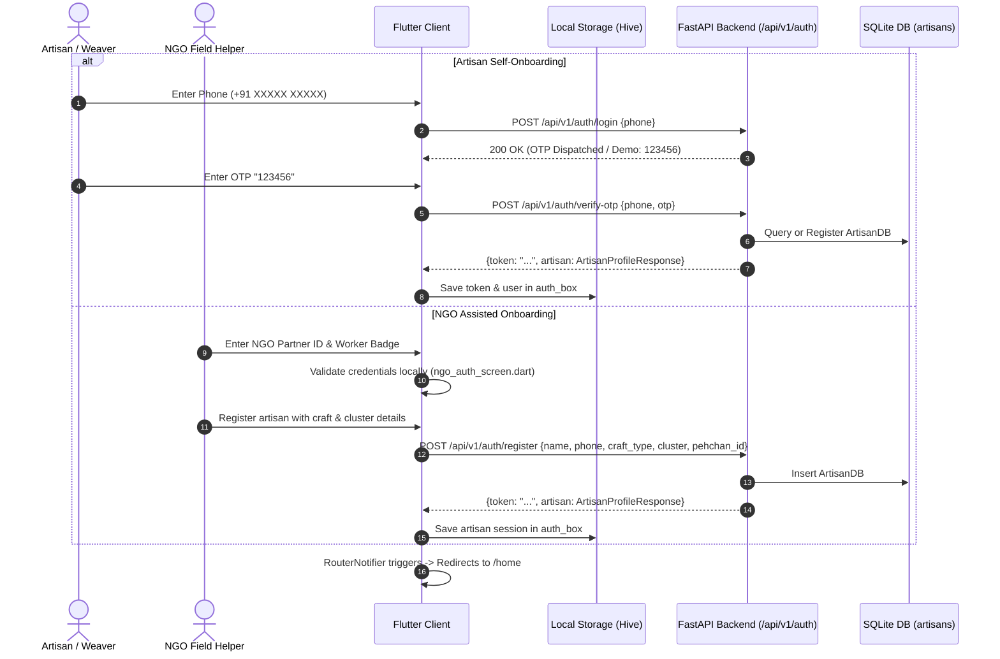
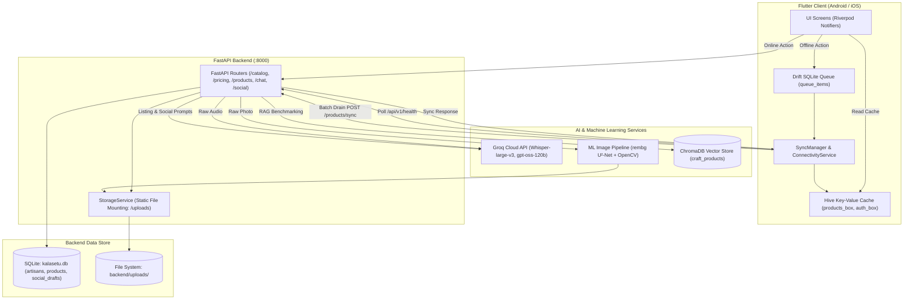

# KalaSetu (कलासेतु) — Comprehensive System Reference & Architecture Documentation

---

## 1. App Overview

**KalaSetu (कलासेतु — "Bridge of Art")** is an offline-first, voice- and vision-driven mobile commerce and market-linkage platform designed specifically for traditional Indian artisans, handloom weavers, and rural craftspersons. Recognizing that many master craftspeople face literacy barriers, lack digital cataloging skills, and are routinely exploited by middlemen, KalaSetu empowers artisans to digitize their handmade inventory in under three minutes. Artisans take a simple photo of their craft, speak in their native tongue (Hindi, Gujarati, Tamil, etc.) to describe materials and labor, and KalaSetu's AI multimodal pipeline automatically removes cluttered workshop backgrounds, writes bilingual SEO marketplace listings (English and Hindi), computes an uncompromised minimum cost floor with fair market pricing suggestions via RAG comparables, generates channel-specific social media marketing campaigns (WhatsApp, Instagram, Facebook), and tracks orders with QR shipping labels. Built with an offline-first Drift SQLite queue, KalaSetu operates seamlessly in low-connectivity rural clusters, synchronizing catalogs and media as soon as an internet link is detected.

---

## 2. Tech Stack & Infrastructure

### 2.1 Frontend (Mobile App)
- **Framework**: Flutter 3.x / Dart 3.x (`frontend/pubspec.yaml`)
- **State Management**: Flutter Riverpod (`flutter_riverpod: ^2.6.1`)
- **Routing**: GoRouter (`go_router: ^14.8.1`) with route guards for language selection and authentication (`frontend/lib/core/router/app_router.dart`)
- **Local Storage & Offline Sync**:
  - **Drift (SQLite)**: Relational offline action queue with auto-retry and status tracking (`drift: ^2.21.0`, `sqlite3_flutter_libs: ^0.5.24`)
  - **Hive / Hive Flutter**: Key-value fast persistent caching for user profile, authentication state, and offline product cache (`hive_flutter: ^1.1.0`)
- **Networking & Network Discovery**: Dio (`dio: ^5.7.0`) and HTTP (`http: ^1.2.2`), with dynamic LAN host discovery (`frontend/lib/core/config/api_config.dart`) and connection heartbeat probing (`frontend/lib/core/offline_sync/services/connectivity_service.dart`)
- **Audio & Speech**:
  - `record`: Audio capture to `.m4a` / `.wav` (`record: ^5.1.2`)
  - `just_audio`: Audio playback for recorded descriptions and TTS audio (`just_audio: ^0.9.42`)
  - `flutter_tts`: On-device text-to-speech engine supporting Hindi (`hi-IN`) and English (`en-US`)
- **Localization**: `easy_localization: ^3.0.7` supporting English (`en`), Hindi (`hi`), and regional Indian languages
- **UI & Interaction**: Google Fonts (`google_fonts: ^6.2.1`), Lucide & Phosphor icons, `gal` (saving enhanced images to camera roll), `share_plus` (native Android share sheet), and custom MethodChannel (`com.kalasetu.kalasetu/whatsapp_share`) for direct WhatsApp Business sharing

### 2.2 Backend (API Service)
- **Runtime & Framework**: Python 3.11+ / FastAPI (`fastapi>=0.115.0`)
- **ASGI Server**: Uvicorn with auto-reload (`uvicorn[standard]>=0.30.0`)
- **Database ORM**: SQLAlchemy 2.0 (`sqlalchemy>=2.0.35`) with SQLite (`backend/kalasetu.db`)
- **Data Validation & Settings**: Pydantic v2 & `pydantic-settings` (`pydantic>=2.9.0`, `pydantic-settings>=2.5.0`)
- **Async HTTP Client**: HTTPX (`httpx>=0.27.0`) and `aiofiles` for asynchronous multipart media streaming
- **File & Static Assets**: Static mounting at `/uploads` (`backend/uploads/`) for original images, studio-enhanced PNGs, and voice recordings

### 2.3 Machine Learning, AI Models & External Services
- **Groq Cloud API** (`https://api.groq.com/openai/v1`):
  - **Speech-to-Text**: `whisper-large-v3` with craft-specific Indian artisan vocabulary biasing (`ML/voice_pipeline/glossary/craft_terms.json`)
  - **Text & Multimodal Generation**: `openai/gpt-oss-120b` (or `llama-3.3-70b-versatile` / `llama-3.1-8b-instant`) powering bilingual catalog listing generation, market pricing reasoning, social media copy generation, and KalaMitra conversation agent
- **Google Gemini API** (`google-genai`): Fallback multimodal vision and cost breakdown analysis (`gemini-2.5-flash` / `gemini-1.5-pro`)
- **Image Pipeline**:
  - `rembg` (U²-Net deep learning model) for instant workshop background removal and clean cutout isolation
  - `OpenCV` (`opencv-python-headless>=4.10.0`) & `Pillow (PIL)` for color temperature white balancing, shadow synthesis, auto-contrast stretching, and perspective cropping (`ML/image_pipeline/enhancer.py`)
- **Vector Search & RAG Pricing Engine**:
  - `ChromaDB` (`ML/pricing/chroma_db/`): High-dimensional vector database indexing verified craft marketplace items (Etsy, ONDC, Amazon Karigar) using text embeddings for real-time market price range benchmarking

---

## 3. Core Features & Module Breakdown

---

### Feature 1: Multilingual Onboarding, Authentication & NGO Assisted Flow

- **Description**: Allows artisans to set their primary interface language (Hindi/English), authenticate via phone number and OTP, complete artisan KYC (craft type, artisan cluster, Pehchan Card ID), or undergo assisted onboarding via registered NGO ground volunteers.
- **User-Facing Flow**:
  1. **Splash & Language Gate**: User opens app -> `SplashScreen` checks stored preferences. If language unset, routes to `LanguageScreen` (`/language`). User taps English or Hindi -> preference saved in Hive `app_settings` box -> routes to `SignInScreen` (`/sign-in`).
  2. **Phone Sign-In / Register**: User enters 10-digit Indian phone number. If unregistered, user fills Name, Craft (e.g. Blue Pottery, Zardozi, Madhubani), State, Cluster, and Pehchan ID in `RegisterScreen` (`/register`).
  3. **OTP Verification**: Triggered via `POST /api/v1/auth/login` or `POST /api/v1/auth/register`. User is navigated to `OtpScreen` (`/otp`). For testing/demo mode, OTP `123456` bypasses SMS gateway.
  4. **NGO Assisted Mode**: Ground volunteers tap "NGO Assisted Login" -> enter NGO ID, Worker Badge Number, and cluster location in `NgoAuthScreen` (`/ngo-auth`) to onboard illiterate artisans without smartphone access.
  5. **Session Established**: Profile saved in Hive `auth_box` -> GoRouter redirects automatically to `/home`.
- **Key Files & Paths**:
  - `frontend/lib/features/auth/screens/splash_screen.dart`
  - `frontend/lib/features/auth/screens/language_screen.dart`
  - `frontend/lib/features/auth/screens/sign_in_screen.dart`
  - `frontend/lib/features/auth/screens/register_screen.dart`
  - `frontend/lib/features/auth/screens/otp_screen.dart`
  - `frontend/lib/features/auth/screens/ngo_auth_screen.dart`
  - `frontend/lib/features/auth/providers/auth_provider.dart`
  - `backend/routers/auth.py`
  - `backend/models/db_models.py` (`ArtisanDB`)
  - `backend/models/schemas.py` (`ArtisanRegisterRequest`, `ArtisanLoginRequest`, `OTPVerifyRequest`)
- **APIs & Endpoints**:
  - `POST /api/v1/auth/register`: Create artisan profile record.
  - `POST /api/v1/auth/login`: Send verification OTP.
  - `POST /api/v1/auth/verify-otp`: Validate 6-digit OTP; returns mock JWT token and `ArtisanProfileResponse`.
  - `GET /api/v1/auth/me`: Fetch currently authenticated artisan profile via `Authorization: Bearer <token>`.
- **Data Models / Tables**:
  - SQLite Table: `artisans` (`id`, `name`, `phone`, `craft_type`, `location_cluster`, `state`, `experience_years`, `pehchan_id`, `preferred_language`, `created_at`).
  - Hive Box: `auth_box` storing `currentUser` JSON and auth tokens.
- **Business Logic & Edge Cases**:
  - Phone validation requires exactly 10 digits prefixed optionally by `+91`.
  - Development OTP fallback is hardcoded to `123456` when SMS gateway (Twilio/Gupshup) is unconfigured.
  - Pehchan ID (Ministry of Textiles Artisan Card) is optional during onboarding to prevent drop-off.
- **Dependencies**: Blocks all other modules via `GoRouter` redirect guard (`app_router.dart`).

---

### Feature 2: Multimodal AI Product Digitization Wizard (Add Product Flow)

- **Description**: A guided 5-step wizard allowing artisans to photograph a product, speak its backstory in their native tongue, preview AI-generated studio cutouts and bilingual listings, calculate cost floors, and publish to the live catalog.
- **User-Facing Flow**:
  1. **Step 0 — Studio Capture**: User taps floating "+" or "Add Product" button -> opens `AddProductFlowScreen` (`/add-product`). User snaps a photo or picks from gallery. Blur/glare check runs client-side.
  2. **Image Enhancement**: Image automatically sent to `POST /api/v1/catalog/enhance-image`. Background is extracted via `rembg`, balanced with studio lighting via OpenCV, and saved to `backend/uploads/enhanced/`. User can toggle Before/After views.
  3. **Step 1 — Voice Backstory**: User holds microphone button and speaks (e.g., *"Yeh pure clay ka hand-painted flower vase hai, 2 din lage banane mein, 300 rupaye ki mitti aur rang laga"*). Recorded `.m4a` file is uploaded to `POST /api/v1/voice/process`.
  4. **Step 2 — AI Listing Review**: Backend runs Whisper transcription + craft glossary bias -> Groq `gpt-oss-120b` extracts materials, production hours, craft tags, and writes both Hindi and English titles/descriptions. User reviews bilingual editable fields.
  5. **Step 3 — Pricing & Cost Floor Engine**: User reviews material costs, labor hours, and transport expenses. System queries `POST /api/v1/pricing/suggest` to compute minimum living-wage cost floor and recommends a Fair Market Range based on ChromaDB benchmark crafts. Hindi audio explanation plays to explain the rationale.
  6. **Step 4 — Final Review & Publish**: Artisan confirms final price -> taps "Publish to Marketplace". If online, hits `POST /api/v1/products`; if offline, saves to Drift SQLite queue for background sync. Returns to Home with celebration card.
- **Key Files & Paths**:
  - `frontend/lib/features/add_product/screens/add_product_flow_screen.dart`
  - `frontend/lib/data/services/image_enhancer_service.dart`
  - `frontend/lib/data/services/speech_service.dart`
  - `frontend/lib/data/services/pricing_service.dart`
  - `backend/routers/catalog.py`
  - `backend/routers/voice.py`
  - `backend/routers/pricing.py`
  - `backend/services/catalog_service.py`
  - `backend/services/groq_client.py`
  - `ML/image_pipeline/enhancer.py`
  - `ML/voice_pipeline/orchestrator/`
- **APIs & Endpoints**:
  - `POST /api/v1/catalog/enhance-image`: Upload raw image -> outputs `enhanced_url` (PNG with transparent/studio background) and quality metrics.
  - `POST /api/v1/voice/process`: Multipart upload of audio file -> returns transcript, detected language, and extracted craft attributes.
  - `POST /api/v1/catalog/generate-listing`: Generates bilingual title, description, category, and tags using multimodal visual features + transcribed voice backstory.
  - `POST /api/v1/pricing/suggest`: Computes cost breakdown and suggested pricing range.
  - `POST /api/v1/products`: Commits new listing to `products` table.
- **Data Models / Tables**:
  - SQLite Tables: `products`, `artisans`.
  - In-flight Riverpod state: `addProductFlowProvider` storing `AddProductDraft`.
- **Business Logic & Validation**:
  - Minimum price cannot fall below the calculated `cost_floor` (Labor Hours × Minimum Hourly Wage + Material Cost + Overhead).
  - Both English and Hindi descriptions are generated simultaneously to support local and export buyers.
- **Dependencies**: Dependent on Auth (artisan ID association) and Offline Sync (Drift queue fallback).

---

### Feature 3: Offline Sync Engine & Drift Local Action Queue

- **Description**: Guarantees zero data loss when artisans work in remote villages without mobile data or Wi-Fi. All actions (product creation, media uploads, edits) are staged into a local SQLite queue and drained automatically upon reconnection.
- **User-Facing Flow**:
  1. **Offline Action**: Artisan publishes a product while offline. The app UI immediately displays a badge: *"Saved offline. Will upload when back online"*.
  2. **Local Queue Staging**: Raw image bytes, audio files, and JSON payloads are written to the local app documents directory and recorded in Drift's `queue_items` SQLite table.
  3. **Heartbeat & Network Polling**: `ConnectivityService` listens to platform connectivity broadcasts and actively pings `/api/v1/health` every 15 seconds.
  4. **Drain & Batch Sync**: Once network is verified, `SyncManager` iterates pending items (`status = 'pending'`), executes upload via `UploadApi` to `POST /api/v1/products/sync`, marks item as `'completed'`, and writes the created product back to local Hive `products_box`.
  5. **UI Update**: Banner automatically dismisses and catalogue transitions product status from "Sync Pending" to "Live".
- **Key Files & Paths**:
  - `frontend/lib/core/offline_sync/database/database.dart` (Drift schema)
  - `frontend/lib/core/offline_sync/services/sync_manager.dart`
  - `frontend/lib/core/offline_sync/services/connectivity_service.dart`
  - `frontend/lib/core/offline_sync/services/upload_api.dart`
  - `frontend/lib/core/offline_sync/offline_sync_service.dart`
  - `backend/routers/products.py` (`sync_products` endpoint)
  - `backend/routers/health.py`
- **APIs & Endpoints**:
  - `GET /api/v1/health`: Lightweight ping returning `{"status": "healthy"}`.
  - `POST /api/v1/products/sync`: Batch ingestion endpoint accepting an array of offline-created products and multipart binaries.
- **Data Models / Tables**:
  - Drift Table: `QueueItems` (`id`, `actionType`, `payload`, `filePath`, `retryCount`, `status`, `createdAt`, `errorMessage`).
  - Hive Box: `products_box` for offline instant query read caching.
- **Business Logic & Edge Cases**:
  - Exponential backoff retry logic (up to 5 retries before marking `'failed'`).
  - Idempotency keys (`idempotency_key` UUID) prevent duplicate listings if network disconnects mid-response.
- **Dependencies**: Utilized by Add Product, Catalogue, and Social Media Helper.

---

### Feature 4: Product Catalogue & Inventory Management

- **Description**: A dual-grid/list marketplace catalogue for artisans to view, search, filter, edit, archive, or inspect the status of their handcrafted inventory.
- **User-Facing Flow**:
  1. **Catalogue View**: User selects the "Catalogue" tab from bottom navigation bar (`CatalogueScreen`).
  2. **Filtering & Search**: User taps category pills (e.g. Pottery, Textiles, Jewelry, Woodwork) or types in the instant search bar. Status filters allow toggling between "All", "Live", "Draft", and "Archived".
  3. **Product Detail**: Tapping any card opens `ProductDetailScreen` (`/product/:id`) displaying high-resolution enhanced photos, bilingual descriptions, tags, pricing breakdown, and QR code.
  4. **Status & Actions**: Artisan can edit listing details, toggle listing status (`live` <-> `archived`), delete the product, or launch the Social Media Launchpad.
- **Key Files & Paths**:
  - `frontend/lib/features/catalogue/screens/catalogue_screen.dart`
  - `frontend/lib/features/catalogue/screens/product_detail_screen.dart`
  - `frontend/lib/data/repositories/product_repository.dart`
  - `frontend/lib/data/models/product.dart`
  - `backend/routers/products.py`
  - `backend/models/db_models.py` (`ProductDB`)
- **APIs & Endpoints**:
  - `GET /api/v1/products`: Fetch listings with query params `?category=...&status=...&artisan_id=...&skip=0&limit=50`.
  - `GET /api/v1/products/{product_id}`: Fetch single product details.
  - `PUT /api/v1/products/{product_id}`: Update title, description, price, or status.
  - `DELETE /api/v1/products/{product_id}`: Soft or hard delete listing.
- **Data Models / Tables**:
  - SQLite Table: `products` (`id`, `artisan_id`, `title`, `title_hi`, `description`, `description_hi`, `price`, `image_url`, `category`, `tags`, `status`, `created_at`, `updated_at`).
- **Business Logic & Edge Cases**:
  - Offline-first fallback: If network call fails, `ProductRepository` immediately reads and displays cached items from Hive `products_box`.
  - Image URLs check for local relative paths vs absolute LAN URLs using `ApiConfig`.
- **Dependencies**: Dependent on Auth (artisan scoping) and Add Product (inventory source).

---

### Feature 5: Multimodal Dynamic Pricing Engine & Cost-Floor Safeguard

- **Description**: AI-driven pricing intelligence that protects artisans from undervaluing their work. Combines deterministic wage calculations (cost floor) with RAG vector search against national craft marketplaces.
- **User-Facing Flow**:
  1. **Trigger**: Automatically invoked in Step 3 of the Add Product Wizard or on-demand from product detail edit.
  2. **Input Breakdown**: Raw materials (clay, natural dyes, silk), production time (hours/days), craft complexity, and shipping overhead.
  3. **Cost Floor Calculation**: Backend computes:
     $$\text{Cost Floor} = \text{Materials} + (\text{Labor Hours} \times \text{Fair Wage Rate}) + \text{Overhead}$$
  4. **Market Benchmarking (ChromaDB RAG)**: Backend queries ChromaDB collection using product title and visual embeddings to find top-5 similar handmade items on Amazon Karigar, Etsy, and FabIndia.
  5. **Fair Pricing Recommendation**: LLM evaluates the cost floor against market comparables and outputs:
     - Minimum Safe Price (Break-even + 15% safety margin)
     - Recommended Fair Price (Optimal direct-to-consumer margin)
     - Premium Gallery Price (Export / luxury craft pricing)
  6. **Voice Reasoning**: Provides a conversational Hindi audio explanation (e.g. *"Aapka kaam Zardozi embroidery ka hai jismein 16 ghante lage hain. Iska bazaar moolya ₹2,400 se ₹3,200 ke beech hona chahiye"*).
- **Key Files & Paths**:
  - `frontend/lib/data/services/pricing_service.dart`
  - `backend/routers/pricing.py`
  - `backend/services/pricing_service.py`
  - `ML/pricing/chroma_db/`
  - `ML/pricing/models.py`
  - `ML/pricing/run_pipeline.py`
- **APIs & Endpoints**:
  - `POST /api/v1/pricing/suggest`: Accepts `PricingRequest` (materials, labor_hours, craft_type, images) -> returns `PricingResponse` (`cost_floor`, `min_price`, `recommended_price`, `max_price`, `confidence`, `explanation_en`, `explanation_hi`).
- **Data Models / Tables**:
  - Pydantic Models: `PricingRequest`, `PricingResponse`, `CostBreakdown`.
  - ChromaDB Collection: `craft_products` (embeddings of verified craft items).
- **Business Logic & Safeguards**:
  - **Hard Cost-Floor Safeguard**: If an artisan attempts to enter a price lower than the calculated cost floor, the UI shows an orange warning badge: *"Warning: This price is below your cost of materials and labor"*.
- **Dependencies**: Integrated into Add Product wizard and Product Details.

---

### Feature 6: Social Media Launchpad (WhatsApp, Instagram, Facebook)

- **Description**: An omnichannel promotional engine that generates customized marketing copy, hashtags, and format-specific captions for WhatsApp direct selling, Instagram visual storytelling, and Facebook community groups.
- **User-Facing Flow**:
  1. **Trigger**: Accessible from the completion screen of the Add Product Wizard or via the "Share" action on any product in the Catalogue (`SocialMediaLaunchpadSheet`).
  2. **Channel Selection**: User selects a channel pill: **WhatsApp**, **Instagram**, or **Facebook**.
  3. **Auto-Draft Lookup or Generation**:
     - Frontend queries `GET /api/v1/social-drafts/lookup?listing_id=...&channel=...`.
     - If draft does not exist, hits `POST /api/v1/social-drafts/generate`.
     - Groq LLM creates tailored content:
       - *WhatsApp*: Personal, polite direct message with price, craft story, and direct order link.
       - *Instagram*: Aesthetic storytelling, emotional artisan narrative, and 15–25 targeted craft hashtags (#HandmadeInIndia, #BluePotteryJaipur).
       - *Facebook*: Community-oriented longer story explaining the heritage technique.
  4. **Artisan Edits & Persistence**: User can edit the text in the app. Edits are debounced and saved via `PUT /api/v1/social-drafts/{draft_id}`.
  5. **Direct Sharing**:
     - *WhatsApp*: Native Android Intent via MethodChannel `com.kalasetu.kalasetu/whatsapp_share` attaches the enhanced image and pre-populates the text directly in WhatsApp.
     - *Instagram/Facebook*: Copies hashtags and caption to clipboard, saves studio-cutout image to Android gallery via `gal`, and opens the respective app.
- **Key Files & Paths**:
  - `frontend/lib/features/social_media/screens/social_media_screen.dart`
  - `frontend/lib/features/social_media/widgets/social_media_launchpad_sheet.dart`
  - `frontend/lib/features/social_media/providers/social_media_provider.dart`
  - `backend/routers/social.py`
  - `backend/services/social_media_service.py`
  - `backend/models/db_models.py` (`SocialDraftDB`)
- **APIs & Endpoints**:
  - `GET /api/v1/social-drafts/lookup`: Retrieve existing draft by `(listing_id, channel)` or `(draft_key, channel)`.
  - `POST /api/v1/social-drafts/generate`: Generate channel-specific caption and hashtags.
  - `POST /api/v1/social-drafts/link`: Links drafts created during the Add Product wizard (`draft_key`) to the finalized `listing_id`.
  - `PUT /api/v1/social-drafts/{draft_id}`: Persist artisan-edited captions or custom hashtags.
- **Data Models / Tables**:
  - SQLite Table: `social_drafts` (`id`, `listing_id`, `draft_key`, `image_url`, `caption`, `hashtags`, `channel`, `source`, `edited_by_user`, `created_at`, `updated_at`).
- **Business Logic & Edge Cases**:
  - If WhatsApp is not installed on the Android device, the app falls back smoothly to standard `share_plus` system intent.
  - In add-product flow where `product_id` does not exist yet, drafts use a temporary client-generated `draft_key` UUID, later linked atomically when the product is published.
- **Dependencies**: Depends on Catalogue listings and Image Enhancer output.

---

### Feature 7: KalaMitra Conversational AI Assistant & Navigation Agent

- **Description**: An in-app conversational AI companion ("कला मित्र" — Friend of Art) that communicates via text or voice in Hindi and English. It answers artisan queries regarding government welfare schemes, craft market trends, and raw material sourcing, and executes direct UI navigation and state actions within the app.
- **User-Facing Flow**:
  1. **Invocation**: Tapping the floating KalaMitra mascot button (`KalaMitraFab`) present on the Home screen or navigating to `/assistant` opens `ChatbotSheet`.
  2. **Input**: Artisan either taps a quick prompt chip (e.g. *"What is PM Vishwakarma scheme?", "How should I pack fragile terracotta?"*), types a message, or holds the voice record button.
  3. **Voice Audio Processing**: Audio is sent to `POST /api/v1/chat/voice` -> Whisper transcribes voice -> routed into `ChatService`.
  4. **Guardrails & Execution**: The backend guardrail filter rejects off-topic queries (coding, politics, crypto) and grounds responses in artisan welfare and business growth.
  5. **Direct Actions (Tool Calling)**: When asked actionable commands (e.g. *"Show my live pottery items"*, *"Take me to add a new product"*, *"Sync my pending offline items"*), the LLM emits structured direct actions (`navigate`, `filter_catalogue`, `sync_pending`, `update_product_status`). The Flutter frontend executes the navigation or state mutation immediately.
  6. **Voice Readback**: Chat responses have an audio readback button powered by `flutter_tts` in Hindi/English.
- **Key Files & Paths**:
  - `frontend/lib/features/chatbot/screens/chatbot_sheet.dart`
  - `frontend/lib/features/chatbot/widgets/kalamitra_fab.dart`
  - `frontend/lib/data/services/chat_service.dart`
  - `backend/routers/chat.py`
  - `backend/services/chat_service.py`
  - `frontend/lib/data/models/chat_message.dart`
- **APIs & Endpoints**:
  - `POST /api/v1/chat/message`: Send text chat payload with conversation history -> returns reply, suggested follow-ups, and optional `direct_action`.
  - `POST /api/v1/chat/voice`: Send `.m4a` audio message -> returns transcription, text answer, and direct actions.
  - `GET /api/v1/chat/quick-topics`: Fetch localized preset prompt chips.
- **Data Models / Tables**:
  - Pydantic Schemas: `ChatMessage`, `ChatRequest`, `ChatResponse`, `DirectAction`.
  - Local Riverpod state: `chatMessagesProvider` in Hive / memory.
- **Business Logic & Edge Cases**:
  - System prompt rigorously enforces the persona of an empathetic mentor for Indian artisans.
  - Recognizes Hindi, Hinglish, and English dialects.
- **Dependencies**: Deeply linked across app routes for context-aware navigation.

---

### Feature 8: Order Management & Shipping Label Maker

- **Description**: Allows artisans to view customer orders across marketplace channels, update packing/shipping statuses, and generate printable, scan-ready PDF shipping labels with embedded QR codes.
- **User-Facing Flow**:
  1. **Order Dashboard**: User navigates to `MyOrdersScreen` (`/my-orders`). Orders are segmented by status tabs: "All", "New Orders", "Packed", "Shipped", "Delivered".
  2. **Order Detail**: Tapping an order card opens `OrderDetailScreen` (`/orders/:orderId`) showing customer shipping address, line items, payment status (COD vs Prepaid), and courier tracking info.
  3. **Status Update**: Artisan taps "Mark as Packed" or "Mark as Handed to Courier". Status updates with visual color badges.
  4. **Print Shipping Label**: Artisan taps "Download / Print Shipping Label". `LabelMakerService` renders a professional A6/4x6 shipping slip containing sender Pehchan ID, buyer address, order SKU, and a scannable QR verification code using `pdf` and `printing` packages.
- **Key Files & Paths**:
  - `frontend/lib/features/orders/screens/my_orders_screen.dart`
  - `frontend/lib/features/orders/screens/order_detail_screen.dart`
  - `frontend/lib/features/orders/services/label_maker_service.dart`
  - `frontend/lib/features/orders/providers/orders_provider.dart`
  - `frontend/lib/features/orders/models/order.dart`
- **APIs & Endpoints**:
  - Currently backed by local provider state (`orders_provider.dart`). Planned backend endpoint: `GET /api/v1/orders` and `PUT /api/v1/orders/{order_id}/status`.
- **Data Models / Tables**:
  - Dart Model: `Order` (`id`, `customerName`, `customerAddress`, `customerPhone`, `items`, `totalAmount`, `status`, `createdAt`, `trackingNumber`).
- **Business Logic & Edge Cases**:
  - Offline label generation: PDFs are generated completely client-side without requiring internet access.
- **Dependencies**: Reads artisan address and Pehchan ID from `AuthProvider`.

---

### Feature 9: Multilingual Voice Readback (TTS) & Page Guides

- **Description**: Universal accessibility feature providing spoken page guidance and audio readback of text listings, chat messages, and tutorials for non-literate artisans.
- **User-Facing Flow**:
  1. **Interactive Audio Page Guides**: On key screens (Add Product, Pricing, Catalogue), a floating speaker icon appears. Tapping it invokes `tts_page_guides.dart`, reading aloud screen instructions in the artisan's preferred language.
  2. **Listing Audio Preview**: In the AI review step, tapping the speaker icon speaks the Hindi listing description to let the artisan verify that the AI captured their craft story accurately.
  3. **Visual Listing Tutorial**: First-time artisans can access `TutorialCarouselScreen` (`/listing-tutorial`), a 4-step illustrated walkthrough explaining photography, speaking into the mic, and setting prices.
- **Key Files & Paths**:
  - `frontend/lib/core/services/tts_service.dart`
  - `frontend/lib/core/widgets/tts_page_guides.dart`
  - `frontend/lib/features/tutorial/screens/tutorial_carousel_screen.dart`
- **APIs & Endpoints**: Fully on-device execution using `flutter_tts` without network latency.
- **Dependencies**: Reads `preferred_language` from user profile settings.

---

## 4. Authentication, Authorization & Permissions Lifecycle



### Roles and Permissions
1. **Artisan Role (Self-Managed)**:
   - Owns private catalog items (`artisan_id` foreign key check).
   - Full read/write access to own products and social media drafts.
2. **NGO Field Worker Role**:
   - Authorized to onboard multiple artisans sequentially from a single field device.
   - Capability to switch active artisan sessions without clearing device cache.
3. **Session Management**:
   - Authentication tokens are cached locally in Hive `auth_box` (`token`, `currentUser`).
   - All outgoing requests attach `Authorization: Bearer <token>`.
   - `RouterNotifier` (`frontend/lib/core/router/app_router.dart`) monitors `authStateProvider`. If session expires or is cleared, the router redirects user to `/sign-in`.

---

## 5. End-to-End Data Flow Architecture



---

## 6. Directory Structure & Key Artifacts

```
kalasetu/
├── backend/                        # FastAPI Backend Application
│   ├── config.py                   # Pydantic environment configuration (API keys, paths)
│   ├── database.py                 # SQLAlchemy engine, SessionLocal & Base setup
│   ├── kalasetu.db                 # SQLite relational database
│   ├── main.py                     # FastAPI application entrypoint & middleware configuration
│   ├── models/
│   │   ├── db_models.py            # SQLAlchemy tables (ArtisanDB, ProductDB, SocialDraftDB)
│   │   └── schemas.py              # Pydantic request & response schemas
│   ├── routers/
│   │   ├── auth.py                 # Registration, login, OTP verification
│   │   ├── catalog.py              # Image enhancement & listing generator endpoints
│   │   ├── chat.py                 # KalaMitra AI assistant endpoints
│   │   ├── health.py               # Heartbeat health probe endpoint
│   │   ├── pricing.py              # Cost floor & RAG pricing endpoints
│   │   ├── products.py             # Product CRUD & batch offline sync
│   │   ├── social.py               # Omnichannel social media draft endpoints
│   │   └── voice.py                # Whisper voice processing endpoints
│   ├── services/
│   │   ├── catalog_service.py      # Multimodal cataloging pipeline
│   │   ├── chat_service.py         # KalaMitra agent logic & tool calling
│   │   ├── groq_client.py          # Groq Cloud API wrapper
│   │   ├── pricing_service.py      # Pricing logic & RAG integration
│   │   ├── social_media_service.py # Channel-specific copy generation
│   │   └── storage_service.py      # File upload & static asset management
│   └── uploads/                    # Local storage for images & audio files
│
├── ML/                             # Machine Learning & AI Subsystems
│   ├── image_pipeline/
│   │   ├── enhancer.py             # rembg U²-Net + OpenCV image processing
│   │   └── run_enhancer.py         # Standalone image enhancement test script
│   ├── pricing/
│   │   ├── chroma_db/              # ChromaDB vector index files
│   │   ├── embeddings/             # Text & visual embedding generators
│   │   ├── models.py               # Pydantic data structures for pricing
│   │   └── run_pipeline.py         # Vector similarity search & benchmark scraper
│   └── voice_pipeline/
│       ├── glossary/craft_terms.json # Indian craft terms for Whisper biasing
│       └── orchestrator/           # Audio pre-processing & transcription runners
│
└── frontend/                       # Flutter Mobile Client
    ├── lib/
    │   ├── main.dart               # App entrypoint, Hive init, dynamic API discovery
    │   ├── app.dart                # MaterialApp setup with EasyLocalization & GoRouter
    │   ├── core/
    │   │   ├── config/api_config.dart # Dynamic LAN IP & backend discovery
    │   │   ├── offline_sync/       # Drift SQLite queue, SyncManager & ConnectivityService
    │   │   ├── router/             # GoRouter routes, constants & route guards
    │   │   ├── services/           # TTS & audio player services
    │   │   └── theme/              # Curated Indian artisan color palette & typography
    │   ├── data/
    │   │   ├── models/             # Product, UserProfile, SocialDraft, ChatMessage models
    │   │   ├── repositories/       # ProductRepository with Hive offline cache
    │   │   └── services/           # HttpApiService, SpeechService, PricingService
    │   └── features/
    │       ├── add_product/        # 5-step multimodal product digitization wizard
    │       ├── auth/               # Sign in, registration, OTP, NGO helper flow
    │       ├── catalogue/          # Product grid, search, filters & detail screens
    │       ├── chatbot/            # KalaMitra FAB, chat sheet & direct action handlers
    │       ├── home/               # HomeShell indexed bottom navigation
    │       ├── notifications/      # Order alerts & market demand tips
    │       ├── orders/             # Order tracking & PDF shipping label generator
    │       ├── profile/            # Artisan profile, Pehchan ID & language settings
    │       ├── social_media/       # Social Media Launchpad (WhatsApp, IG, FB)
    │       └── tutorial/           # Visual onboarding carousel & voice guides
    └── pubspec.yaml                # Flutter dependencies and asset registrations
```

---

## 7. Known Gaps, Mocked Components & Future Roadmap

1. **Order Management Backend Integration**:
   - *Current State*: The Orders feature (`frontend/lib/features/orders/`) uses in-memory mock data generated in `orders_provider.dart`.
   - *Target Fix*: Implement a dedicated `orders` table in `backend/models/db_models.py` and create `backend/routers/orders.py` supporting ONDC (Open Network for Digital Commerce) order webhooks.
2. **NGO Authenticated Backend Registry**:
   - *Current State*: `NgoAuthScreen` validates NGO credentials locally in Dart for development agility.
   - *Target Fix*: Connect to an official NGO partner registry API with verified supervisor tokens and multi-artisan management privileges.
3. **Database Migrations (Alembic)**:
   - *Current State*: Database schemas are initialized using SQLAlchemy `Base.metadata.create_all(bind=engine)`. Schema updates (such as adding columns to `social_drafts`) require manual SQL migrations.
   - *Target Fix*: Set up standard Alembic migrations (`alembic init alembic`) to version control database evolution.
4. **Production Media Storage**:
   - *Current State*: Uploaded images and voice recordings are stored in the local server directory `backend/uploads/`.
   - *Target Fix*: Integrate AWS S3, Cloudflare R2, or Google Cloud Storage via an environment toggle in `StorageService`.
5. **Physical Device LAN Image Resolution**:
   - *Addressed*: Handled dynamically by `ApiConfig.discoverWorkingUrl()` in Flutter, ensuring image URLs served from `/uploads` resolve to the active host Wi-Fi IP rather than `localhost` when running on physical Android phones.
